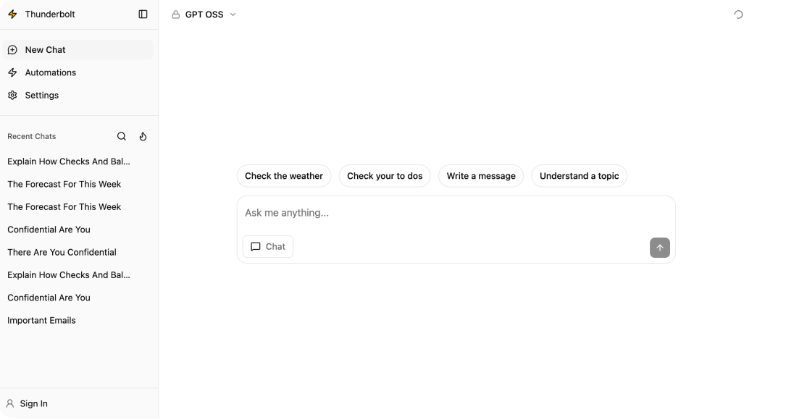

# Thunderbolt [](https://github.com/thunderbird/thunderbolt/actions/workflows/ci.yml)

**AI You Control: Choose your models. Own your data. Eliminate vendor lock-in.**

Thunderbolt is an open-source, cross-platform AI client that can be deployed on-prem anywhere.

Thunderbolt is built with Tauri, React, Vercel AI SDK and is available on all major desktop and mobile platforms: web, iOS, Android, Mac, Linux, and Windows.

Data is stored on-device using SQLite (IndexedDB). Optional end-to-end encrypted cloud syncing is available using Powersync.

**Thunderbolt is under active development, currently undergoing a security audit, and preparing for enterprise production readiness.**



## Roadmap

| Platform | Status |
| --- | --- |
| Web | ✅ |
| Mac | ✅ |
| Linux | ✅ |
| Windows | ✅ |
| Android | ✅ Available - App Store Release Planned |
| iOS | ✅ Available - App Store Release Planned |

| Feature | Status |
| --- | --- |
| ACP | In Development - Release Planned: April 2026 |️
| MCP Support | ✅ |
| Improved MCP Support | In Development - Release Planned: April 2026 |
| Chat Widgets | ✅ |
| Chat Mode | ✅ |
| Search Mode | ✅ |
| Research Mode | ✅ |
| Custom Models / Providers | ✅ |
| Optional End-to-End Encryption | ✅ |
| Cross-Device Cloud Sync | ✅ |
| Google Integration | ✅ |
| Microsoft Integration | ✅ |
| Ollama Compatibility | ✅ |
| Agent Memory | Planned |
| Agent Skills | Planned |
| Offline Support | Planned |
| Research Mode v2 | Planned |

## Quick Start

You must have Bun, Rust, and Docker installed first. Then:

```sh
# Install dependencies
make setup

# Set up .env files
cp .env.example .env
cd backend && cp .env.example .env

# Run postgres + powersync
make docker-up

# Run backend
# cd backend && bun dev

# Browser:
bun dev
# -> open http://localhost:1420 in your browser.

# Desktop
bun tauri:dev:desktop

# iOS Simulator
bun tauri:dev:ios

# Android Emulator
bun tauri:dev:android
```

## Testing

```sh
# Run frontend tests (src/ and scripts/)
bun run test

# Run frontend tests in watch mode
bun run test:watch

# Run backend tests
bun run test:backend

# Run backend tests in watch mode
bun run test:backend:watch
```

**Note**: Don't use `bun test` without the npm script from the project root, as it will pick up both frontend and backend tests. The `test` script is configured to only run tests in `./src` and `./scripts` directories.

See [docs/testing.md](./docs/testing.md) for detailed testing guidelines.

## Run Android

```sh
# Android builds work with default (empty) features
bun tauri android dev
```

## Run Storybook [[DEMO]](https://thunderbolt-storybook.onrender.com/?path=/docs/components-ui-button--docs)

Check the [official](https://storybook.js.org/) documentation for usage instructions and examples.

```sh
bun storybook
# open in your browser http://localhost:6006/

# to build
bun build-storybook
```

## Analyze Vite Modules

Thunderbolt ships with [vite-bundle-analyzer](https://github.com/victorb/vite-plugin-bundle-analyzer) wired in, but **it is disabled by default** so it doesn't slow down normal builds or break CI on missing `stats.html`.

There are two ways to turn it on:

1. Run the dedicated script (convenient for local use):

   ```sh
   bun analyze   # alias for `vite analyze`
   ```

2. Toggle it for any build by setting an environment variable (handy in CI):

   ```sh
   ANALYZE=true bun run build   # generates dist/stats.html alongside a normal production build
   ```

In both cases the plugin runs in _static_ mode and writes `dist/stats.html`; it will **not** try to open a browser automatically.

## Tauri Signing Keys

### Generate New Signing Keys Securely

```sh
# Create the .tauri directory in your home folder (if it doesn't exist)
mkdir -p ~/.tauri

# Generate a cryptographically secure password
PASSWORD=$(openssl rand -base64 32)

# Display the password (save this securely - you'll need it for signing)
echo "Your signing key password: $PASSWORD"

# Generate new Tauri signing keys
tauri signer generate -p "$PASSWORD" -w ~/.tauri/thunderbolt.key

# The keys will be created at:
# Private key: ~/.tauri/thunderbolt.key (Keep this secret!)
# Public key: ~/.tauri/thunderbolt.key.pub
```

### Important Security Notes

- **Never share your private key** with anyone
- **Never commit the private key** to version control
- **Store the password securely** (password manager recommended)
- If you lose the private key or password, you won't be able to sign updates

### Using the Keys

Set these environment variables when signing:

```sh
export TAURI_SIGNING_PRIVATE_KEY="$HOME/.tauri/thunderbolt.key"
export TAURI_SIGNING_PRIVATE_KEY_PASSWORD="your-password-here"
```

## Building for Devices

```sh
rustup target add aarch64-apple-ios-sim # Add your device architecture (replace "aarch64-apple-ios-sim" with the desired device architecture)
bun run tauri ios dev --force-ip-prompt --host # Be sure to select the IP of your dev computer on the local network
```

- https://tauri.app/develop/#developing-your-mobile-application
- https://github.com/sarah-quinones/gemm/issues/31#issuecomment-2395557397

## Thunderbot Skills

The Claude Code slash commands in `.claude/commands/` are managed via [git subtree](https://www.atlassian.com/git/tutorials/git-subtree) from the [thunderbot](https://github.com/user/thunderbot) repo. This means you can edit them here as normal files and sync changes in both directions.

```bash
# Pull latest skills from thunderbot
git subtree pull --prefix=.claude/commands thunderbot main --squash

# Push local skill edits back to thunderbot
git subtree push --prefix=.claude/commands thunderbot main
```

If you haven't added the remote yet:

```bash
git remote add thunderbot git@github.com:thunderbird/thunderbot.git
```

## Documentation

- [Claude Code Skills](./docs/claude-code.md) - Slash commands for bootstrapping, code quality, automation, and more
- [Release Process](./RELEASE.md) - Instructions for creating and publishing new releases
- [Telemetry](./TELEMETRY.md) - Information about data collection and privacy policy
