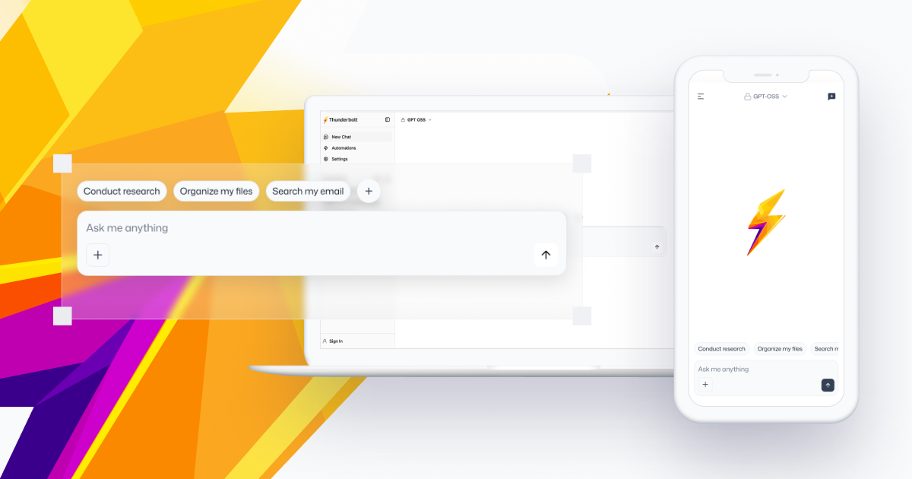

# Thunderbolt [](https://github.com/thunderbird/thunderbolt/actions/workflows/ci.yml)

**AI You Control: Choose your models. Own your data. Eliminate vendor lock-in.**



> [!IMPORTANT]
> ⚠️ **We are excited about the amount of interest Thunderbolt has been getting and want to clarify that it is still early and under active development**. Currently, we are targeting enterprise customers that want to deploy it on-prem. We encourage you to self-host it and try it out, but there are a few caveats we are still working on:
>
> - While we eventually plan to make Thunderbolt fully offline-first, it currently depends on authentication and search functionality (though you can disable search under _Settings → Connections_). You can [deploy your own backend with Docker Compose](./docs/self-hosting/docker-compose.md) and sign up in order to test it locally.
> - Thunderbolt ships system-managed models that the backend serves on your behalf: Opus 5, routed to Anthropic, and a catalog of confidential models hosted in Tinfoil enclaves — one of which, `GLM 5.3 Flash`, is the default model for a new install. A backend you host yourself only serves those if you give it `ANTHROPIC_API_KEY` and `TINFOIL_API_KEY`. Otherwise, add API keys for any OpenAI-compatible model provider in the settings, or point Thunderbolt at [Ollama](https://ollama.com) or [llama.cpp](https://github.com/ggml-org/llama.cpp) for free local inference.

Thunderbolt is an open-source, cross-platform AI client that can be deployed on-prem anywhere.

- 🌐 Available on all major desktop and mobile platforms: web, iOS, Android, Mac, Linux, and Windows.
- 🧠 Compatible with frontier, local, and on-prem models.
- 🙋 Enterprise features, support, and FDEs available.

**Thunderbolt is under active development, currently undergoing a security audit, and preparing for enterprise production readiness.**

## Get Started Locally

```sh
make doctor    # verify your tools — prints exact install commands for anything missing
make setup     # install frontend + backend dependencies, wire up agent symlinks
make up        # start Postgres + PowerSync in Docker
make run       # start the backend (:8000) and frontend (:1420)
```

For self-hosting with Docker Compose, Kubernetes, or Pulumi on AWS, see [`docs/self-hosting/`](./docs/self-hosting/README.md). For full dev-environment details, see [`docs/development/quick-start.md`](./docs/development/quick-start.md).

## Need Help?

Found a bug? Have an idea?

- We're actively working on our docs, community, and roadmap. For now, the best way to get in touch is to [File an issue](https://github.com/thunderbird/thunderbolt/issues).

## Contributing

We welcome contributions from everyone.

- **Getting set up**: the [development guide](./docs/development/quick-start.md) gets the backend, sync service, and frontend running locally.
- **Conventions**: [AGENTS.md](./AGENTS.md) documents the code style and architecture invariants this repository is held to — TypeScript and React rules, `useEffect` discipline, localization, responsive sizing, the app-version gate, reconciled defaults. It is written for coding agents, but it is the same reference human reviewers use.
- Further development, tooling, and architecture docs are listed under [Documentation](#documentation) below.
- Make sure to check out the [Mozilla Community Participation Guidelines](https://www.mozilla.org/about/governance/policies/participation/).

## Documentation

Everything under [`docs/`](./docs) is also published at [thunderbolt.io/docs](https://thunderbolt.io/docs).

### Using Thunderbolt

- [Introduction](./docs/README.md) — what Thunderbolt is, and who it is for today
- [FAQ](./docs/faq.md) — funding, the relationship to Thunderbird, model support, data handling
- [Customize](./docs/customize.md) — the extension points: agents, models, skills, projects, widgets, MCP servers, auth providers
- [CLI](./cli/README.md) — `thunderbolt`, the single-binary terminal coding agent, and the ACP/MCP bridge that connects it to the app
- [Telemetry](./TELEMETRY.md) — what is collected, and how to turn it off

Features:

- [Projects](./docs/architecture/projects.md) — a workspace whose instructions every chat inside it inherits
- [Skills](./docs/architecture/skills.md) — reusable instruction bundles invoked with `/slug` or loaded by the model
- [Widgets](./docs/features/widgets.md) — interactive components the model embeds in a response
- [HTML Artifacts](./docs/architecture/artifacts.md) — model-authored pages rendered in a sandboxed iframe
- [Attachments](./docs/architecture/attachments.md) — files on a chat turn, and why the bytes are never stored server-side
- [Voice Mode](./docs/architecture/voice.md) — spoken conversation through the same send path as typing
- [Search and the Command Palette](./docs/architecture/search.md) — `Cmd/Ctrl+K` over chats, messages and settings
- [MCP Connections](./docs/architecture/mcp-connections.md) — adding Model Context Protocol servers
- [ACP Agents](./docs/architecture/acp-agents.md) — handing a thread to an external coding agent over WebSocket or iroh
- [WebView](./docs/features/webview.md) — opening links in the app's side panel (desktop and mobile)
- [Multi-Device Sync](./docs/architecture/multi-device-sync.md) and [End-to-End Encryption](./docs/architecture/e2e-encryption.md) — local-first SQLite, opt-in sync, opt-in E2EE
- [Export Format](./docs/architecture/export-format.md) — the JSON snapshot behind Settings → Preferences → Export My Data

### Self-Hosting

- [Overview](./docs/self-hosting/README.md) — the three deployment targets and the stack they share
- [Configuration](./docs/self-hosting/configuration.md) — every backend environment variable
- [Docker Compose](./docs/self-hosting/docker-compose.md) — single-host stack, for demos and evaluation
- [Kubernetes](./docs/self-hosting/kubernetes.md) — manifests and ConfigMaps synthesized from `deploy/config/`
- [Pulumi (AWS)](./docs/self-hosting/pulumi.md) — ECS Fargate or EKS via infrastructure-as-code
- [Deployment assets](./deploy/README.md) — the Dockerfiles, realm and sync-rule configs all three targets build on
- [Authentication](./backend/docs/authentication.md) — the four flows that mint a session, plus [OIDC](./backend/docs/oidc-local-dev.md), [SAML](./backend/docs/saml-local-dev.md) and [personal access tokens](./backend/docs/pat-lifecycle.md)
- [Rate limiting](./backend/docs/rate-limiting.md) — the Postgres-backed limiter in front of the routes that cost money
- [Self-hosting the iroh relay](./docs/architecture/iroh-relay-self-hosting.md) — for the peer-to-peer CLI↔app bridge

### Developing and Contributing

- [Quick Start](./docs/development/quick-start.md) — prerequisites, bootstrap, and the local service layout
- [AGENTS.md](./AGENTS.md) — code style and architecture invariants (see [Contributing](#contributing) above)
- [Frontend Structure](./docs/development/frontend-structure.md) — where a new file goes in `src/`, and the `ui/` conventions
- [Error Handling](./docs/development/error-handling.md) — optimistic code, and the few places that legitimately catch
- [Testing](./docs/development/testing.md) and [Backend Testing](./backend/docs/testing.md) — `bun test` scopes, PGlite, and what not to run at the repo root
- [Mobile Setup](./docs/development/mobile-setup.md) — iOS and Android Tauri dev
- [Integrations](./docs/development/integrations.md) — adding a third-party account the model can act on
- [CI and Preview Environments](./docs/development/ci-and-previews.md) — the workflows a pull request starts
- [AI Code Review](./docs/dev-tooling/ai-code-review.md) — the automated review every non-draft PR receives
- [Storybook](./docs/dev-tooling/storybook.md), [Vite Bundle Analyzer](./docs/dev-tooling/vite-bundle-analyzer.md), [Local CDN for app updates](./docs/dev-tooling/local-cdn-for-app-update-testing.md), [Tauri Signing Keys](./docs/features/tauri-signing-keys.md)
- [Release Process](./RELEASE.md) — cutting and publishing a release

### Architecture

Start with the [architecture map](./docs/architecture/README.md) — the components, how they talk, and where each piece of state lives. Then, by area:

- **Client** — [App initialization](./docs/architecture/app-initialization.md) · [Chat runtime](./docs/architecture/chat-runtime.md) · [System prompt, tools and citations](./docs/architecture/prompt-and-tools.md) · [Content view](./docs/architecture/content-view.md) · [Data access layer](./docs/architecture/data-access-layer.md) · [Auth and session](./docs/architecture/client-auth-and-session.md) · [Client data migrations](./docs/architecture/client-data-migrations.md) · [Settings and preferences](./docs/architecture/settings-and-preferences.md) · [Reconciled defaults](./docs/architecture/reconciled-defaults.md) · [Tauri shell](./docs/architecture/tauri-shell.md) · [In-browser agent harness](./docs/architecture/in-browser-agent-harness.md) · [The `shared/` module](./docs/architecture/shared-module.md)
- **Backend** — [API surface](./docs/architecture/backend-api-surface.md) · [Universal proxy](./docs/architecture/universal-proxy.md) · [Managed inference](./docs/architecture/managed-inference.md) · [Sign-in and the waitlist](./docs/architecture/sign-in-and-waitlist.md) · [Debug transcripts](./docs/architecture/debug-transcripts.md) · [Backend service](./backend/README.md)
- **Sync and data** — [PowerSync, account and devices](./docs/architecture/powersync-account-devices.md) · [Sync middleware](./docs/architecture/powersync-sync-middleware.md) · [Upload authorization](./docs/architecture/powersync-upload-authorization.md) · [Composite primary keys and default data](./docs/architecture/composite-primary-keys-and-default-data.md) · [Delete account and revoke device](./docs/architecture/delete-account-and-revoke-device.md)

## Code of Conduct

Please read our [Code of Conduct](./CODE_OF_CONDUCT.md). All participants in the Thunderbolt community agree to follow these guidelines and [Mozilla's Community Participation Guidelines](https://www.mozilla.org/about/governance/policies/participation/).

## Security

If you discover a security vulnerability, please report it responsibly via our [vulnerability reporting form](https://github.com/thunderbird/thunderbolt/security/advisories/new). Please do **not** file public GitHub issues for security vulnerabilities.

## License

Thunderbolt is licensed under the [Mozilla Public License 2.0](./LICENSE).
