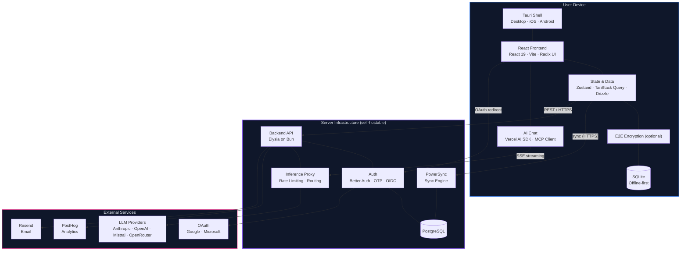

# Thunderbolt Architecture

> **Boundary key:** Blue = on-device · Purple = server · Pink = third-party SaaS

## Key Architectural Properties

- **Offline-first**: Local SQLite is the source of truth. The app works without network.
- **Cross-platform**: A single React codebase runs in Tauri on desktop (macOS, Linux, Windows) and mobile (iOS, Android).
- **Model-agnostic**: LLM calls route through the backend inference proxy, supporting Claude, GPT, Mistral, and OpenRouter.
- **Self-hostable**: The entire server stack (backend, PostgreSQL, PowerSync, Keycloak) runs via Docker Compose.
- **E2E Encrypted (optional)**: When enabled, data is encrypted before leaving the device and the server stores only ciphertext. See [E2E Encryption](./e2e-encryption.md) for details.

> ⚠️ **Note:** Multi-device sync is under active development and is subject to further refinements.

> ⚠️ **Note:** End-to-end encryption is under active development, has not yet undergone a cryptography audit, and is subject to further refinements.
