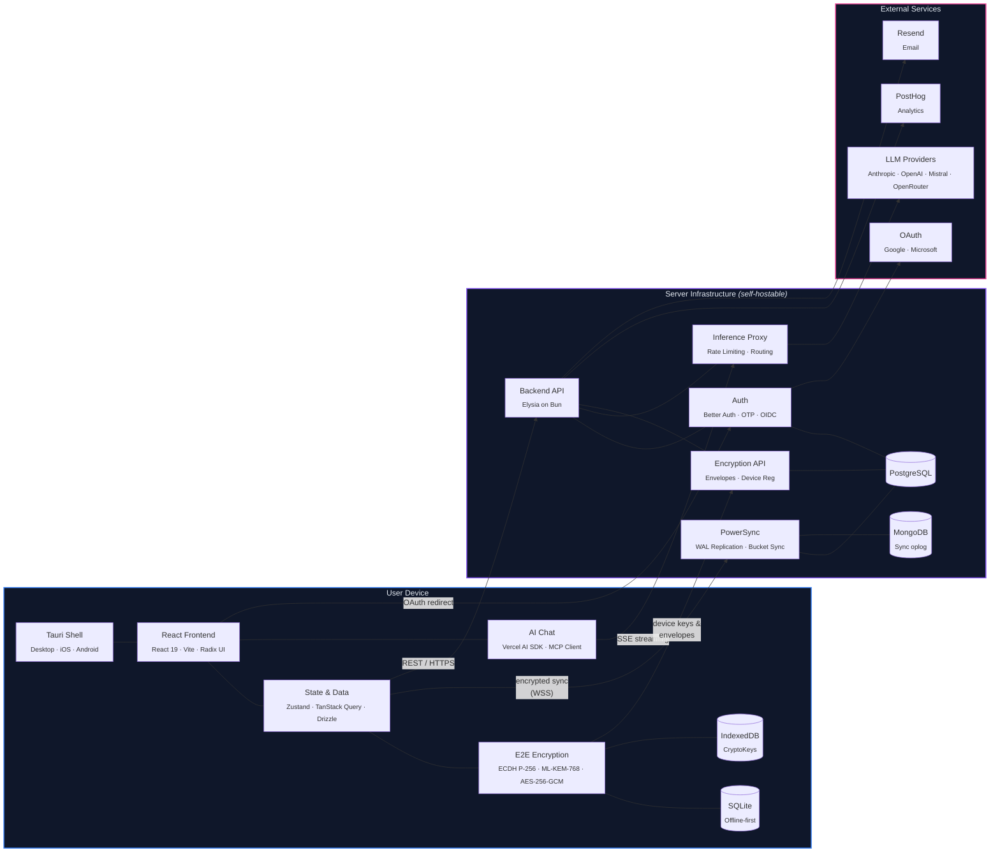
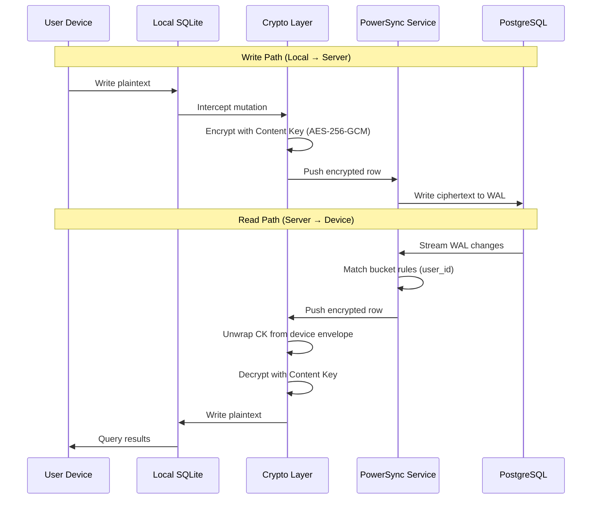
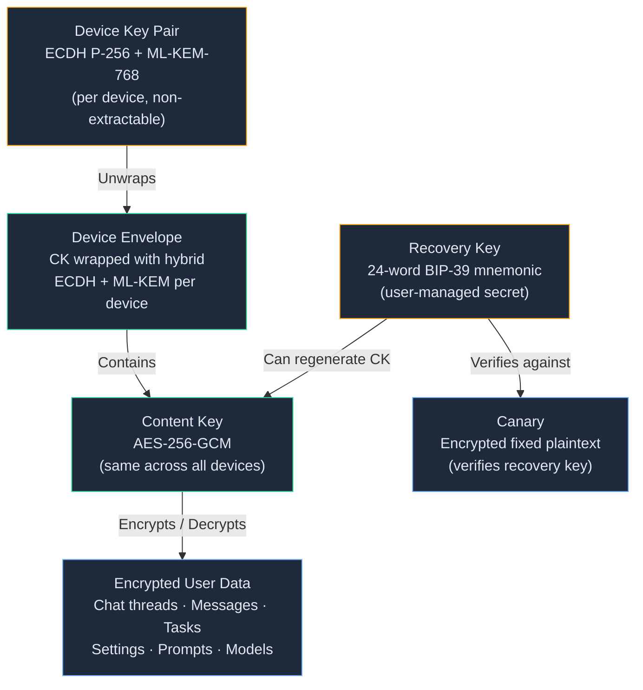

# Thunderbolt Architecture

> **Boundary key:** Blue = on-device (data never leaves unencrypted) · Purple = server (sees only ciphertext) · Pink = third-party SaaS

## Boundary Legend

| Boundary | Description |
|---|---|
| **User Device (Local)** | Everything runs on the user's machine. SQLite + CryptoKeys never leave the device. Private encryption keys are non-extractable. |
| **Network Boundary** | All traffic is HTTPS/WSS. Encrypted payloads pass through — the server cannot read user data. |
| **Server Infrastructure** | Self-hostable backend + sync engine + databases. Stores only ciphertext and public keys. |
| **External Services** | Third-party SaaS — LLM providers, OAuth, analytics, email, app updates. |

## Key Architectural Properties

- **Offline-first**: Local SQLite is the source of truth. The app works without network.
- **E2E Encrypted**: Data is encrypted with AES-256-GCM before leaving the device. The server stores only ciphertext. Private keys (ECDH P-256 + ML-KEM-768) are non-extractable from IndexedDB.
- **Server-blind**: The backend cannot decrypt user data — it lacks device private keys. The decryption chain is permanently broken at the envelope unwrap step.
- **Cross-platform**: A single React codebase runs in Tauri on desktop (macOS, Linux, Windows) and mobile (iOS, Android).
- **Model-agnostic**: LLM calls route through the backend inference proxy, supporting Claude, GPT, Mistral, and OpenRouter.
- **Self-hostable**: The entire server stack (backend, PostgreSQL, PowerSync, MongoDB, Keycloak) runs via Docker Compose.

## Data Sync Flow

## Encryption Key Hierarchy

