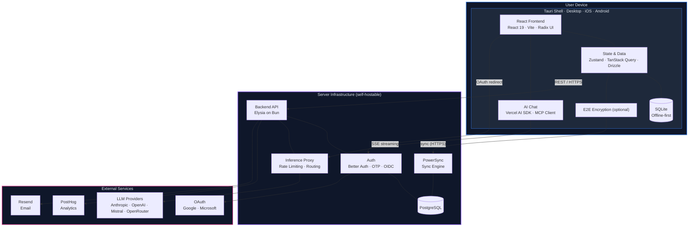

# Architecture

This page is a reference map of the Thunderbolt architecture — the components, how they talk to each other, and where each piece of state lives.

## Key Architecture Decisions

- **Offline-first.** Local SQLite is the source of truth. The app works without network.
- **Cross-platform.** A single React codebase runs in Tauri on desktop (macOS, Linux, Windows) and mobile (iOS, Android).
- **Model-agnostic.** LLM calls route through the backend inference proxy, supporting Claude, GPT, Mistral, OpenRouter, and any OpenAI-compatible endpoint.
- **Self-hostable.** The entire server stack (backend, PostgreSQL, PowerSync, Keycloak) runs via Docker Compose, Kubernetes, or Pulumi.
- **E2E encrypted (optional).** When enabled, data is encrypted before leaving the device and the server stores only ciphertext. See [E2E Encryption](./e2e-encryption.md).

## System Diagram

> **Boundary key:** Blue = on-device · Purple = server · Pink = third-party SaaS

## Client

A single React + Vite codebase targets:

- **Browser** — PWA with COEP/COOP headers for the sync SharedWorker
- **Desktop** — Tauri 2 on macOS, Windows, Linux; Rust shell for native integrations (notifications, haptics, deep links, auto-updater)
- **Mobile** — Tauri 2 for iOS and Android; same JS bundle, same UI

Local state is Zustand plus TanStack Query. Local persistence is SQLite — WA-SQLite in browsers, native SQLite under Tauri. Drizzle is the ORM in both places.

### The WebView Sidebar

On desktop and mobile (not web), link previews and third-party content open in an embedded Tauri `WebView` rather than the system browser. See [webview.md](../platform/webview.md) for the privacy trade-offs, incognito-mode behavior, and per-platform engine details.

### The Widget System

Assistant responses can embed rich interactive components (weather, link previews, stock charts, etc.) via XML-like tags that the parser extracts into `<WidgetRenderer />` calls. Widgets live in `src/widgets/` and register into a central registry — see [widgets.md](../platform/widgets.md).

## Backend

- **Elysia on Bun.** Bun starts in milliseconds; Elysia routes are typed end-to-end and publish an OpenAPI spec at `/v1/swagger` when `SWAGGER_ENABLED=true`.
- **Drizzle ORM.** Schema-first. Migrations are generated with `bun db generate` and tracked via `backend/drizzle/meta/_journal.json` — always verify new migrations land in the journal.
- **Better Auth.** Magic-link (OTP), Google/Microsoft OAuth, and OIDC — same session layer across all flows. Challenge tokens are used for device registration.
- **React Email + Resend.** Transactional email templates live in `backend/src/emails/` as typed React components and are sent via Resend.
- **OpenTelemetry.** Optional OTLP traces when `OTEL_EXPORTER_OTLP_ENDPOINT` is set.

### Route Prefixes

| Prefix              | Purpose                                                         |
| ------------------- | --------------------------------------------------------------- |
| `/api/auth/*`       | Better Auth flows (OAuth, OIDC, magic-link, session)            |
| `/v1/account/*`     | Account deletion, device registration, revocation, envelopes    |
| `/v1/powersync/*`   | Token issuance, client uploads                                  |
| `/v1/inference/*`   | Gated LLM inference calls (rate-limited, provider-agnostic)     |
| `/v1/pro/*`         | Backend proxies for widget data fetching (link preview, etc.)   |
| `/v1/mcp-proxy/*`   | Model Context Protocol pass-through                             |
| `/v1/posthog/*`     | Analytics event relay                                           |
| `/v1/swagger`       | OpenAPI spec (gated by `SWAGGER_ENABLED`)                       |

### Dev-Time Database

Backend tests and local dev can run against [PGLite](https://pglite.dev) — a browser/Node-embedded Postgres — via `bun run db:dev`, which serves data out of `.pglite/data`. Production uses real PostgreSQL.

## Sync

PowerSync keeps a full copy of the user's data on every device. Writes go to local SQLite first; deltas stream between SQLite and the backend's PostgreSQL. The backend issues short-lived JWTs that PowerSync accepts.

### Two Sync Paths

There are two distinct sync pipelines depending on the runtime:

| Runtime                     | Path                                          | Why                                                                 |
| --------------------------- | --------------------------------------------- | ------------------------------------------------------------------- |
| Chrome · Edge · Firefox     | Custom **SharedWorker** with transformers     | Shares one sync connection across tabs; runs E2E crypto in-worker   |
| Safari · iOS · Tauri        | Main-thread transformer pipeline              | OPFSCoopSyncVFS doesn't support SharedWorker; Tauri blocks it too   |

Both pipelines end with decrypted data in local SQLite — the interception happens in a different execution context. Full rationale + file map in [powersync-sync-middleware.md](./powersync-sync-middleware.md).

### The `powersync-web-internal` Alias

The custom SharedWorker extends `SharedSyncImplementation`, an `@internal` class inside `@powersync/web`. `vite.config.ts` exposes it via a `powersync-web-internal` alias pointing at `node_modules/@powersync/web/lib/src`. When you upgrade `@powersync/web`, verify the class still exists at that path — a breaking change there will not produce a TypeScript error.

### Schema Split

- **Application schema** — `users`, `accounts`, `sessions`, `challenges`, `envelopes`, `devices`, waitlist. Freely indexed.
- **Synced schema** — tables in `shared/powersync-tables.ts`. Minimal indexes (primary key + one `user_id` index), no foreign keys. Some tables use composite primary keys `(id, user_id)` or `(key, user_id)` so defaults can be seeded with the same id for every user. See [composite-primary-keys-and-default-data.md](./composite-primary-keys-and-default-data.md).

## Third-Party Services

| Service      | Role                                                   | Replaceable?                          |
| ------------ | ------------------------------------------------------ | ------------------------------------- |
| PowerSync    | Client-server sync                                     | Self-hostable via Docker              |
| PostgreSQL   | Source of truth for everything                         | No                                    |
| Keycloak     | Default OIDC provider in the self-hosted stack         | Yes — any OIDC-compliant IdP          |
| Resend       | Transactional email delivery                           | Swap for any SMTP/provider            |
| PostHog      | In-app analytics (opt-in)                              | Optional                              |
| AI providers | Anthropic, OpenAI, Mistral, Fireworks, OpenRouter, and any OpenAI-compatible endpoint | Bring your own |

## Build and Release

- **Web / enterprise** — Vite build → nginx (COEP/COOP/CORP headers set in the frontend Dockerfile).
- **Desktop** — `bun tauri build`; signed installers per platform. See [RELEASE.md](../RELEASE.md).
- **Mobile** — iOS to TestFlight, Android to Play Store Internal Track via the `release.yml` workflow.

## Further Reading

- [Multi-Device Sync](./multi-device-sync.md) — the sync pipeline in more depth.
- [End-to-End Encryption](./e2e-encryption.md) — key hierarchy and device approval.
- [Quick Start](../development/quick-start.md) and [Testing](../development/testing.md) — schema rules, tests, the things that bite.
