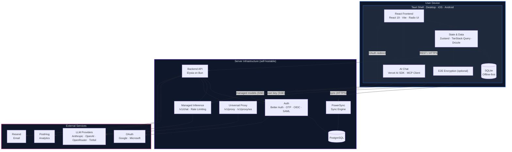

# Architecture

This page is a reference map of the Thunderbolt architecture — the components, how they talk to each other, and where each piece of state lives. Every subsystem also has a page of its own; the [Subsystem Map](#subsystem-map) at the end of this page groups them and says which question each one answers.

## Key Architecture Decisions

- **Offline-first.** Local SQLite is the source of truth. The app works without network.
- **Cross-platform.** A single React codebase runs in Tauri on desktop (macOS, Linux, Windows) and mobile (iOS, Android).
- **Model-agnostic.** A model row names one of six providers — `anthropic`, `openai`, `openrouter`, `tinfoil`, `custom` (any OpenAI-compatible endpoint), or the backend's own `thunderbolt` catalog (`src/settings/models/use-add-model-form.ts`). Bring-your-own-key calls are relayed by the universal proxy at `/v1/proxy`, which maps caller headers to `X-Proxy-Passthrough-*` and forwards the caller's own credentials (`src/lib/proxy-fetch.ts`); a Tauri build compiled with the `native_fetch` Cargo feature calls the upstream directly instead when its `proxy_enabled` toggle is off, but that feature defaults to off and no build in this repo passes it, so every shipped build proxies ([tauri-shell.md](./tauri-shell.md#the-native_fetch-cargo-feature)). The managed catalog served by the backend itself is a separate, much smaller path (`/v1/chat/*`).
- **Self-hostable.** The entire server stack (backend, PostgreSQL, PowerSync, Keycloak) runs via Docker Compose, Kubernetes, or Pulumi.
- **E2E encrypted (optional).** When enabled, data is encrypted before leaving the device and the server stores only ciphertext. See [E2E Encryption](./e2e-encryption.md).

## System Diagram

```mermaid
graph TB
  subgraph LOCAL["User Device"]
    subgraph TAURI["Tauri Shell · Desktop · iOS · Android"]
      UI["React Frontend<br/>React 19 · Vite · Radix UI"]
      STATE["State & Data<br/>Zustand · TanStack Query · Drizzle"]
      AI["AI Chat<br/>Vercel AI SDK · MCP Client"]
      CRYPTO["E2E Encryption (optional)"]
      SQLITE[("SQLite<br/>Offline-first")]

      UI --- STATE
      UI --- AI
      STATE --- SQLITE
      STATE --- CRYPTO
    end
  end

  subgraph SERVER["Server Infrastructure (self-hostable)"]
    direction LR
    API["Backend API<br/>Elysia on Bun"]
    AUTH["Auth<br/>Better Auth · OTP · OIDC · SAML"]
    PROXY["Universal Proxy<br/>/v1/proxy · /v1/proxy/ws"]
    INFERENCE["Managed Inference<br/>/v1/chat · Rate Limiting"]
    PS["PowerSync<br/>Sync Engine"]
    PG[("PostgreSQL")]

    API --- AUTH
    API --- INFERENCE
    API --- PROXY
    PS --- PG
    AUTH --- PG
  end

  subgraph EXTERNAL["External Services"]
    direction LR
    LLM["LLM Providers<br/>Anthropic · OpenAI · OpenRouter · Tinfoil"]
    OAUTH["OAuth<br/>Google · Microsoft"]
    POSTHOG["PostHog<br/>Analytics"]
    RESEND["Resend<br/>Email"]
  end

  CRYPTO -- "sync (HTTPS)" --> PS
  STATE -- "REST / HTTPS" --> API
  AI -- "own key (SSE)" --> PROXY
  AI -- "managed models (SSE)" --> INFERENCE
  UI -- "OAuth redirect" --> AUTH

  PROXY --> LLM
  INFERENCE --> LLM
  AUTH --> OAUTH
  API --> POSTHOG
  API --> RESEND

  style LOCAL fill:#0f172a,stroke:#3b82f6,stroke-width:2px,color:#e2e8f0
  style TAURI fill:#1e293b,stroke:#3b82f6,stroke-width:1px,color:#e2e8f0
  style SERVER fill:#0f172a,stroke:#8b5cf6,stroke-width:2px,color:#e2e8f0
  style EXTERNAL fill:#0f172a,stroke:#ec4899,stroke-width:2px,color:#e2e8f0
```

> **Boundary key:** Blue = on-device · Purple = server · Pink = third-party SaaS

## Client

A single React + Vite codebase targets:

- **Browser** — Vite build served by nginx; COEP `credentialless` plus COOP `same-origin` supply the cross-origin isolation that `SharedArrayBuffer` and the OPFS sync VFS need (`deploy/config/security-headers.conf`)
- **Desktop** — Tauri 2 on macOS, Windows, Linux; Rust shell for native integrations (deep links, haptics, auto-updater, single-instance focus, plus commands for the OAuth loopback server and the `thunderbolt` CLI installer — see the plugin and command list in `src-tauri/src/lib.rs`)
- **Mobile** — Tauri 2 for iOS and Android; same JS bundle, same UI

Startup order — open the database, decide whether to wait for sync, seed and reconcile defaults, run data migrations, build the HTTP client — is one function, documented in [app-initialization.md](./app-initialization.md). The send path that follows is [chat-runtime.md](./chat-runtime.md), and the Rust side of the desktop and mobile builds is [tauri-shell.md](./tauri-shell.md).

Local state is Zustand plus TanStack Query. Local persistence is WA-SQLite everywhere, including under Tauri — there is no native SQLite adapter. The `safari-tauri` config in `src/db/powersync/database.ts` opens the database with `OPFSCoopSyncVFS` where OPFS is available and falls back to `IDBBatchAtomicVFS` where it is not (WebKitGTK on Tauri Linux). Drizzle is the ORM on top.

### The WebView Sidebar

On desktop and mobile (not web), link previews and third-party content open in an embedded Tauri `WebView` rather than the system browser. See [webview.md](../features/webview.md) for the privacy trade-offs, incognito-mode behavior, and per-platform engine details.

### The Widget System

Assistant responses can embed rich interactive components (weather forecasts, link previews, maps, citations) via XML-like tags that the parser extracts into `<WidgetRenderer />` calls. Widgets live in `src/widgets/` and register into a central registry — see [widgets.md](../features/widgets.md).

## Backend

- **Elysia on Bun.** Bun starts in milliseconds; Elysia routes are typed end-to-end and publish an OpenAPI spec at `/v1/swagger` when `SWAGGER_ENABLED=true`.
- **Drizzle ORM.** Schema-first. Migrations are generated with `bun db generate` and tracked via `backend/drizzle/meta/_journal.json` — always verify new migrations land in the journal.
- **Better Auth.** Magic-link (OTP), Google/Microsoft OAuth, and OIDC or SAML SSO (`AUTH_MODE`) — same session layer across all flows, mounted at `basePath: '/v1/api/auth'`. A challenge token gates the email-OTP sign-in path only: `POST /v1/waitlist/join` issues it, the client replays it as `x-challenge-token`, and the before-hook in `backend/src/auth/auth.ts` rejects the sign-in without a valid one. Device identity is a separate mechanism — an `x-device-id` header read on `/v1/powersync/token` and the device routes.
- **React Email + Resend.** Transactional email templates live in `backend/src/emails/` as typed React components and are sent via Resend.
- **OpenTelemetry.** Optional OTLP traces when `OTEL_EXPORTER_OTLP_ENDPOINT` is set.

### Route Prefixes

The table below is the one-line-per-prefix view. [backend-api-surface.md](./backend-api-surface.md) is the full inventory — per route: owning module, auth mode, rate-limit tier, and whether it bypasses the version gate.

Every group below is mounted on one Elysia app with `prefix: '/v1'` (`backend/src/index.ts`), so the `/v1` in each path comes from the mount, not from the plugin. Route groups that declare no prefix of their own — encryption, preview, search, locations, usage receipts — therefore land at the top of `/v1`.

| Prefix                                      | Purpose                                                                                                                                |
| ------------------------------------------- | -------------------------------------------------------------------------------------------------------------------------------------- |
| `/v1/api/auth/*`                            | Better Auth flows (OAuth, OIDC/SAML SSO, email-OTP, session, CLI device grant, API keys, opt-in anonymous sessions)                    |
| `/v1/auth/google/*`, `/v1/auth/microsoft/*` | Confidential-client OAuth token exchange and refresh for the Google and Microsoft integrations, so the client secret stays server-side |
| `/v1/auth/oidc/config`                      | Expected OIDC issuer origin for redirect validation (mounted only in `oidc` mode)                                                      |
| `/v1/config`                                | Unauthenticated bootstrap config — feature flags the client needs before sign-in, plus the OTA default-models payload                  |
| `/v1/health`, `/v1/health/*`                | Liveness, plus token-gated deep probes for database, PowerSync, email, and models                                                      |
| `/v1/waitlist/*`                            | Waitlist join; issues the OTP challenge token                                                                                          |
| `/v1/account/*`                             | Account deletion, CLI device registration/logout, device revocation                                                                    |
| `/v1/devices/*`, `/v1/encryption`           | E2EE device registration, approval/deny, envelope exchange, node-id attestation, allowlist, canary                                     |
| `/v1/powersync/*`                           | Sync JWT issuance (`/token`) and client write upload (`/upload`)                                                                       |
| `/v1/chat/*`                                | Managed inference — `/completions` (OpenAI-shaped) and `/v1/messages` (Anthropic Messages-shaped)                                      |
| `/v1/inference-usage/receipts`              | Signed usage receipts for managed inference                                                                                            |
| `/v1/tinfoil/*`                             | Confidential-compute inference pass-through                                                                                            |
| `/v1/proxy`, `/v1/proxy/ws`                 | Universal upstream proxy and WebSocket relay — hosted-mode egress for BYOK LLM, MCP, and page fetches                                  |
| `/v1/pro/fetch-content`                     | Exa page-content extraction                                                                                                            |
| `/v1/search`                                | Exa web search                                                                                                                         |
| `/v1/preview`                               | Link-preview metadata (POST, so target URLs stay out of access logs)                                                                   |
| `/v1/locations`                             | Geocoding lookup and lookup by id                                                                                                      |
| `/v1/agents`, `/v1/haystack/*`              | Remote agent discovery, managed-agent file fetch, and the managed-ACP WebSocket at `/v1/haystack/ws`                                   |
| `/v1/debug-transcripts/*`                   | Debug transcript upload, plus the server-to-server `/intake` endpoint                                                                  |
| `/v1/posthog/*`                             | Analytics event relay                                                                                                                  |
| `/v1/swagger`                               | OpenAPI spec (gated by `SWAGGER_ENABLED`)                                                                                              |

There is no `/v1/inference` and no `/v1/mcp-proxy`: managed inference is `/v1/chat`, and MCP rides the universal proxy like every other upstream (`e2e/proxy-mcp.spec.ts` asserts the absence of an MCP-specific path).

A global middleware (`createAppVersionMiddleware`) enforces a minimum client version across all `/v1` routes: when `MIN_APP_VERSION` is set, below-minimum clients get a `426 Upgrade Required` unless the path matches `appVersionExemptPrefixes` (`backend/src/middleware/app-version.ts`) — today `/v1/config`, `/v1/health`, `/static`, `/v1/api/auth/sso`, `/v1/api/auth/device`, `/v1/posthog`, `/v1/proxy/ws`, and `/v1/debug-transcripts/intake`. The gate is fail-closed, so a new browser-redirect or header-less route must be added to that list or it will 426 as soon as the gate is enabled.

### Dev-Time Database

Backend tests and local dev can run against [PGLite](https://pglite.dev) — a browser/Node-embedded Postgres — via `bun run db:dev`, which serves data out of `.pglite/data`. Production uses real PostgreSQL.

## Sync

PowerSync keeps a full copy of the user's data on every device. Writes go to local SQLite first; deltas stream between SQLite and the backend's PostgreSQL. The backend issues short-lived JWTs that PowerSync accepts.

Reads and writes are authorized by different credentials: downloads by the sync JWT and the service's sync rules, uploads by the ordinary app session and a per-operation gate in `applyOperation` — see [powersync-upload-authorization.md](./powersync-upload-authorization.md).

### Two Sync Paths

There are two distinct sync pipelines depending on the runtime:

| Runtime                 | Path                                                                        | Why                                                                                                                                 |
| ----------------------- | --------------------------------------------------------------------------- | ----------------------------------------------------------------------------------------------------------------------------------- |
| Chrome · Edge · Firefox | Custom **SharedWorker** (`ThunderboltSharedSyncImplementation`)             | Shares one sync connection across tabs; runs E2E crypto in-worker                                                                   |
| Safari · iOS · Tauri    | **Dedicated Worker** hosting the same `ThunderboltSharedSyncImplementation` | `OPFSCoopSyncVFS` and `tauri://` rule out a SharedWorker, so `enableMultiTabs: true` drives a dedicated Worker over Comlink instead |

Both pipelines run the transformer inside a worker and end with decrypted data in local SQLite; only the worker _kind_ differs. Full rationale + file map in [powersync-sync-middleware.md](./powersync-sync-middleware.md).

### The `powersync-web-internal` Alias

`ThunderboltSharedSyncImplementation` — the class both workers above host — extends `SharedSyncImplementation`, an `@internal` class inside `@powersync/web`. `vite.config.ts` exposes it via a `powersync-web-internal` alias pointing at `node_modules/@powersync/web/lib/src`. When you upgrade `@powersync/web`, verify the class still exists at that path — a breaking change there will not produce a TypeScript error.

### Schema Split

- **Application schema** — the Postgres `public` schema: Better Auth's `user`, `session`, `account`, `verification`, `sso_provider`, `device_code`, `apikey`, plus `envelopes`, `encryption_metadata`, `otp_challenge`, `waitlist`, `rate_limits`, inference usage, and debug transcripts (`backend/src/db/`). Freely indexed.
- **Synced schema** — the tables listed in `shared/powersync-tables.ts`, mirrored server-side in the Postgres `powersync` schema (`backend/src/db/powersync-schema.ts`). Minimal indexes (primary key + one `user_id` index) and no foreign keys between synced tables — the only reference each one carries is `user_id` cascading back to `user`. Some tables use composite primary keys `(id, user_id)` or `(key, user_id)` so defaults can be seeded with the same id for every user. See [composite-primary-keys-and-default-data.md](./composite-primary-keys-and-default-data.md).

## Third-Party Services

| Service      | Role                                                                       | Replaceable?                 |
| ------------ | -------------------------------------------------------------------------- | ---------------------------- |
| PowerSync    | Client-server sync                                                         | Self-hostable via Docker     |
| PostgreSQL   | Server-side store behind PowerSync and Better Auth                         | No                           |
| Keycloak     | Default OIDC provider in the self-hosted stack                             | Yes — any OIDC-compliant IdP |
| Resend       | Transactional email delivery                                               | Swap for any SMTP/provider   |
| PostHog      | In-app analytics (opt-in)                                                  | Optional                     |
| AI providers | Anthropic, OpenAI, OpenRouter, Tinfoil, and any OpenAI-compatible endpoint | Bring your own               |

## Build and Release

- **Web / enterprise** — Vite build → nginx (`deploy/docker/frontend.Dockerfile`). The COEP/COOP and other security headers live in `deploy/config/security-headers.conf`, included from every `location` block in `deploy/config/nginx.conf.template` — nginx drops a parent's `add_header` set as soon as a child location declares one of its own.
- **Desktop** — `bun tauri build`; signed installers per platform. See [RELEASE.md](../../RELEASE.md).
- **Mobile** — iOS to TestFlight, Android to Play Store Internal Track via the `release.yml` workflow.

## Subsystem Map

One page per subsystem, grouped by where it sits. Each line states the question that page answers.

### Client runtime

- [App Initialization](./app-initialization.md) — what runs between "the bundle finished evaluating" and the first rendered chat, and why the step order is load-bearing.
- [Chat Runtime](./chat-runtime.md) — one send end to end: engine routing, spend budgets and retries, Stop, and the three persistence writers.
- [The Content View](./content-view.md) — the panel beside the chat: four kinds of content, one slot, one state machine.
- [Chat Attachments](./attachments.md) — how a file rides a turn without its bytes ever being stored off-device.
- [Search and the Command Palette](./search.md) — the `Cmd/Ctrl+K` box: a local FTS5 index, keyword-only, offline, no search server.
- [Voice Mode](./voice.md) — spoken turns over the ordinary send path: the loop, barge-in, and the engine contract.
- [Projects](./projects.md) — inherited instructions, cross-chat search, assistant notes, and why there is no document set.
- [Settings and Preferences](./settings-and-preferences.md) — synced `settings` row or per-device Zustand store: which one a new setting belongs in.
- [Client Auth and Session](./client-auth-and-session.md) — where the credential lives on the device, and how a session survives a reload, an offline boot, or a second tab.
- [Sign-in and the Waitlist](./sign-in-and-waitlist.md) — the single endpoint that signs a user up, signs them in, or queues them, seen from both ends.
- [Widgets](../features/widgets.md) — how assistant output becomes an interactive component.

### Data and sync

- [Multi-Device Sync](./multi-device-sync.md) — the sync pipeline in more depth.
- [PowerSync Sync Middleware](./powersync-sync-middleware.md) — the transform-before-write pipeline and the two worker paths that host it.
- [PowerSync, Accounts and Devices](./powersync-account-devices.md) — synced-table requirements, token issuance, device identity, and the steps to add a table.
- [PowerSync Upload Authorization](./powersync-upload-authorization.md) — which client writes the server accepts, and which columns of an accepted write it applies.
- [The Data Access Layer](./data-access-layer.md) — the rules for adding a query on either side: SQLite views on the client, real tables on the server.
- [Reconciled Defaults](./reconciled-defaults.md) — how a changed shipped default reaches every device without clobbering user edits or ping-ponging.
- [Composite Primary Keys and Default Data](./composite-primary-keys-and-default-data.md) — why some synced tables key on `(id, user_id)` or `(key, user_id)`.
- [Client Data Migrations](./client-data-migrations.md) — why content migrations have to run on the device, and how to add one.
- [End-to-End Encryption](./e2e-encryption.md) — key hierarchy, device approval, and which columns are ciphertext server-side.
- [Delete Account and Revoke Device](./delete-account-and-revoke-device.md) — the hard-delete paths, and what the account's other devices do.
- [User Data Export Format](./export-format.md) — the versioned JSON snapshot behind Export My Data, and what import reads.

### Agents, models and tools

- [System Prompt, Tools and Citations](./prompt-and-tools.md) — what a built-in model actually sees on a send, and the `[N]` citation contract behind each badge.
- [Skills](./skills.md) — reusable instruction rows, `/slug` tokens, and the prompt-budget reason the catalog is separate from the body.
- [HTML Artifacts](./artifacts.md) — model-authored HTML running on the user's device, and the sandbox and verification around it.
- [MCP Connections](./mcp-connections.md) — adding an MCP server: data model, the three transports, OAuth, and the silent-breakage cases.
- [ACP Agents](./acp-agents.md) — handing a thread to an external coding agent: the three agent kinds, transport routing, and the iroh trust model.
- [The In-Browser Agent Harness](./in-browser-agent-harness.md) — the Pi agent and virtual filesystem behind the built-in agent, and its per-thread workspace jail.

### Backend surface

- [Backend API Surface](./backend-api-surface.md) — per route: owning module, auth mode, rate-limit tier, version-gate exemption, and the checklist for adding one.
- [Managed Inference](./managed-inference.md) — the deployment-paid path: admission and pricing, the usage ledger, and the confidential tier's signed receipts.
- [The Universal Proxy](./universal-proxy.md) — the endpoint pair every BYOK, MCP and ACP upstream goes through, and which client fetch to reach for.
- [Debug Transcripts](./debug-transcripts.md) — the opt-in full-fidelity chat report: what is captured, what is redacted, and the size limits.
- [Self-hosting the iroh relay](./iroh-relay-self-hosting.md) — what a relay does for the CLI↔app bridge, and how to run your own.

### Native shell

- [The Tauri Shell](./tauri-shell.md) — the invoke commands, the capability manifest, per-platform window setup, and the frontend platform predicates.
- [The WebView Sidebar](../features/webview.md) — privacy trade-offs, incognito behavior, and per-platform engines for embedded third-party content.

### Code structure and contracts

- [The `shared/` Module](./shared-module.md) — what earns a place in `shared/`, and how three runtimes with three tsconfigs import it.
- [Frontend Structure](../development/frontend-structure.md) — where a new file goes in `src/`, and the `components/ui/` conventions.
- [Error Handling](../development/error-handling.md) — the three boundaries allowed to catch, and why everything else throws.
- [Integrations](../development/integrations.md) — how a connected third-party account turns into tools the model can call.

### Beyond this directory

- [Quick Start](../development/quick-start.md) and [Testing](../development/testing.md) — schema rules, tests, the things that bite.
- [Authentication](../../backend/docs/authentication.md) and [Rate limiting](../../backend/docs/rate-limiting.md) — server-side session minting, and the limiter tiers behind the routes above.
- [CI and Preview Environments](../development/ci-and-previews.md) — which check verifies what, and which preview URL answers which question.
- [Self-hosting configuration](../self-hosting/configuration.md) — every environment variable named on this page.
