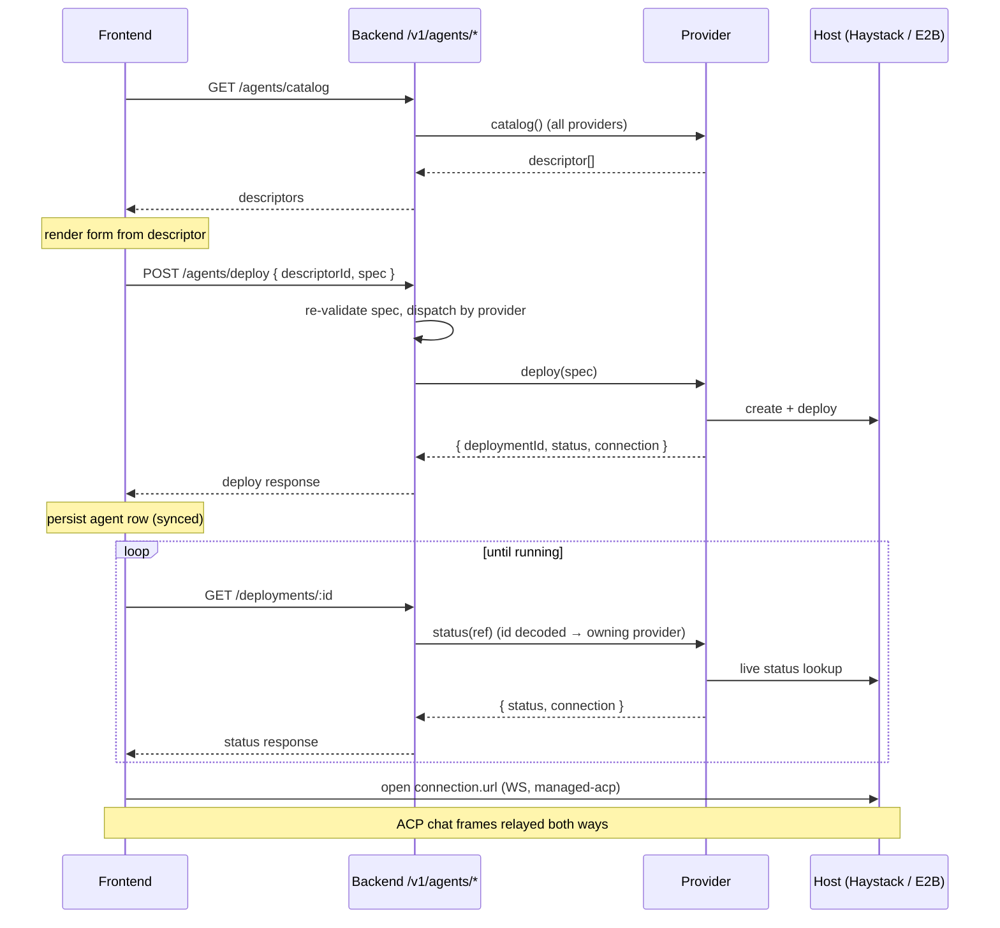

# Agent Deployment (descriptor-driven)

How Thunderbolt lets a user pick an agent kind from a catalog, fill in a short
form, and get a running, chat-ready agent — without the frontend knowing
anything provider-specific. Haystack (managed RAG pipelines) and OpenClaw
(sandboxed coding agent on E2B) are the two providers today.

## Mental model

Three moving parts, one wire contract:

1. **Descriptor** — "an agent-creation form as data." The backend curates it
   (steps → fields → widgets); the frontend renders it over a fixed widget set.
   Defined once in `shared/agent-descriptors.ts` and imported by both ends.
2. **Provider** — the adapter for one agent "kind" (`haystack`, `openclaw`, …).
   It supplies the descriptor and does the real work of `deploy` / `status` /
   `undeploy`. Providers self-register into a module-level registry.
3. **Generic endpoints** — `/v1/agents/*` never mention a provider by name. They
   collect descriptors from every provider, and route a deploy/status/undeploy
   back to the owning provider via the `provider` field on the descriptor.

The key consequence: **adding a new agent kind means writing one provider file
and registering it. No changes to the frontend or the shared endpoints.**

There is also **no server-side deployment table.** A deployment is identified by
a self-describing `deploymentId = "<provider>:<ref>"`. Status is polled _live_
from the host (Haystack / E2B) on demand; the client persists the agent row
itself (in the synced `agents` table).



## Endpoints

All live under the `/v1` prefix. All require an authenticated, **non-anonymous**
user (bearer token). Anonymous sessions get `403 ANONYMOUS_DISCOVERY_FORBIDDEN`;
missing/invalid auth gets `401`.

| Method   | Path                          | Purpose                                                                    | Gated by            |
| -------- | ----------------------------- | -------------------------------------------------------------------------- | ------------------- |
| `GET`    | `/agents`                     | Discovery — every provider's `list()`, flattened. Powers the agent picker. | always on           |
| `GET`    | `/agents/catalog`             | Deployable descriptors (every provider's `catalog()`).                     | `AGENT_DEPLOY=true` |
| `POST`   | `/agents/deploy`              | Deploy an instance from a submitted spec.                                  | `AGENT_DEPLOY=true` |
| `GET`    | `/agents/deployments/:id`     | Live status for a deployment id.                                           | `AGENT_DEPLOY=true` |
| `DELETE` | `/agents/deployments/:id`     | Trigger teardown (undeploy) of a deployment.                               | `AGENT_DEPLOY=true` |
| `WS`     | `/haystack/ws?pipeline=<ref>` | Haystack chat wire (ACP ↔ Haystack SSE, translated in-backend).            | Haystack configured |
| `WS`     | `/openclaw/ws?instance=<ref>` | OpenClaw chat wire (dumb ACP relay to the sandbox).                        | OpenClaw configured |

When `AGENT_DEPLOY` is off, the three deploy endpoints return `404` — the
frontend treats that identically to "nothing to deploy" and hides the flow.

### WebSocket auth

Browsers can't set `Authorization` headers on `new WebSocket()`, so the chat
wires authenticate via a **subprotocol**: the client offers
`["thunderbolt.v1", "thunderbolt.bearer.<base64url(token)>"]`. The server echoes
only the carrier (`thunderbolt.v1`) and validates the bearer once on `open()`.
This is attached automatically **only for `managed-acp` agents**
(`src/acp/transports/index.ts`). A user-added custom agent (`remote-acp`) never
sends Thunderbolt credentials — so pasting a `/openclaw/ws` or `/haystack/ws`
URL into "Add custom agent" will fail auth by design. Deployed agents get typed
`managed-acp` and connect correctly.

### Ownership model

`open()` on both chat wires requires a non-anonymous bearer — but _which_
deployments a caller may reach differs by provider, and a new provider must
choose deliberately:

- **OpenClaw — per-user.** The sandbox is stamped with the deployer's `userId`
  in E2B metadata (the source of truth; no backend table). `status`, `undeploy`,
  and the WS relay all re-check it, so a forged or foreign `?instance=` resolves
  to `gone` / a no-op / a closed socket without ever touching the sandbox.
- **Haystack — workspace-shared.** Pipelines live in one Deepset workspace; any
  authenticated user in the deployment can reach a pipeline by name (no per-user
  gate). Appropriate for shared RAG pipelines — but don't assume it when your
  host resource is per-tenant.

### Errors

All error bodies are `{ error: string, code?: string }`.

| Status | When                                       | Body                                                                    |
| ------ | ------------------------------------------ | ----------------------------------------------------------------------- |
| `401`  | missing / invalid bearer                   | `{ error: 'Unauthorized' }`                                             |
| `403`  | anonymous session                          | `{ error: 'Forbidden', code: 'ANONYMOUS_DISCOVERY_FORBIDDEN' }`         |
| `404`  | `AGENT_DEPLOY` off (catalog/deploy/status) | `{ error: 'Not found' }`                                                |
| `400`  | malformed deploy body                      | `{ error: 'Invalid deploy request' }`                                   |
| `404`  | `descriptorId` not in catalog              | `{ error: 'Unknown agent' }`                                            |
| `409`  | stale `schemaVersion`                      | `{ error: 'Schema version mismatch', code: 'SCHEMA_VERSION_MISMATCH' }` |
| `404`  | provider exposes no `deploy`               | `{ error: 'Agent is not deployable' }`                                  |
| `400`  | spec fails server re-validation            | `{ error: 'Invalid spec' }`                                             |
| `400`  | malformed deployment id                    | `{ error: 'Invalid deployment id' }`                                    |
| `404`  | unknown provider in the id                 | `{ error: 'Unknown provider' }`                                         |

## Contracts

Deploy-flow types live in `shared/agent-descriptors.ts` (zod-validated on both
ends); the discovery shape is in `shared/acp-types.ts`.

**`GET /agents`** → `AgentDiscoveryResponse` — the always-on picker feed
(built-in agent + every provider's `list()`).

```ts
{ version: '1', agents: RemoteAgentDescriptor[], allowCustomAgents: boolean }
// RemoteAgentDescriptor:
{ id, name, type: 'remote-acp' | 'managed-acp', transport: 'websocket', url, description, icon, isSystem: 0 | 1 }
```

`ENABLED_AGENTS` (comma-separated ids) narrows the list; `allowCustomAgents`
mirrors `ALLOW_CUSTOM_AGENTS` so the UI can hide "+ Add Custom Agent".

**`GET /agents/catalog`** → `AgentCatalogResponse`

```ts
{ version: '1', descriptors: AgentDescriptor[] }
```

```jsonc
// real: both providers configured (descriptor.steps trimmed for brevity)
{
  "version": "1",
  "descriptors": [
    {
      "id": "haystack",
      "provider": "haystack",
      "name": "Haystack RAG agent",
      "schemaVersion": 1,
      "action": "deploy",
      "steps": [
        /* … */
      ],
    },
    {
      "id": "openclaw",
      "provider": "openclaw",
      "name": "OpenClaw",
      "schemaVersion": 1,
      "action": "deploy",
      "steps": [
        /* … */
      ],
    },
  ],
}
```

**`POST /agents/deploy`** — body `DeployRequest`, response `DeployResponse`

```ts
// request
{ descriptorId: string, schemaVersion: number, spec: Record<string, string | string[]> }
// response
{ deploymentId: string, status: DeployStatus, connection: AgentConnection | null }
```

```jsonc
// real: Haystack — user typed a name; deploys fast, usually already running
// request
{ "descriptorId": "haystack", "schemaVersion": 1, "spec": { "name": "My research agent" } }
// response
{ "deploymentId": "haystack:tb-my-research-agent-lx9f2k", "status": "running",
  "connection": { "url": "ws://localhost:8000/v1/haystack/ws?pipeline=tb-my-research-agent-lx9f2k", "transport": "websocket" } }
```

```jsonc
// real: OpenClaw — one-click (name defaulted); returns pending, boots async
// request
{ "descriptorId": "openclaw", "schemaVersion": 1, "spec": { "name": "OpenClaw" } }
// response
{ "deploymentId": "openclaw:e2b:iq8fy72dtcwkosdu0jpu", "status": "pending",
  "connection": { "url": "ws://localhost:8000/v1/openclaw/ws?instance=e2b%3Aiq8fy72dtcwkosdu0jpu", "transport": "websocket" } }
```

**`GET /agents/deployments/:id`** → `DeploymentStatusResponse`

```ts
{ deploymentId: string, status: DeployStatus, detail?: string | null, connection?: AgentConnection | null }
```

```jsonc
// real: OpenClaw sandbox now answering ACP (id URL-encoded in the path)
{
  "deploymentId": "openclaw:e2b:iq8fy72dtcwkosdu0jpu",
  "status": "running",
  "connection": {
    "url": "ws://localhost:8000/v1/openclaw/ws?instance=e2b%3Aiq8fy72dtcwkosdu0jpu",
    "transport": "websocket",
  },
}
```

**`DELETE /agents/deployments/:id`** → `UndeployResponse` — triggers teardown on
the host and returns once accepted (does not block on full unmount).

```ts
{ deploymentId: string, status: DeployStatus }   // status is `gone` once teardown is triggered
```

```jsonc
// real: undeploy an OpenClaw sandbox (id URL-encoded in the path)
{ "deploymentId": "openclaw:e2b:iq8fy72dtcwkosdu0jpu", "status": "gone" }
```

Teardown is **idempotent**: a foreign / already-gone / malformed deployment is a
no-op that still returns `gone`, so the client can always drop its local row. A
genuine trigger failure (host/network error) surfaces as a `5xx` — the client
keeps the row and shows an error rather than orphaning a live deployment.

The full curl walkthroughs for these live in [Worked examples](#worked-examples).

Shared value types:

```ts
type DeployStatus = 'pending' | 'running' | 'failed' | 'gone'
type AgentConnection = { url: string; transport: 'websocket' }
```

- `pending` — spinning up. `running` — usable (includes a Haystack pipeline that
  auto-idled; it wakes on query). `failed` — deploy failed. `gone` — deleted /
  undeployed on the host; unusable, redeploy or remove.
- `connection` is the deterministic chat endpoint. It's returned **up front on
  deploy** (even while `pending`) so the client can persist the agent without
  waiting. `status` returns it only once `running`.

**`deploymentId` codec** (`backend/src/agents/deployment-id.ts`):
`"<provider>:<ref>"`, split on the **first** `:` so the ref may itself contain
colons. Examples: `haystack:tb-my-agent-lx9f2` and `openclaw:e2b:iq8fy72dt...`
(here provider=`openclaw`, ref=`e2b:iq8fy72dt...`).

## Descriptors

A descriptor is a small tree: `steps[] → fields[] → widget`. A spec is the flat
`{ fieldKey: value }` map the user fills in.

```ts
type AgentDescriptor = {
  id: string // unique catalog entry
  provider: string // registry key → which provider handles deploy/status
  name: string
  description: string | null
  icon: string | null
  schemaVersion: number // bump on any field change; guards stale submissions
  action: 'deploy' | 'connect'
  steps: { id; title; description?; fields: AgentField[] }[]
}

type AgentField = {
  key: string
  label: string
  widget: 'text' | 'password' | 'textarea' | 'select' | 'option-cards' | 'gallery' | 'file-upload'
  required?: boolean
  placeholder?: string
  helpText?: string
  default?: string | string[]
  visibleWhen?: { field: string; equals: string } // conditional field
  source?: // options for select/cards/gallery
    { kind: 'inline'; options: { value; label; description?; icon? }[] } | { kind: 'fetched'; sourceId: string } // resolved live by the FE (see note)
  multiple?: boolean // collects a list (always true for gallery)
  maxLength?: number
}
```

Notes:

- The **widget set is closed.** The renderer only knows those seven; you can't
  ship a new widget from the backend. Adding one is a frontend change.
- **`visibleWhen`** shows a field only when another field currently equals a
  value — e.g. reveal "Custom model" only when `mode === 'byo'`.
- **`source: 'fetched'`** is defined in the contract but **not yet wired** —
  there is no `/agents/:id/sources/:sourceId` route today. Use `'inline'` until
  it lands. (It's the future home for live option lists like Haystack indexes.)
- **One-click:** if a descriptor's defaults already satisfy every visible
  required field, the UI can deploy it in a single click (`isOneClickEligible`).
  OpenClaw's only field is optional with a default → one-click.

### The two live descriptors

**Haystack** (`backend/src/haystack/provider.ts`) — curated: the owner fixes the
pipeline template via env, so the user only names the agent.

```ts
{
  id: 'haystack', provider: 'haystack',
  name: 'Haystack RAG agent',
  description: 'Deploy a Haystack pipeline as a chat agent.',
  icon: 'file-search', schemaVersion: 1, action: 'deploy',
  steps: [{ id: 'basics', title: 'Name your agent', fields: [
    { key: 'name', label: 'Name', widget: 'text', required: true, maxLength: 60, placeholder: 'My research agent' },
  ]}],
}
```

**OpenClaw** (`backend/src/openclaw/provider.ts`) — owner-managed one-click: the
backend fixes the sandbox provider + model via env, so the single name field is
optional with a default.

```ts
{
  id: 'openclaw', provider: 'openclaw',
  name: 'OpenClaw',
  description: 'Deploy a sandboxed OpenClaw coding agent.',
  icon: 'terminal', schemaVersion: 1, action: 'deploy',
  steps: [{ id: 'basics', title: 'Name your agent', fields: [
    { key: 'name', label: 'Name', widget: 'text', required: false, maxLength: 60, placeholder: 'OpenClaw', default: 'OpenClaw' },
  ]}],
}
```

## Worked examples

Assume local dev (`http://localhost:8000`), `AGENT_DEPLOY=true`, and a valid
bearer token in `$TOKEN`.

### List the catalog

```bash
curl -s http://localhost:8000/v1/agents/catalog -H "Authorization: Bearer $TOKEN"
```

```json
{
  "version": "1",
  "descriptors": [
    {
      "id": "haystack",
      "provider": "haystack",
      "name": "Haystack RAG agent",
      "schemaVersion": 1,
      "action": "deploy",
      "steps": [
        /* … */
      ]
    },
    {
      "id": "openclaw",
      "provider": "openclaw",
      "name": "OpenClaw",
      "schemaVersion": 1,
      "action": "deploy",
      "steps": [
        /* … */
      ]
    }
  ]
}
```

A provider only appears when it's configured (Haystack needs
`HAYSTACK_TEMPLATE_PIPELINE`; OpenClaw needs `E2B_API_KEY` + `OPENCLAW_MODEL` +
`OPENCLAW_OPENROUTER_API_KEY`).

### Deploy Haystack

```bash
curl -s -X POST http://localhost:8000/v1/agents/deploy \
  -H "Authorization: Bearer $TOKEN" -H 'Content-Type: application/json' \
  -d '{ "descriptorId": "haystack", "schemaVersion": 1, "spec": { "name": "My research agent" } }'
```

```json
{
  "deploymentId": "haystack:tb-my-research-agent-lx9f2k",
  "status": "running",
  "connection": {
    "url": "ws://localhost:8000/v1/haystack/ws?pipeline=tb-my-research-agent-lx9f2k",
    "transport": "websocket"
  }
}
```

The provider slugged the name into a `tb-`namespaced pipeline ref, cloned the
template YAML on Haystack, deployed it, and handed back the deterministic chat
URL. Haystack deploys are quick, so status is often `running` immediately.

### Deploy OpenClaw

```bash
curl -s -X POST http://localhost:8000/v1/agents/deploy \
  -H "Authorization: Bearer $TOKEN" -H 'Content-Type: application/json' \
  -d '{ "descriptorId": "openclaw", "schemaVersion": 1, "spec": { "name": "OpenClaw" } }'
```

```json
{
  "deploymentId": "openclaw:e2b:iq8fy72dtcwkosdu0jpu",
  "status": "pending",
  "connection": {
    "url": "ws://localhost:8000/v1/openclaw/ws?instance=e2b%3Aiq8fy72dtcwkosdu0jpu",
    "transport": "websocket"
  }
}
```

Deploy returns **immediately** — it creates the E2B sandbox and launches the
agent daemon, but does _not_ block on the ~15–30s boot. Status starts `pending`;
the client polls until the sandbox's ACP endpoint answers. The sandbox is
stamped with the caller's `userId` in E2B metadata (the ownership source of
truth — no backend table).

### Poll status

```bash
# note the deploymentId is URL-encoded in the path
curl -s "http://localhost:8000/v1/agents/deployments/openclaw%3Ae2b%3Aiq8fy72dtcwkosdu0jpu" \
  -H "Authorization: Bearer $TOKEN"
```

```json
{
  "deploymentId": "openclaw:e2b:iq8fy72dtcwkosdu0jpu",
  "status": "running",
  "connection": {
    "url": "ws://localhost:8000/v1/openclaw/ws?instance=e2b%3Aiq8fy72dtcwkosdu0jpu",
    "transport": "websocket"
  }
}
```

`status` re-derives the state live from the host each call: Haystack pipeline
status for Haystack; an ACP-readiness probe against the sandbox for OpenClaw.
For OpenClaw the lookup is **owner-gated** — a deployment id whose sandbox
metadata `userId` doesn't match the caller resolves to `gone`, never leaking
another user's sandbox.

### Undeploy (delete)

```bash
curl -s -X DELETE "http://localhost:8000/v1/agents/deployments/openclaw%3Ae2b%3Aiq8fy72dtcwkosdu0jpu" \
  -H "Authorization: Bearer $TOKEN"
```

```json
{ "deploymentId": "openclaw:e2b:iq8fy72dtcwkosdu0jpu", "status": "gone" }
```

The frontend calls this when the user deletes a deployed agent: it undeploys
first (Haystack deletes the `tb-*` pipeline clone; OpenClaw kills the sandbox,
owner-gated) and only soft-deletes the local agent row once the teardown is
accepted. A `5xx` keeps the row and surfaces the error (see the idempotency note
under [Contracts](#contracts)).

## Adding a new provider

Everything provider-specific lives in one module. Concretely (mirror
`backend/src/openclaw/`):

1. **Implement `AgentProvider`** (`backend/src/agents/discovery.ts`):

   ```ts
   export const createFooProvider = (deps: FooDeps = {}): AgentProvider => ({
     id: 'foo', // === descriptor.provider
     list: () => [], // discovery descriptors, or [] if deploy-only
     catalog: ({ settings }) => (isConfigured(settings) ? [fooDescriptor] : []),
     deploy: async (spec, { request, settings, userId }) => {
       const ref = await provisionOnHost(spec, settings, userId)
       return {
         deploymentId: encodeDeploymentId('foo', ref),
         status: 'pending',
         connection: {
           url: buildWebSocketUrl(request, `foo/ws?instance=${encodeURIComponent(ref)}`),
           transport: 'websocket',
         },
       }
     },
     status: async (ref, { request, settings, userId }) => {
       /* live host lookup → DeploymentStatusResponse */
     },
     undeploy: async (ref, { settings, userId }) => {
       await tearDownOnHost(ref, settings, userId) // owner-gate + idempotent (no-op if foreign/gone)
       return { deploymentId: encodeDeploymentId('foo', ref), status: 'gone' }
     },
   })
   ```

   - `catalog`/`deploy`/`status`/`undeploy` are all optional. Omit `deploy`/`status`/
     `undeploy` for a discovery-only provider; omit `catalog` if it isn't deployable.
   - Make `undeploy` **idempotent** — a foreign or already-gone ref should no-op and
     still return `gone`, so the client can drop its local row. Reserve throwing for
     a real host/network failure (the FE keeps the row and shows an error).
   - Use `encodeDeploymentId(providerId, ref)` and `buildWebSocketUrl(request, …)`
     (both from `@/agents`) so ids and URLs stay consistent and prod/dev
     (`wss`/`ws`) both work.
   - A `deploy` that returns `pending` + connection up front is the norm — it
     keeps the endpoint fast and lets the status badge drive readiness.

2. **Register + mount.** Register in your route module's factory
   (`registerAgentProvider(createFooProvider(deps))`) — it's idempotent on `id`.
   Then mount that route group in `backend/src/index.ts`:

   ```ts
   .use(createFooRoutes(settings, auth))
   ```

   The generic `/v1/agents/*` endpoints pick it up automatically — no edits
   there.

3. **Add its chat wire** if it needs one — a `WS /v1/foo/ws` route that
   authenticates with `authorizeWsBearer` and pipes ACP frames to the host. Copy
   `backend/src/openclaw/routes.ts` (dumb relay, sandbox already speaks ACP) or
   `backend/src/haystack/routes.ts` (translates ACP ↔ the host's own protocol).

4. **Add settings** in `backend/src/config/settings.ts` (schema + env mapping),
   the test fixture in `backend/src/test-utils/settings.ts`, and document the env
   vars in `backend/.env.example`. Gate `catalog()` on them so an unconfigured
   provider stays invisible.

That's it — the frontend renders your descriptor and drives deploy/status/undeploy
with zero provider knowledge.

## Adding a field to a descriptor

To collect one more input (say a BYO model for Haystack):

1. **Add the field** to a step in the descriptor, using an existing widget:

   ```ts
   { key: 'model', label: 'Model', widget: 'select', required: true,
     source: { kind: 'inline', options: [
       { value: 'gpt-4o', label: 'GPT-4o' },
       { value: 'claude-sonnet', label: 'Claude Sonnet' },
     ]}}
   ```

2. **Bump `schemaVersion`** on that descriptor. A deploy submitted against an
   old version is rejected with `409 SCHEMA_VERSION_MISMATCH`, so stale clients
   fail loudly instead of silently deploying with missing fields.

3. **Read it in `deploy()`** from `spec.model` and pass it to the host.

You do **not** write a validator: the backend rebuilds a zod schema from the
descriptor (`specSchemaForDescriptor`) and re-validates every submitted spec
before `deploy()` runs — required-ness is enforced only for fields that are
_visible_ under the submitted values (so a hidden `visibleWhen` field is never
demanded). The frontend uses the same rebuilt schema via `zodResolver`, so both
ends agree with no duplicated rules. The client is never trusted; the server
re-validation is the authority.

For conditional inputs, add `visibleWhen`; for a list input, set `multiple: true`
(or use the `gallery` widget). To source options from a live host, you'll need
the `source: 'fetched'` endpoint, which isn't implemented yet (see the
descriptor note above).

## Current limitations

- **`source: 'fetched'` is contract-only** — no resolver endpoint yet; use
  `'inline'` options.
- **`deploymentIdForAgent` (frontend) reconstructs the id by parsing the stored
  URL** — `?pipeline=` → `haystack:<ref>`, `?instance=` → `openclaw:<ref>`. This
  works for both providers today, but a new managed provider that uses a
  different query param must be added here until the `provider` field lands on the
  agents row and the id can be read off it directly (see the TODO in
  `src/api/agent-deploy.ts`).

## Source map

| Concern                               | File                                                        |
| ------------------------------------- | ----------------------------------------------------------- |
| Wire contract + validator             | `shared/agent-descriptors.ts`                               |
| Discovery response shape              | `shared/acp-types.ts`                                       |
| Generic endpoints                     | `backend/src/agents/routes.ts`                              |
| Provider seam + registry + URL helper | `backend/src/agents/discovery.ts`                           |
| Deployment id codec                   | `backend/src/agents/deployment-id.ts`                       |
| Haystack provider / chat wire         | `backend/src/haystack/{provider,routes}.ts`                 |
| OpenClaw provider / relay / E2B       | `backend/src/openclaw/{provider,routes,relay,e2b}.ts`       |
| WS bearer auth                        | `backend/src/auth/ws-bearer-auth.ts`, `shared/ws-bearer.ts` |
| Frontend deploy client                | `src/api/agent-deploy.ts`                                   |
| Frontend transport routing            | `src/acp/transports/index.ts`                               |
