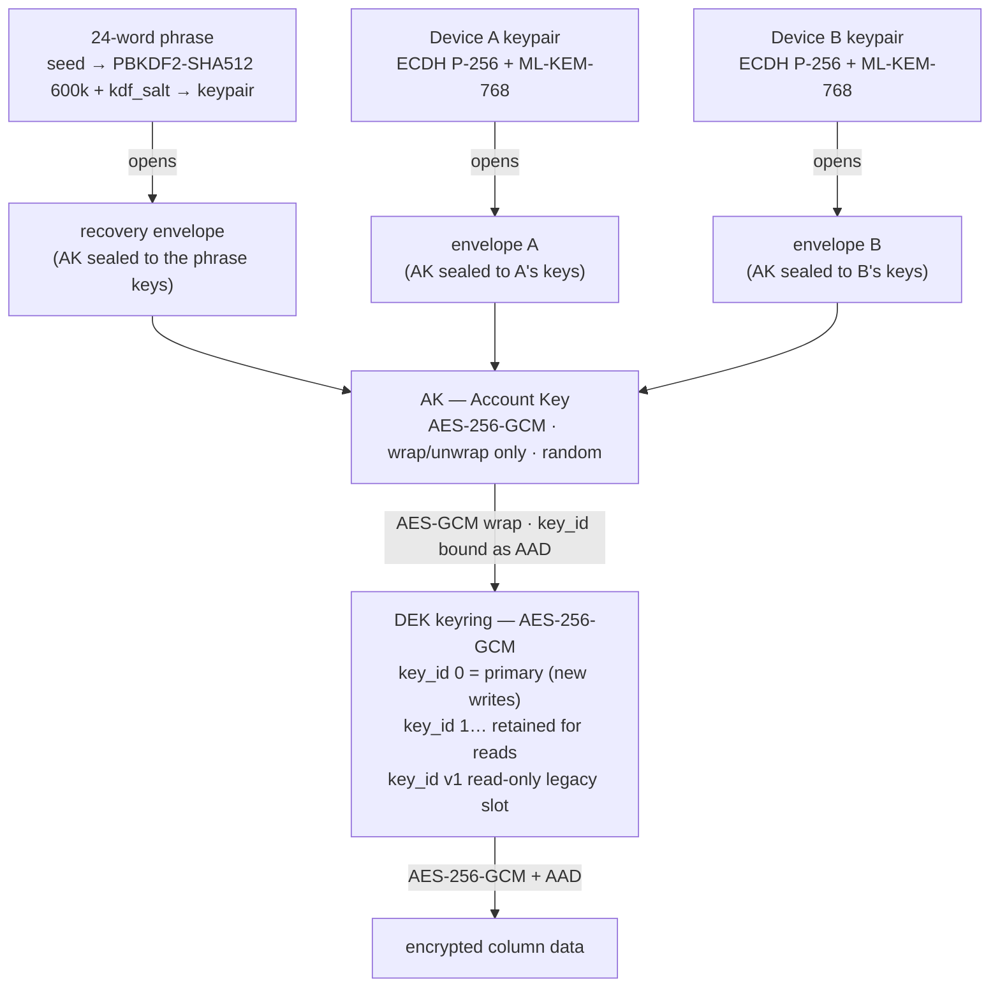
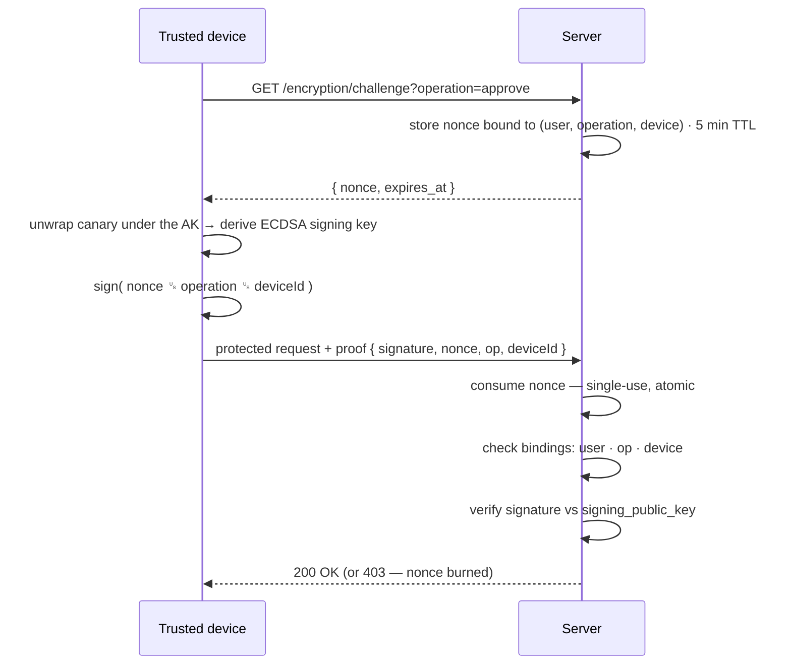
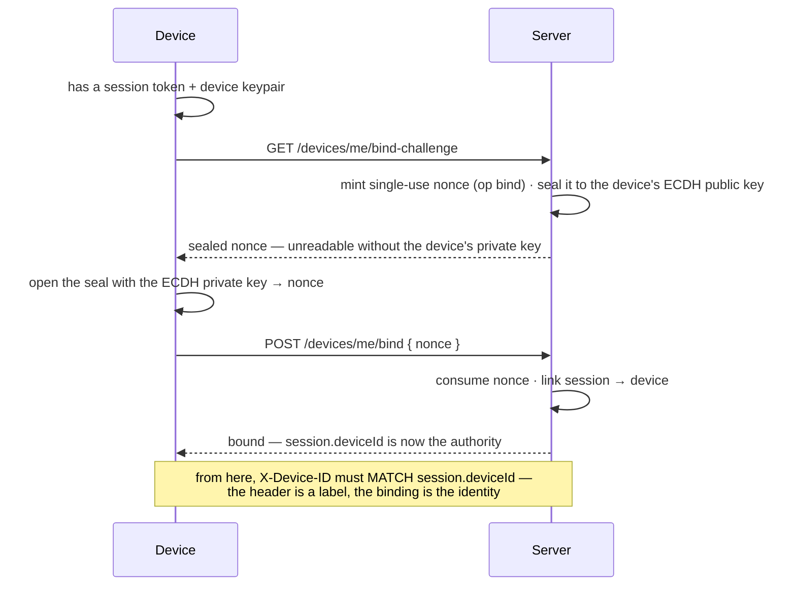
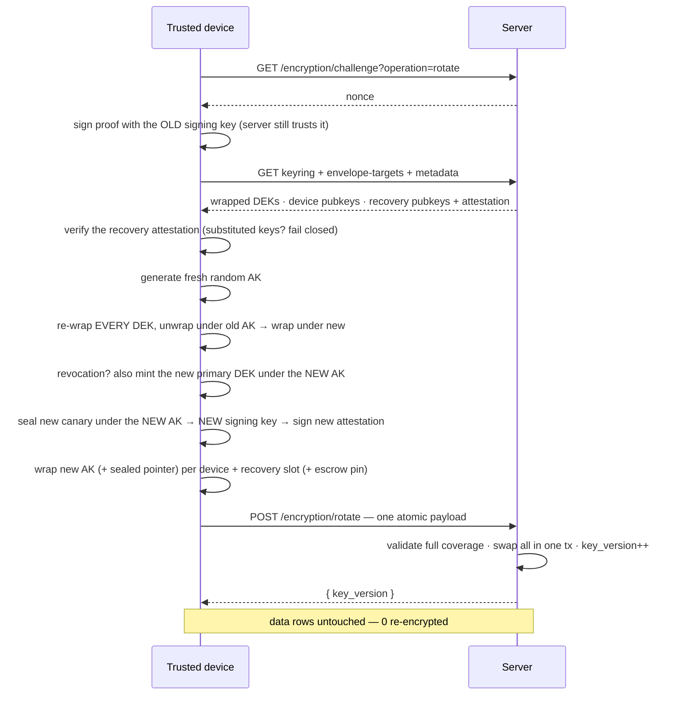
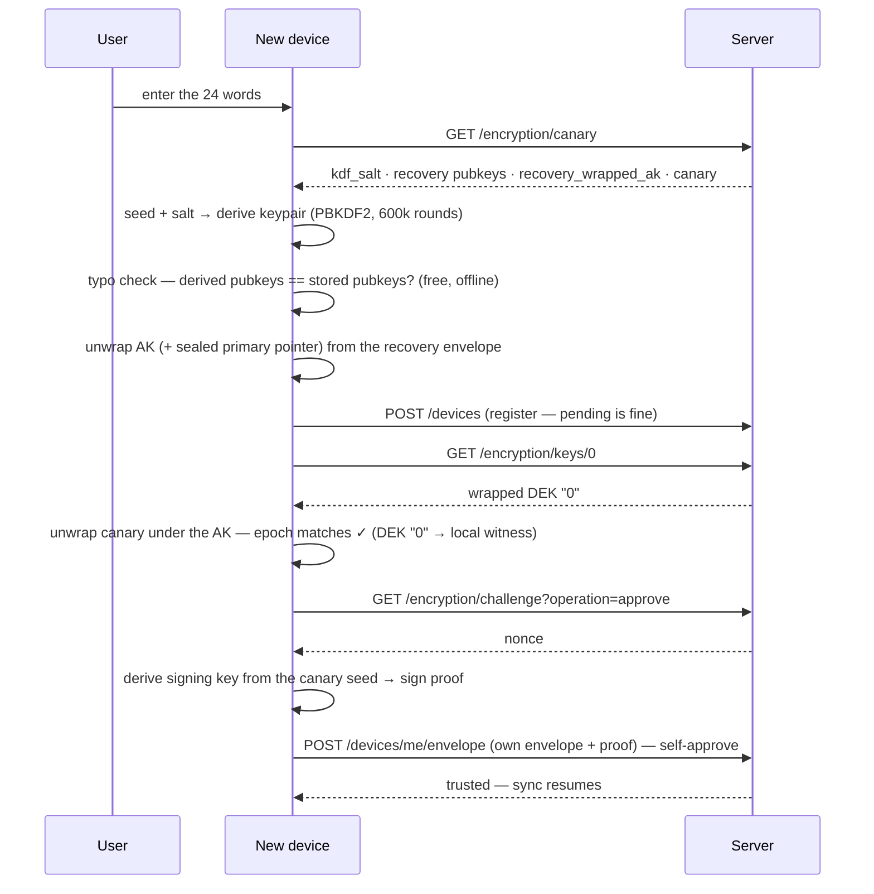
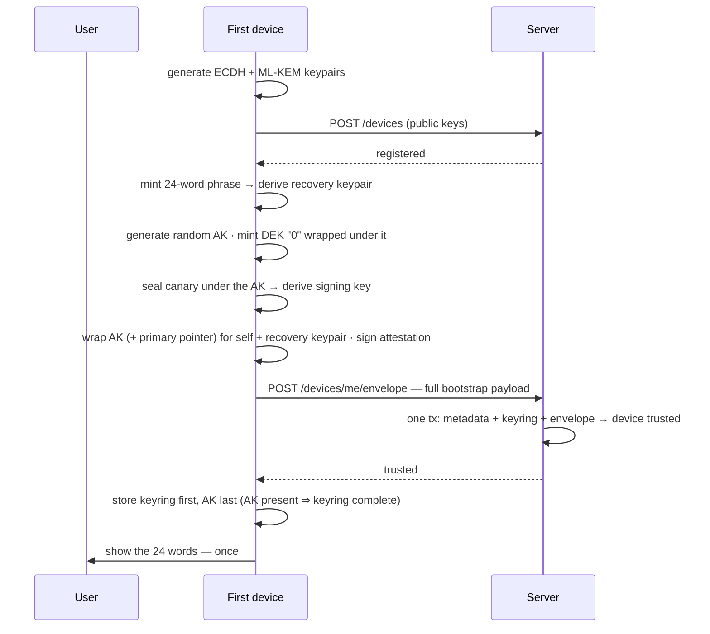
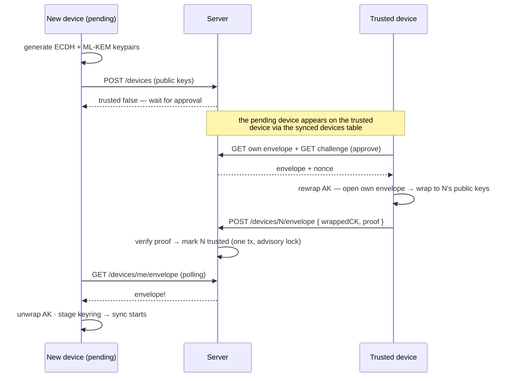
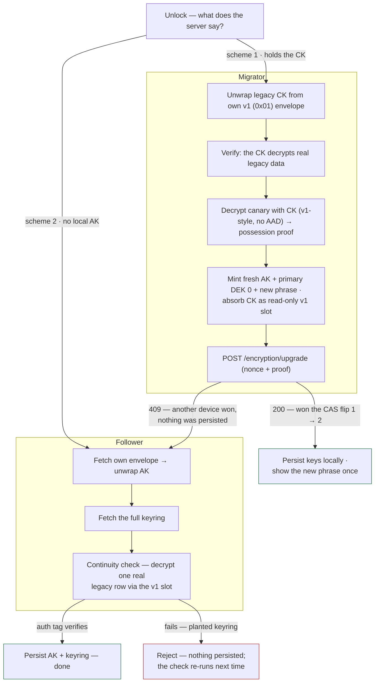

# End-to-End Encryption

> ⚠️ End-to-end encryption is in **Preview**. It has not yet undergone a cryptography audit and is subject to further refinements.

Thunderbolt provides zero-knowledge end-to-end encryption: all user data is encrypted client-side before sync and decrypted client-side after download. The server stores only ciphertext and wrapped keys — it cannot read user data even if compelled or breached.

This document describes **E2EE v2** — the AK/DEK key hierarchy with hybrid post-quantum device envelopes, AAD-bound versioned ciphertext, ECDSA challenge-response device management, and the **data-preserving v1 → v2 migration** — explained from first principles, then grounded in operations, endpoints, and examples. For the sync pipeline internals, see [powersync-sync-middleware.md](powersync-sync-middleware.md); for the adversary model and security claims, see [e2ee-threat-model.md](e2ee-threat-model.md).

---

## The big idea

Thunderbolt syncs data through a server (PowerSync + Postgres). With E2EE, the server only ever sees two kinds of things:

- **Ciphertext** — user data, already encrypted by the device before upload.
- **Wrapped keys** — encryption keys that are themselves encrypted ("wrapped") with other keys the server doesn't have.

So even if the server is hacked, subpoenaed, or malicious, it holds a pile of locked boxes and a pile of locked keys — and no way to open either. This is the "zero-knowledge" claim, and everything below exists to keep it true through the messy realities of multiple devices, lost devices, forgotten passwords, and future algorithm changes.

**E2EE is always on — there is no toggle.** There used to be a server flag (`E2EE_ENABLED`, served via `GET /v1/config`), and it was removed for a reason that sets the tone for this whole document: any switch the server controls is a switch a *malicious* server can flip. A lying server could serve "encryption is off" and quietly collect plaintext (the red team's `config-downgrade` finding). Whether an account is encrypted is now derived from things the server can't fake:

- **Client:** local key material is the authority. `needsSyncSetupWizard()` (`src/db/encryption/config.ts`) returns `true` until an AK plus at least one wrapped DEK exist locally, and `codec.encode` fails closed whenever setup has completed or an AK is present. The connector's canary probe (`GET /encryption/canary`) distinguishes a genuinely pre-E2EE account (404 → plaintext passthrough by design) from an unprovable state (offline/5xx → uploads deferred, download credentials withheld).
- **Backend:** the presence of an `encryption_metadata` row (`schemeVersion === 2`) marks the account encrypted; the upload backstop rejects plaintext in mapped columns for such accounts. Devices are never auto-trusted — every device must register via `POST /devices` and complete the envelope/trust flow before `GET /powersync/token` or `PUT /powersync/upload` succeed.

> [!NOTE]
> **One accepted trade-off up front:** the local SQLite database on the user's own device stores decrypted data. Encryption protects data *in transit and on the server*, not against someone who already controls the device. This is a documented deferral in the threat model.

### Configuration & rollout

- **Compatibility shim:** `GET /v1/config` still returns a hard-coded `e2eeEnabled: true`. Pre-cutover bundles gate `encodeForUpload` on that key, and `updateConfig` replaces the whole config object — omitting it would make a stale client read `undefined`, skip encryption, and upload plaintext into an account current clients treat as encrypted (permanently, since there is no re-encryption pass). The shim is safe to delete only once `MIN_APP_VERSION` is at or above the first always-on release, which 426s every client that still reads it.
- **Rolling out always-on E2EE** to a deployment where encryption was previously optional is a **hard cutover**: raise `MIN_APP_VERSION` past the first always-on release so stranded pre-cutover clients get a 426 instead of silently uploading plaintext. Rows written as plaintext before the cutover stay plaintext — dual-read passes them through indefinitely.
- **Migration gate (`MIN_APP_VERSION`):** the v1 → v2 rollout is likewise a hard cutover guarded by the app-version gate (`createAppVersionMiddleware`, mounted before auth in `backend/src/index.ts`). When set, every non-exempt `/v1` request from a below-minimum client (including `GET /v1/powersync/token`) is rejected with **426 Upgrade Required** — fail-closed, so a missing `X-App-Version` is also rejected. See [powersync-account-devices.md](powersync-account-devices.md) and [Migration](#migration-v1--v2-absorb--permanent-dual-read).

---

## The crypto toolbox

Every algorithm in the system does exactly one job, and the whole design is easier to follow once you know which tool does what:

| Algorithm | Job in one sentence | Used for |
| --- | --- | --- |
| **AES-256-GCM** | Encrypts data *and* stamps it with a tamper-proof seal (the "auth tag") — change one bit of the ciphertext and decryption fails instead of returning garbage. Its AAD input (see [wire format](#the-wire-format--aad)) glues a *label* into that seal. | User data, the canary, the ML-KEM secret at rest — *and all key wrapping inside the account*: the AK wraps each DEK with GCM, and the envelope payload is GCM-sealed. |
| **AES-KW** | A special AES mode designed to encrypt *other keys* ("Key Wrap") — deterministic, no IV, built-in integrity check. Its limitation: it takes no AAD, so it can't bind a label to what it wraps — exactly why Thunderbolt's key wrapping moved to GCM. | Only the [org-escrow envelope](#enterprise-key-escrow-poc) and legacy v1 envelopes. |
| **ECDH P-256** | Lets two parties who only know each other's *public* keys agree on a shared secret nobody else can compute. | Half of every device envelope; the escrow envelope; the bind handshake. |
| **ML-KEM-768** | The same "agree on a shared secret" job, with math a quantum computer can't break. | The other half of every device envelope ([details](#device-envelopes--post-quantum)). |
| **HKDF-SHA256** | Stretches secret material into one or more clean, purpose-labeled keys. Fast — for input that is already strong and random. | Combining the two envelope secrets into the sealing key; deriving the signing key from the canary seed. |
| **PBKDF2-SHA512** | Also derives a key from input — but *deliberately slow* (600,000 rounds), for input a human might type. | Recovery phrase → recovery keypair ([recovery](#the-recovery-key-a-device-made-of-words)). |
| **ECDSA P-256** | Digital signatures: sign with a private key; anyone with the public key can verify, nobody can forge. | Signing [nonce challenges](#nonce-challenges-proving-you-hold-the-keys) and the recovery attestation. |
| **SHA-256** | A one-way fingerprint — easy to compute, impossible to reverse. | The migration possession proof; key fingerprints. |

### Four concepts used everywhere

**Key derivation.** *Deriving* a key means computing it from input with a deterministic function: same input in, exact same key out, on any device. That's the opposite of *generating* a key, which is pure randomness. Both appear here, and the choice is always deliberate:

- **Derived** when two places must independently arrive at the same key with nothing to sync: the recovery keypair (derived from the 24 words — any device they're typed into gets the same keypair) and the signing keypair (derived from the canary seed — every current key-holder can sign).
- **Generated** (random) when the key must be *replaceable*: the AK and the DEKs are random precisely so they can be thrown away and re-minted without asking the user for a phrase.

**Salt.** A random, *non-secret* value mixed into a derivation. It changes the output completely without needing to be hidden. Thunderbolt's `kdf_salt` is 32 random bytes stored per account, mixed into the phrase → keypair derivation. Two things it buys: two users with the same phrase would still get different keys, and an attacker can't precompute a giant "phrase → key" lookup table — the salt makes every account its own puzzle, and each guess pays the full 600,000-round PBKDF2 cost. The salt lives on the server and is handed to any device that asks; a salt's job isn't to be secret, it's to make the derivation unique to this account.

**Wrapping vs. encrypting — why WebCrypto separates them.** "Wrapping a key" is just encrypting a key instead of a document — so why does WebCrypto have separate `wrapKey`/`unwrapKey` operations next to `encrypt`/`decrypt`? Because every `CryptoKey` carries a **usage list**, enforced by the browser itself. Thunderbolt's AK is created with usages `['wrapKey', 'unwrapKey']` — *only*. Call `encrypt()` with it and the browser throws, no matter what the calling code wants. This is a real security property: even if malicious script got hold of the AK handle, it could not use the AK to encrypt or decrypt a single byte of data — the AK can only open the key box. One key, one job, enforced by the platform.

**Non-extractable keys.** In WebCrypto, code never touches raw key bytes — it holds an opaque `CryptoKey` handle while the actual bytes live inside the browser's crypto engine. A key created with `extractable: false` makes that one-way permanent: `exportKey()` throws, forever. The key can be *used* (the browser does the math internally) but never *read*. Why it matters: a malicious script running in the page (XSS, a hostile extension) can call the same functions the app calls — but it cannot exfiltrate a non-extractable key. The AK, the DEKs, and the device's ECDH private key are all stored non-extractable in IndexedDB. The only exceptions are brief, in-memory moments where wrapping mathematically requires an extractable copy (initial setup, re-wrapping during rotation) — the extractable copy is used and dropped, and only a non-extractable re-import is ever persisted.

---

## The key hierarchy: AK and DEKs

There are two tiers of keys, and the split is the whole trick that makes rotation cheap:

| | |
| --- | --- |
| **AK — Account Key** | One AES-256-GCM key per account, usable **only for wrapping** (`wrapKey`/`unwrapKey` — the usage-list enforcement above: it physically cannot encrypt data). GCM rather than AES-KW so every wrap can carry AAD: each DEK is wrapped with its own `key_id` baked into the seal (`__kw␟<key_id>`), so a wrapped key can't be served under a different label. Randomly generated, never derived — which is exactly why it can be replaced at any time. |
| **DEK keyring** | Versioned AES-256-GCM Data Encryption Keys (`key_id` `"0"`, `"1"`, …). Exactly one is the **primary** (all new writes use it). Old DEKs are **kept forever** so old data always decrypts. A migrated account also carries a read-only `"v1"` slot (see [migration](#migration-v1--v2-absorb--permanent-dual-read)). A `key_id` is an unpadded decimal counter of at most 15 digits (`keyIdPattern`) — bounded so the "next id" arithmetic stays exact, see [Minting a DEK](#minting-a-dek). |

In plain words: the DEKs are the keys that actually lock the data. The AK is the master key to the box the DEKs live in. The server stores each DEK wrapped under the AK, and stores the AK wrapped separately for every device — so it holds every key and can open none of them.



Every path to the data goes: something you hold (device keys or the phrase) → your envelope → the AK → a DEK → the data. The server stores only the envelopes, the wrapped DEKs, and ciphertext. Every device independently walks the same ladder: unwrap *its own* envelope to get the AK, then unwrap the wrapped-DEK keyring under that AK. The recovery phrase is just one more rung on the same ladder — a "virtual device".

---

## Device envelopes & post-quantum

Each device generates two keypairs when it first registers: a classical **ECDH P-256** pair and a post-quantum **ML-KEM-768** pair. The private halves never leave the device; the public halves go to the server via `POST /v1/devices`. An **envelope** is the AK wrapped for exactly one device, using *both* keypairs together.

**Why "post-quantum" at all?** Today's public-key crypto (ECDH, RSA) rests on math problems that are hard for normal computers but — thanks to Shor's algorithm — *easy* for a large enough quantum computer. No such machine exists yet, but there's a real attack that starts today: **harvest now, decrypt later**. An adversary records encrypted traffic and stored envelopes now, then decrypts everything the day the machine exists. ML-KEM-768 is built on lattice problems, which no known quantum algorithm breaks — so envelopes protected by it stay sealed even in that future.

**How ML-KEM works.** ML-KEM is a **KEM** — a Key Encapsulation Mechanism. Unlike RSA, you can't encrypt a chosen message "to" a lattice public key. Instead: **encapsulate** — feed in the recipient's public key, get back a random **shared secret** plus a **ciphertext** (1088 bytes) that acts like a sealed hint. Only the holder of the matching secret key can **decapsulate** that ciphertext and recover the same shared secret. So the "ML-KEM secret key" a device keeps in IndexedDB is its decapsulation key. (Because ML-KEM secret keys are raw bytes — the noble JS library, not WebCrypto — they can't be made non-extractable like the ECDH key; instead they're encrypted at rest with an AES-GCM key derived from the device's own non-extractable ECDH keypair. Best available protection for material the platform can't hold natively.)

**The hybrid: belt and suspenders.** Wrapping the AK for a device runs *both* mechanisms and combines them:

1. ECDH: a fresh ephemeral P-256 key agrees a 32-byte shared secret with the device's ECDH public key.
2. ML-KEM: encapsulation against the device's ML-KEM public key yields another 32-byte shared secret plus the 1088-byte ciphertext.
3. HKDF mixes *both* secrets — with a salt binding both transcripts and the label `thunderbolt-hybrid-ak-seal-v2` — into one AES-GCM sealing key.
4. That key seals the payload: the raw AK **plus the current primary `key_id`**, together, in one GCM ciphertext:

```
[0x02][eph P-256 pubkey 65B][ML-KEM-768 ciphertext 1088B][iv 12B][AES-GCM( rawAK ‖ primary key_id )]
  └ version              └ classical half           └ PQ half            └ sealed payload + tag
```

(Base64 on the wire. Same combiner pattern as Signal's PQXDH. Implemented in `src/crypto/primitives.ts`.)

Because the sealing key needs *both* shared secrets, an attacker must break *both* ECDH *and* ML-KEM to open an envelope. If one falls — a quantum computer breaks ECDH, or a flaw is found in the young lattice math — the other still holds.

> [!IMPORTANT]
> **Why the primary `key_id` rides inside the seal:** "which DEK is primary" is a pointer the client would otherwise have to take on the server's word — and a lying server could serve an *older* pointer to roll a device back onto a retired key. Sealing the pointer next to the AK means the GCM tag covers the pair *(AK, primary)* jointly: whoever wrote the envelope (always a device that held the cleartext AK) vouched for that pointer, and a server that never holds a cleartext AK cannot re-pair the account's real AK with a pointer of its choosing — any byte it flips breaks the tag. This is also exactly why the seal is GCM and not AES-KW: KW wraps bare key material and takes no extra data, so a pointer appended outside it would have been malleable. The old `0x01` AES-KW envelope format is still *read* — but only to absorb the legacy CK during [v1 → v2 migration](#migration-v1--v2-absorb--permanent-dual-read).

> [!NOTE]
> **Naming debt in the code:** the envelope column and request field are still called `wrapped_ck` / `wrappedCK` — in v1 it carried a "Content Key". In v2 it carries the AK. The name was kept to avoid breaking the wire format; only the meaning changed.

---

## The wire format & AAD

Encrypted values are stored as plain strings inside normal database columns, marked by a prefix. A v2 value:

```
__enc : v2 : <key_id> : <iv base64> : <ciphertext base64>
  └ sentinel  └ format   └ which DEK  └ 12 B      └ AES-GCM output + auth tag
```

Segment by segment:

- **`__enc:`** — a sentinel so the codec can tell encrypted values from plain ones at a glance. Detection only; never trusted beyond parsing.
- **`v2` (format version)** — says *which recipe* produced this value, so the decoder knows how to read the rest. It's the dispatch switch: values without it are legacy v1 and take the v1 path. This little segment is also the door to [future algorithm changes](#what-lets-us-change-algorithms-later).
- **`key_id`** — names the DEK that encrypted this value. This is what makes DEK rotation free: every value permanently remembers its own key, so any device can pick the right DEK out of the keyring at read time, no matter how many times the primary changed since.
- **`iv` (initialization vector)** — 12 fresh random bytes chosen for *every single encryption*: the "starter" that makes AES-GCM produce a completely different ciphertext even when the same text is encrypted twice — without it, an observer could spot repeated values. The IV is not secret; it just has to be unique, which is why it's stored right next to the ciphertext.
- **`ciphertext`** — the encrypted bytes plus GCM's 16-byte auth tag (the tamper seal).

### AAD: gluing ciphertext to its cell

Every v2 encrypt and decrypt also binds **AAD** (Additional Authenticated Data):

```
AAD = table ␟ column ␟ row_id ␟ key_id     (␟ = U+001F unit separator)
```

The part that surprises people: **the AAD is never stored anywhere.** It isn't a secret and it isn't a derivation — it's simply *rebuilt from context, at runtime, on both sides*. When the upload encoder encrypts `chat_threads.title` for row `abc-123`, it knows all four facts from the write it's performing, so it assembles the AAD bytes and hands them to AES-GCM. GCM doesn't encrypt them — it folds them into the auth tag. Later, when the sync decoder receives a value destined for `chat_threads.title` of row `abc-123`, it knows the same four facts from *where the value is going*, rebuilds the identical bytes, and hands them to decrypt. If — and only if — both sides assembled the same bytes, the seal verifies.

Now imagine a malicious server swaps the ciphertexts of two rows. The bytes are perfectly valid ciphertext — but the decoder, decrypting "row B's title," rebuilds AAD with `row_id = B`, while the seal was made with `row_id = A`. Mismatch → decryption fails. The ciphertext is effectively glued to its exact cell: no moving between rows, columns, tables, or accounts, ever. Both sides build AAD through one shared helper (`encodeAAD` in `shared/e2ee-types.ts`), so they can never drift apart.

### Legacy v1 values

```
__enc:<iv-base64>:<ciphertext-base64>      no version, no key_id, no AAD
```

Rows written before the v2 migration keep this shape *forever* — decrypted in place through the read-only `"v1"` keyring slot, never rewritten in bulk. The codec is **dual-read, write-v2**: it reads both formats but only ever writes v2. `encode()` always encrypts (no `__enc:`-prefixed idempotency bypass); `isV2EncryptedValue` in `src/db/encryption/wire-format.ts` is the single classifier (a v1 IV is 16 base64 characters, so its second segment can never read as `v2` — no ambiguity).

### What gets encrypted

The single source of truth is `encryptedColumnsMap` in `shared/e2ee-types.ts`: user-authored content columns across `settings`, `chat_threads`, `chat_messages`, `tasks`, `models`, `prompts`, `triggers`, `model_profiles`, `devices`, `skills`, `projects`, and `agents`. It's shared with the backend on purpose: the frontend uses it to decide what to encrypt on upload, and the backend uses it to *reject plaintext* arriving in those columns for a v2 account. Adding a column to the map automatically enables download decryption, upload encryption, and server-side plaintext rejection — and the download side enforces it too (the [quarantine](#download-quarantine)). See [Adding a new encrypted column](#adding-a-new-encrypted-column).

---

## What lets us change algorithms later

Several small, deliberate design choices mean a future move to a new cipher or KEM never needs a big-bang re-encryption. Each is a *version label on a boundary*:

**1. The wire version segment.** The decoder dispatches on the segment after `__enc:`. Shipping a `v3` format with a different algorithm is just a new branch in the codec; every stored `v2` and `v1` value keeps decoding exactly as before, because each value carries its own recipe label.

**2. The key_id on every value.** New writes can move to a new key — and a new algorithm — *instantly*: mint a new keyring entry and flip the primary. Old data keeps its old key and old format, readable forever.

### Which key is primary

The pointer is one column, `primary_key_id` on `encryption_metadata`: written as `"0"` at first-device setup, changed only by the optional `newPrimaryKey` field on `POST /encryption/rotate` (there is deliberately no standalone "add a key" endpoint — see [Minting a DEK](#minting-a-dek)). But unlike every wrapped key, a pointer can't prove itself by unwrapping — it has to be believed. Three layers keep a served pointer honest:

- **Grammar.** Only a *mintable* id (unpadded decimal, ≤ 15 digits) is ever accepted as primary — checked when staging (`applyKeyring` skips a non-mintable pointer and keeps the one in force), when persisting (`storePrimaryKeyId` refuses), and again in the encoder (`codec.encode` fails closed). The read-only `"v1"` slot sits outside the grammar on purpose (`isMintableKeyId(legacyKeyId) === false`): it's the legacy key that old phrases and retired devices can still open, so a pointer steering new writes onto it is refused three times over. The encoder check is not redundant — the pointer lives in IndexedDB, so without it a single write from an in-origin script would steer every future write for the life of the device.
- **Label glued to material.** Each DEK is wrapped with its own `key_id` as AAD (`dekWrapAAD` in `shared/e2ee-types.ts`), and `unwrapDEK` builds the AAD from the key_id the client is resolving — never from a separately server-supplied field. A server re-serving the `"v1"` blob under an innocent-looking mintable label like `"1"` gets a pointer that parses — but the relabelled blob fails its auth tag and never unwraps, so the encoder fails closed and the upload retries, rather than sealing anything under the legacy CK.
- **Freshness sealed into the envelope.** A grammar-valid, honestly-labelled pointer could still be an *old* one — a rollback onto a retired key. That's why the envelope carries the pointer inside its GCM seal: when a device adopts an AK, the pointer it trusts is the one the envelope's writer — a real keyholder — sealed in, not whatever column the server serves today.

**3. The envelope version byte.** The first byte of every envelope is a recipe number, and this isn't hypothetical — it has already earned its keep. The original envelopes were recipe `0x01` (AES-KW payload, no pointer); when the sealed-pointer format shipped, new envelopes became recipe `0x02` and the parser simply dispatches on the byte: says 1 → old recipe (still used to absorb the legacy CK during migration), says 2 → current recipe. Without that byte, a parser would have to *guess* how to slice the blob — with it, old and new envelopes coexist safely, and the next format change is just `0x03`.

**4. Versioned HKDF info strings.** HKDF takes a purpose label (the "info" string), mixed into the math — so *the same secret with a different label produces a completely unrelated key*. Every derivation has its own versioned label, and note how the envelope's format bump brought a new label with it, exactly as designed:

```
thunderbolt-hybrid-ak-seal-v2     → device envelope sealing key (0x02)
thunderbolt-hybrid-ck-wrap-v1     → legacy 0x01 envelope wrapping key
thunderbolt-mlkem-at-rest-v1      → ML-KEM secret's at-rest key
thunderbolt-org-escrow-ak-wrap-v1 → escrow envelope wrapping key
thunderbolt-signing-v1            → canary seed → ECDSA signing key
```

Two guarantees fall out. *Separation:* even if two derivations consumed the same input secret, their different labels make the outputs unrelated — a key from one context can never be replayed into another. *Agility:* a future recipe change ships with a new label, so new derivations can't collide with or be confused for old ones.

**5. The migration precedent.** The v1 → v2 "absorb + permanent dual-read" migration is the proven template: absorb the old key into a read-only keyring slot, write only the new format, never bulk-rewrite. The same play works for v2 → v3.

---

## The canary & the signing key

The name comes from the canary in a coal mine: a small, cheap thing you check *first*, before trusting the environment. Thunderbolt's canary is a random 32-byte seed, sealed **directly under the AK** (AES-GCM, with a fixed AAD of `canaryAAD(userId, "__ak")` — a synthetic cell built with the same `encodeAAD` helper as data) and stored on the server (`canary_iv` + `canary_ctext` on `encryption_metadata`).

How a device opens it:

1. Unwrap its own envelope → the AK.
2. Unwrap `canary_ctext` under the AK with the fixed AAD. There is no "known prefix" to compare — **succeeding is itself the verification**: the GCM tag plus AAD prove the blob was minted for *this account's current AK*. Wrong keys, another account's canary, or a stale epoch all fail loudly, without touching a byte of real data.
3. The seed never surfaces: it unwraps into a **non-extractable handle** — the signing keypair is derived *through* it (HKDF, label `thunderbolt-signing-v1`, then noble's bias-free scalar reduction; see `src/crypto/canary.ts`), so even the code doing the signing can't read the seed bytes.

Its two jobs:

- **Key verification.** At unlock, and during recovery, the canary answers "do my keys actually fit this account, right now?" before any real decryption is attempted. Recovery uses it to reject a wrong phrase or a recovery slot that no longer matches the live epoch.
- **Identity.** The seed deterministically derives an **ECDSA P-256 signing keypair** (same seed in → same keypair out, on every device). The server stores only the public half (`signing_public_key`). This signing key answers the [nonce challenges](#nonce-challenges-proving-you-hold-the-keys), and it also signs the [recovery attestation](#verifying-the-recovery-anchor) — so being able to sign *literally means* "I opened my envelope, hold the current AK, and opened the current canary." Only current key-holders can do that.

**Does the canary rotate?** Yes — with every AK rotation, phrase change, and the v1→v2 migration: a fresh seed, and therefore a fresh signing keypair. And the anchor matters as much as the rotation. The canary used to be encrypted under DEK `"0"` — but DEK `"0"` is retained *forever* and a revoked device keeps its copy, so a revoked device could keep deriving the *current* signing identity just by re-fetching the canary. Sealing the canary under the **AK** closed that: the AK is replaced on every rotation and the new one is never delivered to a revoked device, so the new canary is unreadable to it — its signing power dies with the revocation, cryptographically. A **DEK rotation doesn't touch the canary**: the AK didn't change, so challenge proofs keep working no matter where the primary pointer moves.

(The **v1 canary** — a known-prefix value encrypted under the legacy CK with no AAD — is retained untouched, together with `canary_secret_hash`, solely as the [migration possession proof](#migration-v1--v2-absorb--permanent-dual-read); `recoverCanarySecretV1` is its only reader.)

---

## Nonce challenges: proving you hold the keys

**Why sessions aren't enough.** A session token proves that *someone logged in at some point*. Tokens get stolen — malware, a leaked backup, an XSS payload exfiltrating storage. The threat model calls this adversary A5: a **stolen live session** — a valid auth token, but *none* of the keys. That attacker can call every API endpoint. Now look at what the key-management endpoints can do: revoke devices, deny a pending device, rotate keys. A token-only attacker abusing those could lock the user out of their own account or sabotage the keyring — even without ever reading data. So for every operation that changes *who has access to keys*, "logged in" is not enough. The server demands a second, cryptographic proof: **show me you hold the account's key material, right now, for this specific action.**

**How the client proves it.** Only a device that can walk envelope → AK → canary can reach the canary seed, and from that seed it derives the account's ECDSA signing key — the same keypair on every key-holding device, with only the public half on the server. So the proof is a signature:



1. The client asks for a challenge. The server mints a random **nonce** ("number used once"), stores it bound to **(user, operation, device)** with a ~5-minute expiry (`challengeNonceTtlMs`), and returns it. The nonce is a fresh random ticket — worthless by itself.
2. The client rebuilds its signing key by walking the ladder. A stolen session *stops here*: no envelope it can open → no AK → no canary seed → no signing key. That's the whole defense in one sentence.
3. The client signs the exact byte string `nonce ␟ operation ␟ deviceId` (shared encoder `encodeChallengePayload`) and attaches the proof to the protected request.
4. The server **consumes the nonce first** (one atomic update — replay or expiry rejects; a failed attempt burns the nonce), checks that the nonce's stored bindings match both the proof and what this route expects, and verifies the signature against `signing_public_key`. Any mismatch fails closed.

In plain words: the server hands you a one-time ticket and says "sign this exact ticket, for this exact action, from this exact device."

| Property | Attack it stops |
| --- | --- |
| **Signed with the derived key** | The headline: a stolen session (token, no keys) can fetch nonces all day and never produce one valid signature. |
| **Single-use** (consumed atomically) | Replay: capturing a valid proof off the wire and submitting it again. |
| **Expiring** (~5 min) | Stockpiling nonces to use long after they were issued. |
| **Bound to the operation** | Cross-operation confusion: a signature made to *approve* a device being replayed to *revoke* one. |
| **Bound to the device** | Cross-device replay — the ticket names the device it was issued to. (And "which device is asking" is itself authenticated by the session binding, next.) |

The valid operations are `approve`, `deny`, `revoke`, `rotate`, `recover`, and `upgrade`:

| Endpoint | Operation | What it protects |
| --- | --- | --- |
| `POST /devices/:id/envelope` | `approve` | Approving a new device / self-recovery envelope. (First-device bootstrap is the one exception — no keys exist yet, so the route requires the full atomic setup payload instead.) |
| `POST /devices/:id/deny` | `deny` | Rejecting a pending device. |
| `POST /account/devices/:id/revoke` | `revoke` | Kicking a device off the account. |
| `POST /encryption/rotate` | `rotate` | Replacing the AK (and everything anchored to it), optionally minting the new primary DEK in the same transaction. |
| `POST /devices/:id/node-id` | `approve` | Attesting another device's P2P identity. |
| `POST /encryption/upgrade` | `upgrade` * | * Special case: pre-migration accounts have no signing key yet, so the nonce is consumed for *replay protection only*, and the real gate is the CK-possession proof. |

> [!NOTE]
> A deliberate asymmetry: a *pending* (not yet trusted) device may fetch challenges and wrapped keys. That's safe — nonces are unsignable without the signing key, and wrapped DEKs are sealed under an AK it doesn't have. Nothing is leaked and nothing is authorized; **the signature is the gate, not the trusted flag**. There is exactly one legitimate way a pending device *does* hold keys: [recovery](#the-recovery-key-a-device-made-of-words), where the 24-word phrase — not another device's approval — supplied the AK. The endpoints allow pending devices to fetch keys and challenges precisely so that flow can exist.

### Device–session binding

There's a subtle gap in everything above: every request carries an `X-Device-ID` header, but a header is *client-set* — on its own it's a claim, not an identity (and this was once exactly the hole: any authenticated session on the account could *name* any device on that account and inherit its standing — including a revoked device with a surviving re-authenticated session naming a trusted sibling to keep rotating keys *after* its own revocation). And no account-wide secret can fix it, because a revoked device still remembers account keys it once held — the signing key proves *account*-key possession, never *device* identity.

So the server trusts only one thing: `session.deviceId` — a link between the auth session and one device, written at first registration and otherwise only by a **bind handshake** that uses the one secret that is genuinely per-device: the device's ECDH private key (whose public half the server already stores):



Asking for a bind challenge is harmless — anyone may name any device and learns nothing, because the reply is unreadable without that device's private key (ECDH-P256 ephemeral → HKDF-SHA256 → AES-GCM, `backend/src/lib/device-bind.ts`). Once bound, **every key- and device-touching route checks that `X-Device-ID` matches `session.deviceId`** and fails closed if the session is bound to nothing; the mismatch is checked *before* the device lookup, so a session cannot probe which device ids exist on its own account.

Implementation notes that matter:

- `bind` is deliberately **not** a member of `challengeOperations`: that list gates `GET /encryption/challenge`, which returns nonces in cleartext, and types `ChallengeProof`. Keeping them disjoint means a bind nonce can never be minted in the clear nor replayed as a signature proof. The handshake is ECDH-only by design — the sealed value is an ephemeral liveness nonce, not stored ciphertext, so a hybrid KEM would buy nothing, and v1-era devices (no ML-KEM key) would be permanently unbindable.
- Two client triggers, both calling the idempotent `ensureSessionBound` (deduped per bearer token): app init runs it before `startKeyRequestResponder`, so a keyring fetch cannot 403 into a fail-closed codec; and `useDeviceSessionBinding` re-runs it whenever the session id changes, which covers re-authentication (that flow never reloads the page).
- `POST /devices` no longer links a session for an already-trusted device — that branch took an unverified client-supplied id, so linking there was a rebind bypass. It still links at **first registration**, where the device is created as pending and the link grants nothing.
- **The sync routes are pinned too.** `GET /powersync/token` and `PUT /powersync/upload` resolve their device the same way. They answer with a distinct `DEVICE_NOT_BOUND` code, deliberately absent from `getCredentialsInvalidReason`: the client logs it quietly, defers sync, and retries once `ensureSessionBound` completes — it must never be mistaken for a revocation, which would trigger a full local reset.
- The cost to weigh: a headless client that syncs but holds no device keypair (a server-side integration, an API-key job) cannot bind, and so cannot sync — a deliberate constraint; enrolling as a device with its own keypair is the supported path. A keyless device (a bridge, a v1 device that never published hybrid keys) cannot bind at all, which is safe because nothing keyless reaches a caller-resolving route; an API-key/PAT session can never drive a key operation.

---

## Rotation without re-encrypting anything

Both rotations touch **zero data rows**. This falls straight out of the two-tier design: data is encrypted only by DEKs, and the AK only wraps DEKs — so replacing the AK re-wraps a handful of small blobs, and replacing the primary DEK just changes which key *future* writes use.

### AK rotation — re-wrap the keyring, not the data



Four details worth pausing on:

- **The proof comes first**, signed with the *old* signing key — the server only stops trusting it when the transaction commits.
- **Full coverage is enforced.** The server rejects the payload unless *every* existing `key_id` (including `"v1"`) is re-wrapped and *exactly* the set of envelope-capable devices gets a new envelope. A missed key would be stranded under the discarded AK forever; an extra envelope would hand the new AK to a device that shouldn't have it. The device list comes from `GET /encryption/envelope-targets` — the server's own list, served from the same predicate the validator uses, so client and validator can never disagree. (A row that *already* won't unwrap is passed through with its original wrapping instead of aborting — one poisoned row must never be able to block a revocation. The exception is DEK `"0"` failing, which can only mean this device's own AK is stale: refresh and retry. On any 4xx the client refreshes its AK and throws a retryable `RotationStaleError`.)
- **The recovery slot is verified, then re-anchored.** The new AK is wrapped to the *stored* recovery public keys (no phrase needed — wrapping only needs public halves) — but only after the device checks the **recovery attestation** over those keys, and it signs a fresh attestation with the new canary seed. See [Verifying the recovery anchor](#verifying-the-recovery-anchor).
- **The DEK mint can ride along.** When the rotation is part of a revocation, the same request also carries `newPrimaryKey` — a freshly minted DEK, already wrapped under the *new* AK — and the server installs it as the primary in the same transaction.

### Minting a DEK

There is deliberately **no standalone "add a key" endpoint**. An earlier design had one (`POST /encryption/keys`), retired because it was a poison surface three different ways:

- **Not atomic.** An AK rotation is *documented* to sometimes ask the caller to retry (stale local state). When the DEK mint was its own request running before the rotation, every retry minted another keyring row — a user on a flaky connection slowly grew their keyring toward a size where no rotation payload could cover it at all.
- **Strandable.** A device holding an outdated AK could still pass the `rotate` proof (which attests key possession, not AK freshness) and insert a DEK wrapped under the *old* AK — a row nobody could ever open again.
- **Plantable.** A malicious in-page script on a trusted device could mint arbitrary unopenable rows with a valid proof.

Now the mint is the optional `newPrimaryKey` field on `POST /encryption/rotate`: a failed rotation adds *nothing*, and the minted DEK is wrapped under the very AK the same request installs, so it can never be stranded. The new `key_id` is chosen client-side as the **smallest unused canonical counter** (unpadded decimal, ≤ 15 digits — `keyIdPattern`) — picking the first hole rather than "max + 1" means a maliciously planted row with a giant id is simply inert, instead of breaking the arithmetic (`max + 1 === max` past 2^53) or pushing the next id out of the grammar the server itself validates. The server independently validates the grammar on `newPrimaryKey`, rejects an id that already exists, and asserts the insert actually happened; the re-wrap path stays deliberately permissive about ids that *already* exist (`^[^:]+$`), because an account may carry a row that predates the grammar or was planted — rejecting it there would make that account permanently unrotatable.

The effect is the hierarchy's promise: new writes carry the new `key_id` on the wire, every old value still names its old key and keeps decrypting through the retained keyring, and zero rows are re-encrypted. This buys forward secrecy over *future* writes — anyone who somehow held the old primary learns nothing about data written after the flip. And the canary is untouched — it's sealed under the AK, which a DEK flip doesn't change.

### How other devices catch up

A rotation performed on device A must not break devices B and C. Two mechanisms, both self-healing, no push needed:

- **Polling:** `key_version` rides along on `GET /encryption/canary` (the metadata fetch clients already do at unlock). A bump means "your envelope was replaced — go fetch it."
- **Failure-driven refresh:** when a device tries to unwrap a DEK and its stored AK doesn't fit (a rotation happened elsewhere), the codec escalates to `refreshAK()`: re-fetch this device's *new* envelope, unwrap the new AK, re-stage the keyring. The staging code probes the keyring against the local AK *before* writing, so IndexedDB can never end up holding DEKs the stored AK can't open.
- **Adoption also resets the codec's sticky pointer.** The in-memory primary pointer deliberately survives ordinary cache invalidation (that stickiness is part of the anti-steering defense in [Which key is primary](#which-key-is-primary)) — but after a *verified* envelope adoption moves the primary, keeping it would leave a warmed surviving device encrypting under the pre-rotation primary — the very DEK the revoked device still holds — for the rest of its session. So adopting a rotation drops every codec cache including the pointer (`invalidateAdoptedKeyring`); the next encode re-reads it from IndexedDB, which only trusted code writes, so this opens no steering surface.

#### Adopting an AK from the server

Catching up means adopting a key the server handed you — so adoption is gated. An envelope is *anonymous*: wrapping needs only the target's public keys, which the server stores, so a well-formed envelope proves nothing about who minted the AK inside it. A malicious server could hand a device an envelope containing an AK *it* generated, plus a matching fake keyring.

The gate is a **device-local witness to DEK `"0"`'s key material** (`src/crypto/keyring-anchor.ts`): a fixed-plaintext ciphertext encrypted under DEK `"0"`, stored in the device's own IndexedDB as `thunderbolt_keyring_anchor`. Before adopting a served AK, the device unwraps the *served* DEK `"0"` under it and requires the result to open that witness. A refused adoption writes nothing: the device keeps the AK, keyring and pointer it already had, keeps working, and recovers on its own once an openable envelope is served.

Three things make this work, each easy to get wrong:

- **It survives legitimate rotations.** DEK `"0"`'s *material* is immutable for the life of a v2 account: bootstrap and the v1→v2 upgrade each mint it once, and every AK rotation **re-wraps the same key**. So a real rotation always opens the witness, and a planted keyring never does. (This is also why the witness is a ciphertext *under* the key rather than a copy of its wrapping — a wrapping changes on every rotation.)
- **It is minted from local state, never from a served keyring** — otherwise a server could omit `key_id "0"` forever and no device would ever hold a witness. An established device that has an AK but no witness and nothing local to mint from refuses rather than skipping.
- **It is write-once.** A current witness is never rewritten, only replaced when its on-disk format version is superseded. "Re-mint whenever it disagrees" looks like a harmless self-heal and is exactly the relabelling hole.

The costs are deliberate: a device's **first** adoption (approval, or phrase recovery) is trust-on-first-use — a new device shares no secret with the account and its only channel is the server. And a **rollback to an older honest epoch** passes by construction, since DEK `"0"` is the same in every epoch; catching that would require authenticating the whole keyring. (`keyringUnwrapsUnderLocalAK` is *not* part of this gate — it asks "has my AK fallen behind?", a currency probe; failing it is what triggers an adoption in the first place.)

### Device revocation

**Every revocation automatically rotates both the AK and the DEK — and the recovery phrase survives untouched.** `revokeDeviceAndRotate` runs two requests: ① **revoke** — the server cuts the device's API access and kills its sessions; ② **one atomic rotation** that replaces the AK *and* mints the new primary DEK in the same transaction (the `newPrimaryKey` field). The revoked device gets no new envelope, so it's cryptographically locked out of the keyring; future writes use a DEK it never saw; and the fresh canary + signing key mean it can never sign a challenge again — the new canary is sealed under an AK it never receives. The rotation goes last because it's the only step that can't be safely re-run from a partial failure; the phrase survives because step ② re-wraps the new AK to the *stored, attestation-verified* recovery public keys — wrapping needs only the public half, so the rotation is silent.

```mermaid
sequenceDiagram
    participant T as Trusted device
    participant S as Server
    participant R as Revoked device
    T->>S: POST /account/devices/R/revoke (proof revoke)
    S->>S: revoke R + kill R's sessions
    T->>S: POST /encryption/rotate — new AK + new primary DEK, envelopes exclude R
    Note over S: one atomic tx — R's envelope gone · new canary +<br/>signing key · recovery slot re-anchored (attested)
    R--xS: any API call → 403 revoked
    Note over R: old AK opens nothing new; the new canary<br/>is sealed under an AK it never gets
```

**One bounded window to know about:** the sync stream doesn't cut off at the same instant as the API. PowerSync verifies its JWT locally (signature + expiry) and never calls back to the backend, so a revoked device keeps *reading* the stream until its current token expires — the token TTL **is** the post-revocation read window. That's why `POWERSYNC_TOKEN_EXPIRY_SECONDS` defaults to 300 (5 minutes) and should stay short. Writes don't get this grace: uploads go through the backend, which rejects a revoked device immediately.

**And if step ② fails?** That used to be the dangerous corner: the device was revoked at the API but still cryptographically inside the keyring, and nothing said so. An incomplete revocation is now **visible and resumable**: the devices screen surfaces the half-finished lockout with a specific action — retry the rotation, finish the lockout, refresh this device's keys, or change the phrase — depending on what actually failed (a transient error retries; a failed recovery-attestation or witness check is named as possible tampering and routes to a phrase change; see `src/services/revoke-failure.ts`). Re-running a revoke is a server-side no-op, so the whole flow is safely retryable. The server derives the pending-lockout list itself, so a revocation that failed on one device is visible to every other one — and it clocks that list on the **current primary DEK's mint**, not on keyring re-wraps: what actually locks a revoked device out of future writes is a new primary it never held, and an AK-only rotation (a phrase change mints no new primary) must not clear the list while the old primary still serves new writes.

---

## The recovery key: a device made of words

The recovery key is a 256-bit random seed shown once as a **24-word BIP-39 mnemonic**. The crucial design choice: the phrase is **not** the AK, and doesn't derive it. Instead:

```
24 words → seed → PBKDF2-SHA512 (600,000 iterations, per-account kdf_salt)
        → a recovery keypair (ECDH P-256 + ML-KEM-768)
```

That keypair makes the phrase a **virtual device** — the same kind of hybrid keypair every real device has. Its public halves are stored on the server, and the AK is wrapped to them in `recovery_wrapped_ak` — an envelope exactly like any device's. Entering the phrase lands on the same key ladder a device walks.

> [!IMPORTANT]
> **Why the phrase survives AK rotation:** wrapping a key needs only the *public* half of the recipient's keypair. So any trusted device can rotate the AK and re-wrap the new AK to the *stored* recovery public keys — without ever seeing the phrase. The phrase keeps working through every silent rotation and every revocation. Only an explicit "change recovery phrase" mints a new seed, new salt, and new keypair (and rotates the AK too, so the old phrase is fully dead).

### Verifying the recovery anchor

That convenience had a hidden edge. The rotating device learns the recovery public keys *from the server* — and wrapping to them needs no proof of anything. A malicious or compelled server could quietly substitute *its own* keypair; the very next silent rotation (say, a routine device revoke) would then wrap the new AK to keys the server controls, and the attacker could "recover" the whole account with a phrase of its choosing.

The fix is not to remember the keys locally — a local pin wedges every other device after a legitimate phrase change. The keys are instead **authenticated against key material the server does not have**:

1. **Every write signs.** Every path that establishes a recovery slot (first-device setup, migration, every AK rotation) signs `userId ␟ kdf_salt ␟ recovery public keys` with that epoch's canary-derived signing key and stores it as `recovery_attestation` next to the slot.
2. **Every phrase-preserving rotation verifies first.** Before wrapping anything, the device derives the signing *public* key locally — by opening the current canary under its own AK, deliberately ignoring the server's `signing_public_key` column — and checks the attestation (`readStoredRecoveryPlan`). Substituted keys can't carry a valid signature, so the rotation fails closed (`RecoveryAnchorError`) instead of handing over the AK.
3. **An explicit phrase change verifies nothing** — it mints the keys itself, so there's nothing served to distrust. It writes a freshly signed slot, which is also how an account whose row predates the attestation gets one.

Replay is free to handle: the signing key is re-minted with every rotation (fresh canary), so an attestation from an older epoch simply doesn't verify at the current one — no version counter needed. A device whose AK fell behind can't open the current canary either, but that's the normal catch-up path: it refreshes its envelope first, then verifies.

Two implementation details are load-bearing. The payload encoder (`encodeRecoveryAttestationPayload`, `shared/e2ee-types.ts`) leads with a domain tag — the challenge payload's nonce is *server-chosen*, so without domain separation a server could try to steer a harvested challenge signature into the anchor check; verification always **reconstructs** the payload from known values and never parses a received one. And the backend only stores and serves the attestation, requiring its *presence* (`assertRecoveryCoverage`) but never verifying the signature — it would be checking a value against a key from the same request, so it could not detect the adversary that matters. The worst a lying server can still do is *withhold* the attestation, which blocks the rotation — a visible failure, never a takeover.

### Recovery re-anchor step-up + security emails

The attestation authenticates the **account** — any keyring holder signs a valid one — not the **human**. So a still-trusted attacker (a malicious in-page script, someone at an unlocked laptop) could run the perfectly legitimate change-phrase flow and silently replace the recovery phrase with one it chose. Two controls close that:

- **Step-up gate (server-enforced).** `POST /encryption/rotate` compares the request's recovery public keys against the stored ones — intent derived from *effect*, never from a client-declared mode, since the client may be the attacker. Differing keys (a phrase change) require `stepUpOtp`: an 8-digit code minted server-side and emailed to the **session's** email. Refusals are `403 { code: 'step_up_required' | 'step_up_invalid' }`; the client maps them to `StepUpVerificationError` (never `RotationStaleError` — no refresh, just re-prompt). The code is consumed only after the rotation **commits**, so a rotation that fails midway retries with the same code. Matching keys — revocation's silent re-anchor — never see the gate: one-click revoke stays one-click. `POST /encryption/step-up/request` mints + emails the code (trusted devices only, 30s cooldown). The UI flow is confirm → code entry → phrase display. The interim factor is an email OTP; a passkey/PRF assertion is the planned upgrade.
- **Security emails (out-of-band).** Every event where the recovery anchor moves or a device gains access notifies the account email — the channel an in-origin attacker cannot suppress: recovery phrase changed, recovery phrase *used* (a device self-approved via phrase), device approved (with the approver's name), bridge connected (first registration only), and encryption set up / upgraded. Senders live in `backend/src/lib/security-notifications.tsx` and fire AFTER the transaction commits, fire-and-forget — a mail failure never fails a committed security operation.

### Recovering on a fresh device



Every earlier concept shows up: the derivation is deterministic, so a correct phrase reproduces the stored public keys byte-for-byte — that's the free typo check. The canary verifies the whole chain before anything is persisted. The self-approval is the "pending device that legitimately holds keys" case — the phrase, not another device's blessing, is what opened the account. One deliberate exception: recovery is *not* gated by the local witness — the phrase is the account's break-glass, and a break-glass that the thing it rescues you from can disable would be no break-glass at all. (It re-mints the witness only on a device that held no AK; on a device that still holds one, the witness is left alone — the phrase does not authenticate the AK, so re-minting there would turn "talk the user into a recovery" into a witness bypass.)

---

## Request flows

### First device setup

Everything is created client-side and lands on the server as **one atomic bootstrap** (`POST /devices/:id/envelope`, allowed only when no encryption metadata exists yet, and only for the caller's own device). Half-configured accounts cannot exist — the transaction writes everything or nothing.



### Adding a device (approval)



Note what the trusted device does *not* do: it never exports its stored AK (non-extractable). `rewrapAK` opens the device's own envelope into a temporary in-memory key and wraps that for the newcomer — carrying the sealed pointer along unchanged. Denying instead calls `POST /devices/:id/deny` with a `deny` proof.

### Returning device

Keypair present in IndexedDB but no AK: fetch own envelope → unwrap AK → stage keyring → done. No approval needed; the envelope was never deleted.

### Change recovery phrase

`changeRecoveryPhrase` = the same atomic AK rotation, but anchored to a *freshly minted* phrase instead of the stored public keys: new seed, new salt, new recovery keypair, new AK, full keyring re-wrap, every device envelope re-issued, new canary + signing key, `key_version++`. Because the recovery keys *differ* from the stored ones, the server demands the **step-up email code** first — confirm → enter the 8-digit code → the new phrase is shown once. The old phrase stops working. Rows re-encrypted: 0.

### Sign out

All local key material is cleared (DEK ids are enumerated dynamically, not from a static list, so nothing is orphaned) and codec caches reset. Next sign-in makes this a new device.

---

## Migration (v1 → v2): absorb + permanent dual-read

v1 accounts had a single "Content Key" (CK) that both gated access *and* encrypted data, with no AAD. v2 migrates them with **zero data loss and zero re-upload**. One device becomes the **migrator**; every other device becomes a **follower**:



The pieces worth understanding:

- **The possession proof.** Pre-migration accounts have no signing key, so challenge-response can't gate this — instead the migrator proves it holds the CK by decrypting the stored v1 canary with it and presenting the recovered secret; the server checks `hash(canarySecret) == canary_secret_hash` (the retained v1 anchor). A stolen session without the CK cannot fake this. An `upgrade` nonce is consumed purely for replay protection.
- **The migrator verifies before absorbing.** The CK it unwrapped from its own served envelope must actually decrypt real legacy data before it is absorbed into the keyring as the `"v1"` slot — the same continuity check followers run, applied at the source, so a forged envelope can't poison the slot everyone else inherits.
- **The CAS flip.** The server flips `scheme_version` 1 → 2 with a compare-and-swap as the atomic last step of the transaction. Exactly one concurrent migrator wins; the loser gets a 409, has persisted *nothing* locally (the recovery phrase is shown only on HTTP 200), and cleanly becomes a follower.
- **The follower's continuity check.** A follower doesn't blindly trust the keyring it's handed — *before persisting anything*, it decrypts one real synced legacy row with the candidate `"v1"` slot. GCM decryption fails loudly on the wrong key, so a success proves the slot is the genuine CK. Verify-then-persist is the point: nothing is written until the keyring proves itself, so a rejection leaves the device untouched and the check re-runs.
- **Dual-read is permanent.** Legacy rows stay in the v1 format forever and decrypt through the `"v1"` slot; there is no bulk rewrite and no v1-encode path. The `MIN_APP_VERSION` gate is set in the merge deploy so it is live before any client can flip an account, closing the window where a live v1 client could read a flipped account.

---

## The sync pipeline

Encryption is a **transform middleware** in the PowerSync pipeline — data is decrypted on the way *in* and encrypted on the way *out*, transparently to the rest of the app:

- **Download:** the sync stream is intercepted by `TransformableBucketStorage` before anything touches SQLite. `EncryptionMiddleware` decrypts every column in `encryptedColumnsMap` (rebuilding AAD from the row context), so local SQLite holds plaintext and the app reads normal columns.
- **Upload:** the connector's `encodeForUpload` encrypts the configured columns with the primary DEK, binding AAD, before the CRUD batch leaves the device. `encode()` always encrypts — there is no "already looks encrypted, skip it" bypass (a v1 bug that could leak plaintext), and it fails closed.

On Chrome, Edge, and Firefox, the download path runs inside a **custom SharedWorker** so all tabs share one sync connection and key material stays in one place. On Safari and Tauri it runs on the main thread. The worker has keys but *no auth token*, which shapes the key plumbing: the main thread pre-stages the wrapped-DEK keyring (including `"v1"`) plus the primary pointer and `key_version` into IndexedDB at unlock and after every rotation (`stageKeyring`); on an unknown `key_id` the worker signals the main thread over a `BroadcastChannel` to refresh the AK / fetch the missing DEK rather than failing open. See [multi-device-sync.md](multi-device-sync.md#two-sync-paths) and [powersync-sync-middleware.md](powersync-sync-middleware.md).

### Download quarantine

The pipeline also enforces the map in the *inbound* direction. On a device that holds an AK — a client-local fact; the server-supplied `scheme_version` is deliberately not consulted, since a lying server could use it to switch the guard off — a sync PUT carrying a non-`__enc:` value in a mapped column is suppressed by `EncryptionMiddleware`: the op is flipped to a MOVE, which consumes the op_id and server-supplied checksum (dropping the op outright would fail checkpoint validation) but **writes nothing**. Every legitimate writer encrypts those columns on upload and the backend rejects plaintext uploads to them, so a plaintext arrival has exactly one possible author: the server. A mutated row keeps its previous good value; an injected row never lands; nothing is ever written as NULL. Legacy `__enc:` v1 values stay accepted (dual-read), and decryption itself stays map-blind so stale bundles keep decoding columns their bundled map predates.

---

## API endpoints

All routes are under `/v1`, require an authenticated session, and most also require the `X-Device-ID` header — which must **match the device the session is bound to** (`session.deviceId`, established by the [bind handshake](#devicesession-binding)); an unbound session fails closed, and the header alone grants nothing. Defined in `backend/src/api/encryption.ts`.

| Endpoint | Gate | Purpose |
| --- | --- | --- |
| `POST /devices` | session | Register a device with its two public keys. Returns `trusted + envelope`, or `pending`. 10-device cap. |
| `POST /devices/:id/envelope` | bootstrap *or* proof `approve` | Two shapes: atomic first-device setup (no metadata exists), or store an envelope for approval / self-recovery. |
| `GET /devices/me/envelope` | session + device | Fetch this device's own AK envelope. |
| `GET /encryption/canary` | session | Account metadata: canary (sealed under the AK), `kdf_salt`, signing public key, recovery slot + attestation, `key_version`, `primary_key_id`, `scheme_version`. The polling heartbeat for detecting rotations and the v2 flip. |
| `GET /encryption/keys` / `/keys/:keyId` | non-revoked device | The wrapped-DEK keyring. Pending devices may read (recovery needs it); wrapped keys are inert without the AK. |
| `GET /encryption/envelope-targets` | non-revoked device | The exact device set (+ public keys) a rotation/upgrade must cover — served from the same predicate the validator uses. |
| `GET /encryption/challenge?operation=` | non-revoked device | Issue a single-use nonce bound to (user, operation, device), ~5 min TTL. |
| `GET /devices/me/bind-challenge` | session | Single-use bind nonce, **sealed** to the claimed device's ECDH public key. |
| `POST /devices/me/bind` | session + opened nonce | Consume the opened nonce and link the session to the device. |
| `POST /encryption/rotate` | trusted + proof `rotate` | Atomic AK rotation: envelopes (with sealed pointer) + keyring re-wrap + attested recovery slot + canary + signing key + optional `newPrimaryKey` DEK mint, `key_version++`. Recovery keys that *differ* from the stored ones additionally require `stepUpOtp`. |
| `POST /encryption/step-up/request` | trusted device | Mint + email the 8-digit step-up code for a phrase change (30s cooldown). |
| `POST /encryption/upgrade` | trusted + CK-possession proof + nonce | v1 → v2 migration; CAS-flips `scheme_version`. Loser gets 409. |
| `POST /devices/:id/deny` | trusted + proof `deny` | Reject a pending device. |
| `POST /account/devices/:id/revoke` | trusted + proof `revoke` | Revoke a device and kill its sessions (client follows with the atomic rotation). |
| `POST /devices/:id/node-id` · `/devices/me/node-id` · `/devices/bridge` · `/devices/allowlist` · `/devices/me/cancel-pending` | varies | P2P identity attestation (proof-gated for other devices; self-enroll pinned to the session's device), bridge registration, account allowlist, cancel a pending request. |

All mutating key routes take a **per-user advisory lock** in Postgres (`pg_advisory_xact_lock`) inside their transaction, so approvals, rotations, upgrades, and revokes serialize instead of interleaving. The PowerSync sync routes (`GET /powersync/token`, `PUT /powersync/upload`) resolve their device from the same session binding, and the issued sync JWT carries a server-asserted `device_id` claim — the value comes from the bind-pinned device, never from the client — so a token's blast radius is scoped to the one device it was minted for. Its TTL (`POWERSYNC_TOKEN_EXPIRY_SECONDS`, default 300) doubles as the post-revocation read window for the sync stream (see [Device revocation](#device-revocation)).

## Server-side tables

Defined in `backend/src/db/encryption-schema.ts`. None of these sync via PowerSync — they're plain server tables served only through the API above.

| Table | Holds |
| --- | --- |
| `envelopes` | One row per trusted device: the AK (+ sealed pointer) wrapped to that device's keys (`wrapped_ck`). Each device fetches only its own. |
| `encryption_metadata` | One row per account: the canary (sealed under the AK), `canary_secret_hash` (v1 possession anchor), signing public key, `kdf_salt`, the recovery slot (public keys + wrapped AK) plus its `recovery_attestation`, `key_version`, `primary_key_id`, `scheme_version`. |
| `wrapped_keys` | The DEK keyring: one row per `(key_id, user)`, the DEK wrapped under the current AK with the key_id bound as AAD. Rows are never deleted; wrappings are rewritten on AK rotation. |
| `challenge_nonces` | Single-use nonces bound to (user, operation, device) with expiry + consumed flag — both the signed challenge ops and the sealed `bind` nonces. |
| `org_envelopes` | One row per user when escrow is on: the AK wrapped to the pinned operator public key. Deliberately no fingerprint column — which key an envelope was wrapped to is proven only by unwrapping it. |

---

## Enterprise Key Escrow (POC)

An optional, operator-controlled **third recipient** for the AK, alongside device envelopes and the recovery phrase. When `ORG_ESCROW_ENABLED=true`, every AK create/change (first-device setup, AK rotation, v1→v2 upgrade) must include an `orgEnvelope` — the new AK wrapped to the operator's P-256 public key — which the server upserts into the server-only `org_envelopes` table (one row per user) inside the same transaction.

**Structurally, escrow is another "virtual device"** — like the recovery phrase, the operator is a recipient known only by a *public* key, whose envelope carries the AK; every AK change re-wraps to it using only that public half. The differences: the public key lives in the *client build* rather than on the server, the envelope is **ECDH-only** (no ML-KEM half — see the trade-off below), the keypair belongs to the *deployment operator* rather than deriving from a user secret, the private half lives offline, and there's no in-app unwrap at all. A one-way drop box: the app can put the AK in, and only the offline tool can take it out.

**The operator key lives only in the client build** (`VITE_ORG_ESCROW_PUBLIC_KEY`), never on the server. A wrap target served by the very server being defended against is a standing invitation to trust the adversary — a lying server could substitute a key it holds and quietly receive every future AK. With the pin: no build-time key ⇒ no envelope is ever written, whatever the server says; a pin ⇒ always *that* key. `GET /v1/encryption/org-key` **was deleted**, along with the server's `ORG_ESCROW_PUBLIC_KEY` setting. The server's whole configuration surface is `ORG_ESCROW_ENABLED`, whose only job is making the envelope mandatory so no account slips through unescrowed; what it stores is opaque ciphertext it can neither unwrap nor attribute to a particular key. `GET /v1/config` still surfaces `orgEscrowEnabled` for UI purposes; no client path may drive the wrap target from it. Device approval never touches the org envelope (approval doesn't change the AK).

### Setting up escrow

```bash
# 1. Operator generates the keypair — the private half stays OFFLINE, never on the app server
bun scripts/org-escrow-keygen.ts            # human-readable output
bun scripts/org-escrow-keygen.ts --json     # { publicKey, privateKey, fingerprint }

# 2. Pin the PUBLIC half into the client build (frontend .env)
VITE_ORG_ESCROW_PUBLIC_KEY="BNPkxi77YSUg..."   # base64 raw uncompressed P-256 point, 65 bytes

# 3. Backend .env — only after the rollout preconditions below
ORG_ESCROW_ENABLED=true
```

**Rollout order matters.** The envelope is REQUIRED once the flag is on, and only clients that carry the wrap path **and pin a key** send one. So enabling escrow has two preconditions, not one: ship a client build carrying `VITE_ORG_ESCROW_PUBLIC_KEY`, raise `MIN_APP_VERSION` past it, and let clients roll over — *then* set `ORG_ESCROW_ENABLED`. Flip it earlier and every setup, rotate and upgrade 400s (`orgEnvelope is required when org escrow is enabled`) for any client without the pin. Since the server holds no key, there is nothing to keep in sync — but a build pinning the WRONG key escrows to something the operator cannot open, and nothing detects that: the pin and the offline private key must be two halves of the same keypair. Rotating the operator key is a build-and-deploy event. A malformed pin fails loudly on the client at the first AK mint (`importOrgPublicKey` throws).

### Recovering with escrow (offline only)

```bash
bun scripts/org-escrow-decrypt.ts \
  --user-id <id> --table <table> --column <column> --row-id <id> \
  --db-url postgresql://... --private-key <base64-pkcs8>
```

Given the operator private key and direct DB access, the tool recovers the AK from `org_envelopes`, unwraps the DEK keyring, and decrypts a single cell (v2 with AAD, or legacy v1 via the `"v1"` slot). **The wrap target is proven by unwrapping** — identifying which public key an ECDH envelope was wrapped to requires the private half, which is why there is no fingerprint column (`org_envelopes` once carried one, stamped by the server from its own config over an envelope it never validated — a label masquerading as evidence: under a key substitution, an operator auditing it saw nothing wrong). An operator holding several historical escrow keys tries each until one opens the row; a wrong key fails with a descriptive error.

### Trade-offs and non-goals

- **Envelope format** (ECDH-only, deliberately no ML-KEM hybrid): `[0x01][ephemeral P-256 pubkey raw, 65B][AES-KW-wrapped AK, 40B]`, base64; derivation is ECDH → HKDF-SHA256 (`orgEscrowHkdfInfo`, salt = ephemeral pubkey) → AES-KW-256. Constants in `shared/e2ee-types.ts`; the frontend wrap is `wrapAKForOrg` in `src/crypto/primitives.ts` (no unwrap exists in the app).
- **Enabling escrow forfeits the account's post-quantum protection.** The AK is wrapped independently per recipient and every copy opens the same key, so the account is only as strong as its *weakest* recipient. Device and recovery-slot envelopes are hybrid and hold up against harvest-now-decrypt-later; the escrow envelope is classical P-256 alone. An adversary who captures an `org_envelopes` row and later runs a cryptographically-relevant quantum computer recovers the AK, hence every DEK, hence all of that user's data. Accepted POC trade-off for operator-key simplicity; making escrow post-quantum means adding an ML-KEM half to the operator keypair and the offline tool.
- **Non-goals (POC):** end-user disclosure UI, backfill for pre-escrow accounts, revocation on disable (existing envelopes persist; an AK+DEK rotation while disabled leaves the stale envelope unusable), recovery audit trail, in-app admin decrypt.

`e2e/e2ee/org-escrow.spec.ts` proves the loop end to end: setup escrows the AK, the offline tool recovers a synced row's plaintext. `e2e/e2ee/attacks/org-key-substitution.spec.ts` is the counterpart gate: a server serving an attacker's escrow key must not redirect the escrow, and the operator's key must still recover the row.

---

## Adding a New Encrypted Column

Add the table and column name to `encryptedColumnsMap` in [shared/e2ee-types.ts](../../shared/e2ee-types.ts). The middleware handles every column in the map automatically — download decryption and upload encryption (which binds AAD from the row context).

**If plaintext rows for the column already exist server-side, ship a re-encryption data migration in the same change** (the `reencrypt-agents` shape in `src/lib/data-migrations/`): the [download quarantine](#download-quarantine) refuses plaintext in mapped columns, so historical rows would otherwise be quarantined on every device enrolled afterwards. The migration must be a delete+reinsert (a same-value UPDATE diffs to an empty CRUD patch and never changes the server copy) and must not mark itself done when it finds zero local rows.

## Key Files

| File | Role |
| --- | --- |
| `shared/e2ee-types.ts` | Cross-boundary contracts: wire prefixes, `encodeAAD`/`canaryAAD`/`dekWrapAAD`, challenge + attestation payloads, `keyIdPattern`, DTOs |
| `src/crypto/primitives.ts` | AK/DEK primitives, hybrid envelope seal/open (0x01 + 0x02), `unwrapLegacyCK`, AES-256-GCM + AAD |
| `src/crypto/key-storage.ts` | IndexedDB key storage (AK + dynamic `thunderbolt_dek_{keyId}`, ML-KEM at rest) |
| `src/crypto/canary.ts` | Canary mint/unwrap under the AK, deterministic ECDSA signing keypair, recovery attestation sign/verify, `recoverCanarySecretV1` |
| `src/crypto/keyring-anchor.ts` | Device-local witness to DEK `"0"`'s material — gates adopting a server-supplied AK |
| `src/crypto/device-bind.ts` | Client half of the sealed-nonce session↔device bind handshake |
| `src/crypto/recovery-key.ts` | Recovery seed ↔ BIP-39 mnemonic, `deriveRecoveryKeyPairFromSeed` (KDF) |
| `src/db/encryption/wire-format.ts` | v1/v2 wire parse/format + `isV2EncryptedValue` classifier |
| `src/db/encryption/config.ts` | Encryption client config (encrypted-columns map re-export, setup checks) |
| `src/db/encryption/codec.ts` | Dual-read AES-GCM codec with a key_id-indexed keyring cache |
| `src/services/encryption.ts` | Service layer: setup, approve, recover, rotate, revoke, migrator + follower |
| `src/services/revoke-failure.ts` | Maps a failed revocation to a visible, resumable action |
| `backend/src/api/encryption.ts` | Backend API: devices, envelopes, keys, challenge, bind, rotate, step-up, upgrade |
| `backend/src/lib/canary.ts` | ECDSA challenge verification + `/upgrade` possession-proof check |
| `backend/src/lib/device-bind.ts` | Server half of the sealed-nonce bind handshake |
| `backend/src/lib/security-notifications.tsx` | Out-of-band security emails (post-commit, fire-and-forget) |
| `backend/src/db/encryption-schema.ts` | Server-only tables: `encryption_metadata`, `wrapped_keys`, `challenge_nonces`, `envelopes`, `org_envelopes` |

## Testing

The end-to-end suite lives in `e2e/e2ee/` and runs against a real Postgres + PowerSync service:

```bash
bash scripts/run-e2ee-powersync.sh                       # full suite
bash scripts/run-e2ee-powersync.sh migration.spec.ts     # one spec
```

The script boots `powersync-service/docker-compose.yml` on dedicated ports (5434/8081) and runs `playwright.e2ee.config.ts`. `migration.spec.ts` seeds a real legacy v1 account (hybrid CK envelopes + `__enc:<iv>:<ct>` rows) and proves zero data loss across the migrator, a later-joining follower, and a fresh recovery, plus the concurrent-migrator CAS and the below-min 426 guard. The `e2e/e2ee/attacks/` specs are the red-team regression gates — each names the threat-model claim it defends.

### Running it faster (local)

A cold full run is ~25 min, most of it a `vite build`, the Docker boot, and strictly serial tests. Three levers collapse that — combine them freely:

| Flag / env | What it skips | Notes |
| --- | --- | --- |
| `--keep` | Docker boot + teardown on repeat runs | Leaves the harness up under a stable compose project (`thunderbolt-e2ee-keep`) and reuses it; a second run's boot is a no-op. Tear down with the command it prints on exit. |
| `--skip-build` (`E2EE_SKIP_BUILD=1`) | the cold `vite build` | Reuses the existing `dist/`. Safe for spec/backend-only changes; **do one build after any frontend change** or you test a stale bundle. |
| `E2EE_WORKERS=N` | serial execution | Parallelizes across spec *files* (`fullyParallel` stays off). `N=4` on a 10-core Mac measured ~2.4× faster and stayed green; the suite is load-sensitive, so raise deliberately and drop back if a run flakes. |

```bash
# once per session (build + boot, kept warm):
bash scripts/run-e2ee-powersync.sh --keep

# full suite thereafter — no rebuild, warm harness, parallel:
E2EE_WORKERS=4 bash scripts/run-e2ee-powersync.sh --keep --skip-build

# while iterating — only what changed vs main, or just last failures:
bash scripts/run-e2ee-powersync.sh --keep --skip-build --only-changed=main
bash scripts/run-e2ee-powersync.sh --keep --skip-build --last-failed

# when done:
docker compose -p thunderbolt-e2ee-keep -f powersync-service/docker-compose.yml down --volumes --remove-orphans
```

### CI (`.github/workflows/e2e.yml`)

The `powersync-e2ee` job is **sharded 4 ways** (`--shard=i/4`), so PR wall-clock is ~9 min rather than ~25. Sharding across runners — not `E2EE_WORKERS` within one — is the right CI lever: the hosted runners are CPU-constrained and this suite throws false failures under load, whereas each shard gets its own runner and its own harness. `--skip-build` is deliberately **not** used in CI: each shard is a fresh parallel runner, so a per-shard build overlaps rather than stacks.
