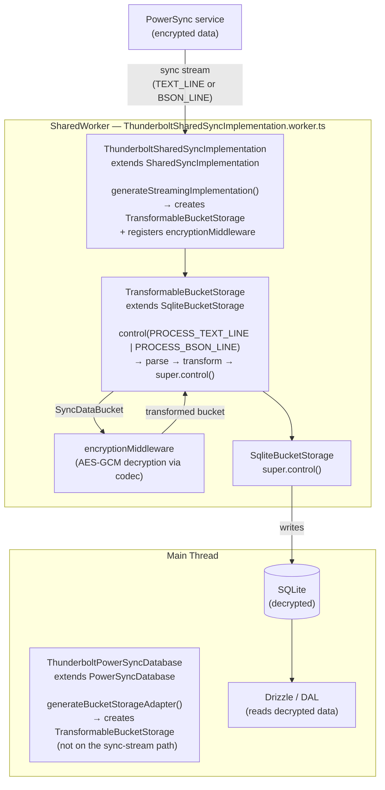
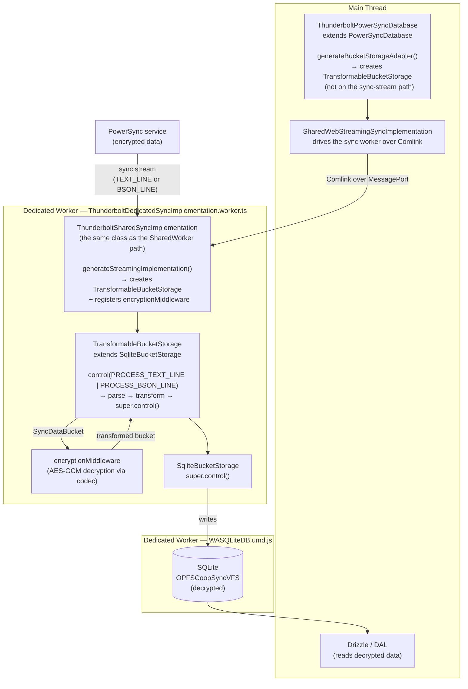

# PowerSync Sync Middleware & Custom SharedWorker

This document explains the data transformation middleware built on top of PowerSync and the custom SharedWorker required to make it work with multi-tab support.

---

## Overview

PowerSync syncs data from the server (PostgreSQL) to the local SQLite database. By default, sync data arrives from the server and is written to SQLite as-is. The middleware layer intercepts sync data **before it is written**, allowing transformations such as decoding, normalization, or decryption.

The implementation uses AES-256-GCM decryption to decrypt all encrypted columns before local storage. See [e2e-encryption.md](e2e-encryption.md) for the full encryption architecture.

---

## Architecture

### Key Files

| File                                                                                                                                                       | Role                                                                                                                                         |
| ---------------------------------------------------------------------------------------------------------------------------------------------------------- | -------------------------------------------------------------------------------------------------------------------------------------------- |
| [src/db/powersync/TransformableBucketStorage.ts](../../src/db/powersync/TransformableBucketStorage.ts)                                                     | Extends `SqliteBucketStorage` to intercept sync data and run the transformer pipeline                                                        |
| [src/db/powersync/ThunderboltPowerSyncDatabase.ts](../../src/db/powersync/ThunderboltPowerSyncDatabase.ts)                                                 | Extends `PowerSyncDatabase` to inject `TransformableBucketStorage` as the storage adapter                                                    |
| [src/db/powersync/middleware/EncryptionMiddleware.ts](../../src/db/powersync/middleware/EncryptionMiddleware.ts)                                           | Decrypts every `__enc:`-prefixed string value in the sync stream using AES-256-GCM via the codec                                             |
| [src/db/powersync/worker/ThunderboltSharedSyncImplementation.ts](../../src/db/powersync/worker/ThunderboltSharedSyncImplementation.ts)                     | Extends `SharedSyncImplementation` to inject `TransformableBucketStorage` into the worker's sync pipeline — used by both worker paths        |
| [src/db/powersync/worker/ThunderboltSharedSyncImplementation.worker.ts](../../src/db/powersync/worker/ThunderboltSharedSyncImplementation.worker.ts)       | SharedWorker entry point — mirrors PowerSync's original but uses the custom implementation                                                   |
| [src/db/powersync/worker/ThunderboltDedicatedSyncImplementation.worker.ts](../../src/db/powersync/worker/ThunderboltDedicatedSyncImplementation.worker.ts) | Dedicated-Worker entry point for Safari/Tauri — hosts the same `ThunderboltSharedSyncImplementation` over a single Comlink endpoint (`self`) |
| [src/db/powersync/database.ts](../../src/db/powersync/database.ts)                                                                                         | Database config — picks the SharedWorker (Chrome/Edge/Firefox) or the dedicated Worker (Safari/Tauri)                                        |

---

## Data Flow

Two paths exist depending on the platform. Both run the same `ThunderboltSharedSyncImplementation` off the main thread and end at the same point — decrypted data in SQLite. They differ only in how that worker is hosted (SharedWorker vs dedicated Worker) and in which VFS backs SQLite.

### Chrome / Edge / Firefox (SharedWorker Path)



### Safari / Tauri (Dedicated Worker Path)



---

## How `TransformableBucketStorage` Works

PowerSync's Rust sync client sends incoming data to the storage adapter via:

```
adapter.control(PROCESS_TEXT_LINE, jsonPayload)   // NDJSON responses
adapter.control(PROCESS_BSON_LINE, bsonPayload)   // BSON responses (preferred since @powersync/web 1.37+)
```

`TransformableBucketStorage` overrides `control()` to intercept both formats. The Rust sync client delivers **one bucket per `control()` call** (one NDJSON line, or one BSON line). When a sync data command arrives, it:

1. Parses the payload (JSON string or BSON binary) to extract the `SyncDataBucket`
2. Runs it through the registered transformer pipeline (each transformer receives the output of the previous)
3. Re-encodes the transformed bucket in the **same format** as the original (JSON → JSON, BSON → BSON)
4. Passes the result to `super.control()` → `SqliteBucketStorage` → SQLite

All other control commands (START, STOP, etc.) pass through unchanged.

> **Why both formats?** Starting with `@powersync/web` 1.37, the HTTP sync stream sends an `Accept` header preferring BSON over NDJSON. If the server supports BSON, sync data arrives as binary `Uint8Array` payloads via `PROCESS_BSON_LINE` instead of JSON strings via `PROCESS_TEXT_LINE`. The middleware must handle both to ensure transformations run regardless of server response type.

### Middleware Interface

```typescript
type DataTransformMiddleware = {
  transform(bucket: SyncDataBucket): Promise<SyncDataBucket> | SyncDataBucket
}
```

Transformers operate on a single `SyncDataBucket` → `OplogEntry[]` (via `bucket.data`). Each entry has:

- `object_type` — table name (e.g. `"tasks"`)
- `object_id` — row ID
- `data` — JSON string of the row (modify this to transform field values)
- `op` — one of `PUT`, `REMOVE`, `MOVE`, `CLEAR` (`OpTypeJSON` in the sync protocol, not SQL verbs)

> **Why per-bucket and not per-batch?** The Rust sync client streams data one bucket at a time via `control(PROCESS_*_LINE)`. The legacy `SyncDataBatch` abstraction belonged to the (now-removed) JavaScript sync client, which buffered multiple buckets before writing. Our middleware never sees more than one bucket per invocation.

### Registering Transformers

Pass them via `ThunderboltPowerSyncOptions.transformers` in `getPowerSyncOptions()`:

```typescript
transformers: [encryptionMiddleware]
```

`ThunderboltPowerSyncDatabase.generateBucketStorageAdapter()` picks these up and registers them on the main thread's `TransformableBucketStorage`. That adapter is not the one the sync stream writes through on either platform — the stream runs in a worker, which builds its own adapter in `ThunderboltSharedSyncImplementation.generateStreamingImplementation()`. See [Adding a Non-Encryption Transformer](#adding-a-non-encryption-transformer) for why a new transformer has to be registered in both places.

---

## The Multi-Tab Problem

PowerSync defaults to `enableMultiTabs: true` on Chrome/Edge/Firefox. This launches a **SharedWorker** that:

- Manages a single sync connection shared across all browser tabs
- Deduplicates CRUD uploads (only one tab uploads at a time)

**The problem**: the SharedWorker creates its own `SqliteBucketStorage` instance internally (in `SharedSyncImplementation.generateStreamingImplementation()`). It completely ignores any custom `BucketStorageAdapter` configured on the main thread. Setting `enableMultiTabs: false` was the original workaround — but this sacrifices cross-tab sync efficiency.

The root cause is architectural:

- `SharedSyncImplementation` hardcodes `new SqliteBucketStorage(...)` with no injection hook
- Transformer functions cannot be serialized across the worker boundary (Comlink limitation)
- The `adapter` field is explicitly omitted from the `SharedSyncInitOptions` type passed to the worker

---

## Solution: Custom SharedWorker

Instead of disabling multi-tab, we provide a custom SharedWorker that **embeds** the transformer logic at bundle time.

### How It Works

`ThunderboltSharedSyncImplementation` extends `SharedSyncImplementation` and overrides `generateStreamingImplementation()` — the one `protected` method that controls which storage adapter is used. The override is a direct copy of the parent method with `SqliteBucketStorage` replaced by `TransformableBucketStorage + encryptionMiddleware`.

`ThunderboltSharedSyncImplementation.worker.ts` is the SharedWorker entry point, mirroring PowerSync's original `SharedSyncImplementation.worker.ts` but instantiating the custom class.

In `database.ts`, the default config (Chrome/Edge/Firefox) points PowerSync to this custom worker via:

```typescript
sync: {
  worker: () =>
    new SharedWorker(
      new URL('./worker/ThunderboltSharedSyncImplementation.worker.ts', import.meta.url),
      { type: 'module', name: `shared-sync-${dbFilename}` },
    ),
}
```

Vite detects the `new SharedWorker(new URL(...))` pattern and bundles the worker file as a separate ES module chunk.

### Why This Works

- Transformer **logic** lives in the worker bundle (compiled at build time) — no serialization needed
- The content key (CK) is accessed directly via IndexedDB inside the SharedWorker — no `postMessage` needed
- Multi-tab sync efficiency is preserved: SharedWorker still manages a single connection

### Accessing `SharedSyncImplementation` Internals

`SharedSyncImplementation` is marked `@internal` and not in `@powersync/web`'s public exports map. We access it via a Vite alias and a matching TypeScript `paths` entry that both point to the compiled lib output:

**`vite.config.ts`:**

```typescript
resolve: {
  alias: {
    'powersync-web-internal': path.resolve(__dirname, 'node_modules/@powersync/web/lib/src'),
  }
}
```

**`tsconfig.json`:**

```json
"paths": {
  "powersync-web-internal/*": ["./node_modules/@powersync/web/lib/src/*"]
}
```

Imports then look like:

```typescript
import { SharedSyncImplementation } from 'powersync-web-internal/worker/sync/SharedSyncImplementation.js'
```

> **Upgrade note**: When upgrading `@powersync/web`, verify that `generateStreamingImplementation()` in `node_modules/@powersync/web/src/worker/sync/SharedSyncImplementation.ts` hasn't changed. If it has, update the override in `ThunderboltSharedSyncImplementation.ts` to match.

---

## Safari / Tauri: Why It Stays Different

What stays different on Safari and Tauri is the worker _hosting_, not the transform. The environment rules out a SharedWorker:

- **OPFSCoopSyncVFS** (required on Safari/iOS for stack size reasons) does not support SharedWorker
- **Tauri** (`tauri://` protocol) blocks SharedWorker and `import.meta.url`-based worker loading for `node_modules` workers, so the DB worker is loaded from an explicit UMD path (`/@powersync/worker/WASQLiteDB.umd.js`)
- SharedWorker itself exceeds iOS WKWebView memory limits and causes black-screen crashes

So the config sets `enableMultiTabs: false` on the inner `WASQLiteOpenFactory` (the DB worker) but `enableMultiTabs: true` at the `PowerSyncDatabase` level. The `true` is what selects `SharedWebStreamingSyncImplementation`, which drives a worker over Comlink; `createDedicatedSyncWorker()` then hands it a dedicated `Worker` in place of the SharedWorker, mapping `.close()` onto `.terminate()` because a dedicated Worker exposes only the latter. Inside that worker, `ThunderboltDedicatedSyncImplementation.worker.ts` instantiates the same `ThunderboltSharedSyncImplementation` the SharedWorker path uses — the transform runs off the main thread everywhere (THU-777).

---

## Adding Encrypted Columns

To encrypt a new column, add the table and column name to `encryptedColumnsMap` in [src/db/encryption/config.ts](../../src/db/encryption/config.ts). The map is the **upload** side's source of truth: `encodeForUpload` ([src/db/encryption/upload-encoder.ts](../../src/db/encryption/upload-encoder.ts)), called from the connector, encrypts exactly the columns listed there.

Download decryption needs no map entry. `encryptionMiddleware` is deliberately data-driven: it decrypts any string value carrying the `__enc:` prefix, whatever column it came from. That is what lets a stale client — one whose bundled map predates the new column — still read rows a newer client encrypted, instead of writing ciphertext into SQLite.

See [e2e-encryption.md](e2e-encryption.md#adding-a-new-encrypted-column) for details.

## Adding a Non-Encryption Transformer

If you need a non-encryption transformation (e.g. data normalization, decompression):

1. Create a file in `src/db/powersync/middleware/` implementing `DataTransformMiddleware`.
2. Register it in **two places** (both must be kept in sync):
   - `getPowerSyncOptions()` in [src/db/powersync/database.ts](../../src/db/powersync/database.ts) — `transformers: [encryptionMiddleware, myMiddleware]`, in **both** the `default` and `safari-tauri` branches. This feeds `ThunderboltPowerSyncDatabase.generateBucketStorageAdapter()`, i.e. the main-thread adapter, not the sync stream.
   - `ThunderboltSharedSyncImplementation.generateStreamingImplementation()` in [src/db/powersync/worker/ThunderboltSharedSyncImplementation.ts](../../src/db/powersync/worker/ThunderboltSharedSyncImplementation.ts) — `storage.addTransformer(myMiddleware)`. This is the sync-stream adapter, and it covers both platforms: the SharedWorker and the dedicated Worker host the same class.

---

## CK Access in the Sync Worker

Both worker types have direct `indexedDB` access, so the codec loads the content key (CK) lazily from IndexedDB without needing `postMessage`. The CK is cached in a module-scoped variable inside the worker for the process lifetime.

`invalidateCKCache()` posts to a `BroadcastChannel` (`thunderbolt-ck-invalidation`) to propagate cache invalidation across all contexts (main thread, sync worker, other tabs), so the worker clears its stale CK immediately. `resetCodecState()` does the same for sign-out/wipe and additionally clears the setup flag.

See [e2e-encryption.md](e2e-encryption.md) for the full encryption architecture.
