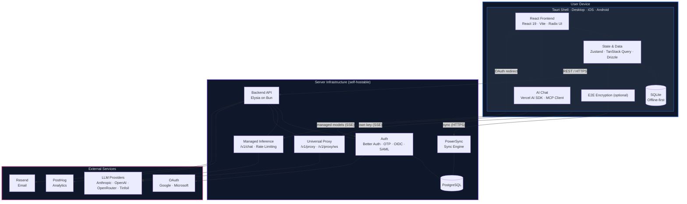

# Architecture

A reference map of Thunderbolt: the components, how they talk, and where state lives. Per-subsystem pages are indexed in the [Subsystem Map](#subsystem-map).

## Key Architecture Decisions

- **Offline-first.** Local SQLite is the source of truth. The app works without network.
- **Cross-platform.** One React codebase runs in Tauri on desktop (macOS, Linux, Windows) and mobile (iOS, Android).
- **Model-agnostic.** A model row names one of six providers: `anthropic`, `openai`, `openrouter`, `tinfoil`, `custom` (any OpenAI-compatible endpoint), or the backend's `thunderbolt` catalog (`src/settings/models/use-add-model-form.ts`). BYOK calls go through the universal proxy at `/v1/proxy`, which maps caller headers to `X-Proxy-Passthrough-*` and forwards the caller's credentials (`src/lib/proxy-fetch.ts`). Only a Tauri build compiled with the `native_fetch` Cargo feature can skip it (when `proxy_enabled` is off), but that feature defaults to off and no build in this repo passes it, so every shipped build proxies ([tauri-shell.md](tauri-shell.md#the-native_fetch-cargo-feature)). Managed models use `/v1/chat/*` instead.
- **Self-hostable.** The whole server stack (backend, PostgreSQL, PowerSync, Keycloak) runs via Docker Compose, Kubernetes, or Pulumi.
- **E2E encrypted (optional).** When enabled, data is encrypted before leaving the device and the server stores only ciphertext ([E2E Encryption](e2e-encryption.md)).

## System Diagram

> **Boundary key:** Blue = on-device · Purple = server · Pink = third-party SaaS

## Client

One React + Vite codebase targets three runtimes:

- **Browser**: Vite build served by nginx. COEP `credentialless` plus COOP `same-origin` give `SharedArrayBuffer` and the OPFS sync VFS their required cross-origin isolation (`deploy/config/security-headers.conf`)
- **Desktop**: Tauri 2 on macOS, Windows, Linux; Rust shell for deep links, haptics, auto-updater, single-instance focus, the OAuth loopback server, and the `thunderbolt` CLI installer (`src-tauri/src/lib.rs`)
- **Mobile**: Tauri 2 for iOS and Android; same JS bundle, same UI

Startup (open the database, decide whether to wait for sync, seed and reconcile defaults, run data migrations, build the HTTP client) is one function: [app-initialization.md](app-initialization.md). The send path is [chat-runtime.md](chat-runtime.md); the Rust side is [tauri-shell.md](tauri-shell.md).

Local state is Zustand plus TanStack Query, with Drizzle over WA-SQLite. WA-SQLite runs everywhere, Tauri included, because there is no native SQLite adapter: the `safari-tauri` config in `src/db/powersync/database.ts` opens with `OPFSCoopSyncVFS` where OPFS exists and `IDBBatchAtomicVFS` where it does not (WebKitGTK on Tauri Linux).

### The WebView Sidebar

On desktop and mobile (not web), link previews and third-party content open in an embedded Tauri `WebView`, not the system browser. Privacy trade-offs, incognito behavior, and per-platform engines: [webview.md](../../features/webview.md).

### The Widget System

Assistant responses embed interactive components (weather, link previews, maps, citations) through XML-like tags the parser turns into `<WidgetRenderer />` calls. Widgets live in `src/widgets/` and register into a central registry ([widgets.md](../widgets.md)).

## Backend

- **Elysia on Bun.** Routes are typed end to end and publish an OpenAPI spec at `/v1/swagger` when `SWAGGER_ENABLED=true`.
- **Drizzle ORM.** Schema-first. Migrations come from `bun db generate` and are tracked in `backend/drizzle/meta/_journal.json`; verify each new one lands in the journal.
- **Better Auth.** Magic-link (OTP), Google/Microsoft OAuth, and OIDC or SAML SSO (`AUTH_MODE`) share one session layer at `basePath: '/v1/api/auth'`. A challenge token gates the email-OTP path only: `POST /v1/waitlist/join` issues it, the client replays it as `x-challenge-token`, and the before-hook in `backend/src/auth/auth.ts` rejects a sign-in without one. Device identity is separate: an `x-device-id` header on `/v1/powersync/token` and the device routes.
- **React Email + Resend.** Transactional templates in `backend/src/emails/`, as typed React components.
- **OpenTelemetry.** Optional OTLP traces when `OTEL_EXPORTER_OTLP_ENDPOINT` is set.

### Route Prefixes

All groups mount on one Elysia app with `prefix: '/v1'` (`backend/src/index.ts`), so `/v1` comes from the mount, not the plugin; groups with no prefix of their own (encryption, preview, search, locations, usage receipts) sit at the top of `/v1`. Full per-route inventory: [backend-api-surface.md](backend-api-surface.md).

| Prefix                                      | Purpose                                                                                                                                |
| ------------------------------------------- | -------------------------------------------------------------------------------------------------------------------------------------- |
| `/v1/api/auth/*`                            | Better Auth flows (OAuth, OIDC/SAML SSO, email-OTP, session, CLI device grant, API keys, opt-in anonymous sessions)                    |
| `/v1/auth/google/*`, `/v1/auth/microsoft/*` | Confidential-client OAuth token exchange and refresh for the Google and Microsoft integrations, so the client secret stays server-side |
| `/v1/auth/oidc/config`                      | Expected OIDC issuer origin for redirect validation (mounted only in `oidc` mode)                                                      |
| `/v1/config`                                | Unauthenticated bootstrap config: feature flags the client needs before sign-in, plus the OTA default-models payload                   |
| `/v1/health`, `/v1/health/*`                | Liveness, plus token-gated deep probes for database, PowerSync, email, and models                                                      |
| `/v1/waitlist/*`                            | Waitlist join; issues the OTP challenge token                                                                                          |
| `/v1/account/*`                             | Account deletion, CLI device registration/logout, device revocation                                                                    |
| `/v1/devices/*`, `/v1/encryption`           | E2EE device registration, approval/deny, envelope exchange, node-id attestation, allowlist, canary                                     |
| `/v1/powersync/*`                           | Sync JWT issuance (`/token`) and client write upload (`/upload`)                                                                       |
| `/v1/chat/*`                                | Managed inference: `/completions` (OpenAI-shaped) and `/v1/messages` (Anthropic Messages-shaped)                                       |
| `/v1/inference-usage/receipts`              | Signed usage receipts for managed inference                                                                                            |
| `/v1/tinfoil/*`                             | Confidential-compute inference pass-through                                                                                            |
| `/v1/proxy`, `/v1/proxy/ws`                 | Universal upstream proxy and WebSocket relay: hosted-mode egress for BYOK LLM, MCP, and page fetches                                   |
| `/v1/pro/fetch-content`                     | Exa page-content extraction                                                                                                            |
| `/v1/search`                                | Exa web search                                                                                                                         |
| `/v1/preview`                               | Link-preview metadata (POST, so target URLs stay out of access logs)                                                                   |
| `/v1/locations`                             | Geocoding lookup and lookup by id                                                                                                      |
| `/v1/agents`, `/v1/haystack/*`              | Remote agent discovery, managed-agent file fetch, and the managed-ACP WebSocket at `/v1/haystack/ws`                                   |
| `/v1/debug-transcripts/*`                   | Debug transcript upload, plus the server-to-server `/intake` endpoint                                                                  |
| `/v1/posthog/*`                             | Analytics event relay                                                                                                                  |
| `/v1/swagger`                               | OpenAPI spec (gated by `SWAGGER_ENABLED`)                                                                                              |

There is no `/v1/inference` and no `/v1/mcp-proxy`: managed inference is `/v1/chat`, and MCP rides the universal proxy like every other upstream (`e2e/proxy-mcp.spec.ts` asserts no MCP-specific path exists).

`createAppVersionMiddleware` enforces a minimum client version on all `/v1` routes: with `MIN_APP_VERSION` set, below-minimum clients get `426 Upgrade Required` unless the path matches `appVersionExemptPrefixes` (`backend/src/middleware/app-version.ts`), today `/v1/config`, `/v1/health`, `/static`, `/v1/api/auth/sso`, `/v1/api/auth/device`, `/v1/posthog`, `/v1/proxy/ws`, `/v1/debug-transcripts/intake`. The gate is fail-closed: a new browser-redirect or header-less route must join that list or it 426s once the gate is on.

### Dev-Time Database

Backend tests and local dev can run on [PGLite](https://pglite.dev), an embedded Postgres, via `bun run db:dev` (data in `.pglite/data`). Production uses real PostgreSQL.

## Sync

PowerSync keeps a full copy of the user's data on every device. Writes hit local SQLite first; deltas stream between SQLite and the backend's PostgreSQL, against short-lived JWTs the backend issues.

Downloads and uploads use different credentials: downloads the sync JWT plus the service's sync rules, uploads the ordinary app session plus a per-operation gate in `applyOperation` ([powersync-upload-authorization.md](powersync-upload-authorization.md)).

### Two Sync Paths

| Runtime                 | Path                                                                        | Why                                                                                                                                 |
| ----------------------- | --------------------------------------------------------------------------- | ----------------------------------------------------------------------------------------------------------------------------------- |
| Chrome · Edge · Firefox | Custom **SharedWorker** (`ThunderboltSharedSyncImplementation`)             | Shares one sync connection across tabs; runs E2E crypto in-worker                                                                   |
| Safari · iOS · Tauri    | **Dedicated Worker** hosting the same `ThunderboltSharedSyncImplementation` | `OPFSCoopSyncVFS` and `tauri://` rule out a SharedWorker, so `enableMultiTabs: true` drives a dedicated Worker over Comlink instead |

Both run the transformer in a worker and end with decrypted data in local SQLite; only the worker _kind_ differs. Rationale and file map: [powersync-sync-middleware.md](powersync-sync-middleware.md).

### The `powersync-web-internal` Alias

`ThunderboltSharedSyncImplementation` extends `SharedSyncImplementation`, an `@internal` class in `@powersync/web`, reached through the `powersync-web-internal` alias in `vite.config.ts` (`node_modules/@powersync/web/lib/src`). When upgrading `@powersync/web`, verify the class still exists there: a breaking change produces no TypeScript error.

### Schema Split

- **Application schema**: the Postgres `public` schema, freely indexed. Better Auth's `user`, `session`, `account`, `verification`, `sso_provider`, `device_code`, `apikey`, plus `envelopes`, `encryption_metadata`, `otp_challenge`, `waitlist`, `rate_limits`, inference usage, and debug transcripts (`backend/src/db/`).
- **Synced schema**: the tables in `shared/powersync-tables.ts`, mirrored in the Postgres `powersync` schema (`backend/src/db/powersync-schema.ts`). Minimal indexes (primary key plus one `user_id` index) and no foreign keys between synced tables; the only reference each carries is `user_id`, cascading back to `user`. Composite keys `(id, user_id)` or `(key, user_id)` let defaults seed with the same id for every user ([composite-primary-keys-and-default-data.md](composite-primary-keys-and-default-data.md)).

## Third-Party Services

| Service      | Role                                                                       | Replaceable?               |
| ------------ | -------------------------------------------------------------------------- | -------------------------- |
| PowerSync    | Client-server sync                                                         | Self-hostable via Docker   |
| PostgreSQL   | Server-side store behind PowerSync and Better Auth                         | No                         |
| Keycloak     | Default OIDC provider in the self-hosted stack                             | Any OIDC-compliant IdP     |
| Resend       | Transactional email delivery                                               | Swap for any SMTP/provider |
| PostHog      | In-app analytics (opt-in)                                                  | Optional                   |
| AI providers | Anthropic, OpenAI, OpenRouter, Tinfoil, and any OpenAI-compatible endpoint | Bring your own             |

## Build and Release

- **Web / enterprise**: Vite build → nginx (`deploy/docker/frontend.Dockerfile`). COEP/COOP and the other security headers live in `deploy/config/security-headers.conf` and must be included from every `location` block in `deploy/config/nginx.conf.template`: nginx drops a parent's `add_header` set as soon as a child location declares one.
- **Desktop**: `bun tauri build`; signed installers per platform. See [RELEASE.md](../../../RELEASE.md).
- **Mobile**: iOS to TestFlight, Android to Play Store Internal Track via the `release.yml` workflow.

## Subsystem Map

### Client runtime

- [App Initialization](app-initialization.md): boot sequence, and why the step order is load-bearing.
- [Chat Runtime](chat-runtime.md): one send end to end. Routing, budgets, retries, Stop, persistence.
- [The Content View](content-view.md): the side panel's four content kinds and its state machine.
- [Chat Attachments](attachments.md): files ride a turn, bytes never stored off-device.
- [Search and the Command Palette](search.md): `Cmd/Ctrl+K` over a local FTS5 index. Keyword-only, offline.
- [Voice Mode](voice.md): the spoken loop, barge-in, and the engine contract.
- [Projects](projects.md): inherited instructions, cross-chat search, assistant notes.
- [Settings and Preferences](settings-and-preferences.md): synced `settings` row vs per-device Zustand store.
- [Client Auth and Session](client-auth-and-session.md): credential storage; reload, offline boot, second tab.
- [Sign-in and the Waitlist](sign-in-and-waitlist.md): one endpoint signs a user up, in, or onto the queue.
- [Widgets](../widgets.md): assistant output as interactive components.

### Data and sync

- [Multi-Device Sync](multi-device-sync.md): the pipeline in depth.
- [PowerSync Sync Middleware](powersync-sync-middleware.md): transform-before-write and its two worker paths.
- [PowerSync, Accounts and Devices](powersync-account-devices.md): table requirements, tokens, device identity, adding a table.
- [PowerSync Upload Authorization](powersync-upload-authorization.md): which writes, and which columns, the server accepts.
- [The Data Access Layer](data-access-layer.md): SQLite views client-side, real tables server-side.
- [Reconciled Defaults](reconciled-defaults.md): changing a shipped default without clobbering user edits.
- [Composite Primary Keys and Default Data](composite-primary-keys-and-default-data.md): why some tables key on `(id, user_id)`.
- [Client Data Migrations](client-data-migrations.md): why content migrations run on-device, and adding one.
- [End-to-End Encryption](e2e-encryption.md): key hierarchy, device approval, ciphertext columns.
- [Delete Account and Revoke Device](delete-account-and-revoke-device.md): the hard-delete paths.
- [User Data Export Format](export-format.md): the versioned JSON snapshot behind Export My Data.

### Agents, models and tools

- [System Prompt, Tools and Citations](prompt-and-tools.md): what a model sees, and the `[N]` citation contract.
- [Skills](skills.md): instruction rows, `/slug` tokens, catalog vs body.
- [HTML Artifacts](artifacts.md): model-authored HTML, sandboxed and verified.
- [MCP Connections](mcp-connections.md): data model, three transports, OAuth, silent breakage.
- [ACP Agents](acp-agents.md): three agent kinds, transport routing, the iroh trust model.
- [The In-Browser Agent Harness](in-browser-agent-harness.md): the Pi agent, its virtual filesystem, its workspace jail.

### Backend surface

- [Backend API Surface](backend-api-surface.md): per-route module, auth, rate limit, version gate, add-a-route checklist.
- [Managed Inference](managed-inference.md): admission, pricing, the usage ledger, signed receipts.
- [The Universal Proxy](universal-proxy.md): the endpoint pair for BYOK, MCP and ACP upstreams.
- [Debug Transcripts](debug-transcripts.md): what the opt-in report captures, redacts, and caps.
- [Self-hosting the iroh relay](iroh-relay-self-hosting.md): the CLI↔app bridge relay, and running your own.

### Native shell

- [The Tauri Shell](tauri-shell.md): invoke commands, capability manifest, window setup, platform predicates.
- [The WebView Sidebar](../../features/webview.md): privacy trade-offs, incognito, per-platform engines.

### Code structure and contracts

- [The `shared/` Module](shared-module.md): what belongs there, and how three tsconfigs import it.
- [Frontend Structure](../development/frontend-structure.md): where a new file goes in `src/`, and `components/ui/` conventions.
- [Error Handling](../development/error-handling.md): the three boundaries allowed to catch.
- [Integrations](../development/integrations.md): connected accounts as model-callable tools.

### Beyond this directory

- [Quick Start](../development/quick-start.md) and [Testing](../development/testing.md): schema rules, tests, the things that bite.
- [Authentication](../../../backend/docs/authentication.md) and [Rate limiting](../../../backend/docs/rate-limiting.md): session minting and limiter tiers.
- [CI and Preview Environments](../development/ci-and-previews.md): which check verifies what, which preview answers what.
- [Self-hosting configuration](../../self-hosting/configuration.md): every environment variable named on this page.
