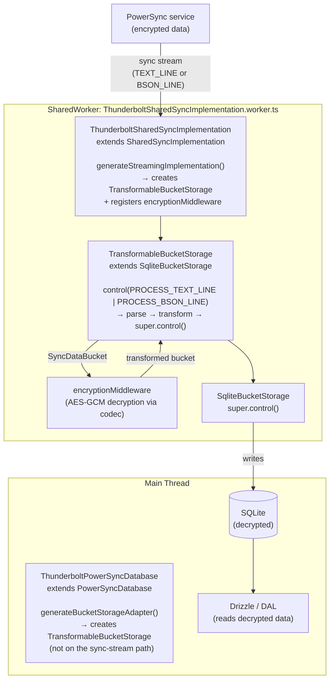
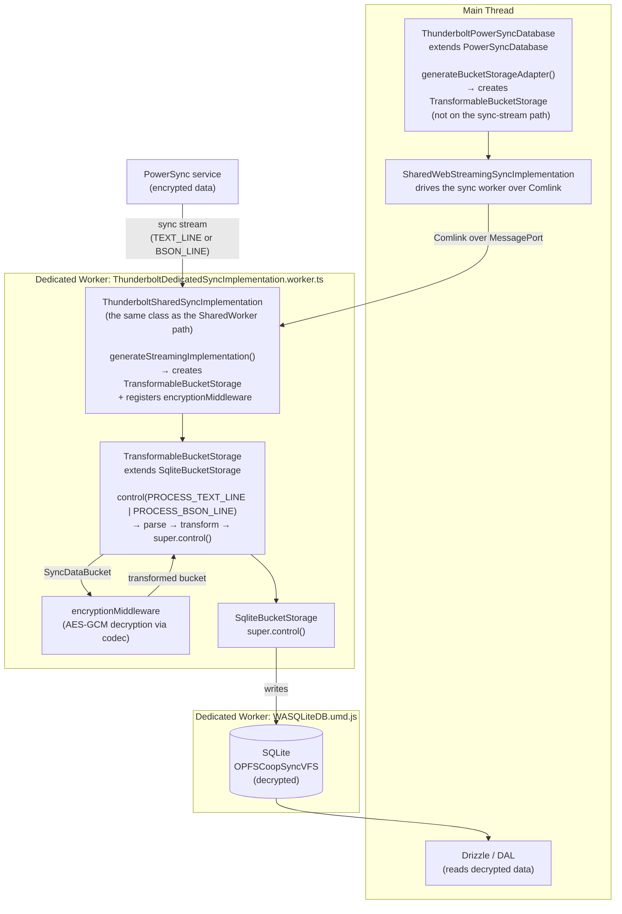

# PowerSync Sync Middleware & Custom SharedWorker

## Overview

PowerSync writes server data (PostgreSQL) into local SQLite as-is. The middleware intercepts sync data **before the write** to decode, normalize, or decrypt it. The only transformer today is AES-256-GCM decryption of encrypted columns ([e2e-encryption.md](e2e-encryption.md)).

---

## Architecture

### Key Files

| File                                                                                                                                                          | Role                                                                                                                                        |
| ------------------------------------------------------------------------------------------------------------------------------------------------------------- | ------------------------------------------------------------------------------------------------------------------------------------------- |
| [src/db/powersync/TransformableBucketStorage.ts](../../../src/db/powersync/TransformableBucketStorage.ts)                                                     | Extends `SqliteBucketStorage` to intercept sync data and run the transformer pipeline                                                       |
| [src/db/powersync/ThunderboltPowerSyncDatabase.ts](../../../src/db/powersync/ThunderboltPowerSyncDatabase.ts)                                                 | Extends `PowerSyncDatabase` to inject `TransformableBucketStorage` as the storage adapter                                                   |
| [src/db/powersync/middleware/EncryptionMiddleware.ts](../../../src/db/powersync/middleware/EncryptionMiddleware.ts)                                           | Decrypts every `__enc:`-prefixed string value in the sync stream using AES-256-GCM via the codec                                            |
| [src/db/powersync/worker/ThunderboltSharedSyncImplementation.ts](../../../src/db/powersync/worker/ThunderboltSharedSyncImplementation.ts)                     | Extends `SharedSyncImplementation` to inject `TransformableBucketStorage` into the worker's sync pipeline; used by both worker paths        |
| [src/db/powersync/worker/ThunderboltSharedSyncImplementation.worker.ts](../../../src/db/powersync/worker/ThunderboltSharedSyncImplementation.worker.ts)       | SharedWorker entry point; mirrors PowerSync's original but uses the custom implementation                                                   |
| [src/db/powersync/worker/ThunderboltDedicatedSyncImplementation.worker.ts](../../../src/db/powersync/worker/ThunderboltDedicatedSyncImplementation.worker.ts) | Dedicated-Worker entry point for Safari/Tauri; hosts the same `ThunderboltSharedSyncImplementation` over a single Comlink endpoint (`self`) |
| [src/db/powersync/database.ts](../../../src/db/powersync/database.ts)                                                                                         | Database config; picks the SharedWorker (Chrome/Edge/Firefox) or the dedicated Worker (Safari/Tauri)                                        |

---

## Data Flow

Both paths run the same `ThunderboltSharedSyncImplementation` off the main thread and end at decrypted data in SQLite. They differ only in worker hosting (SharedWorker vs dedicated Worker) and in the VFS backing SQLite.

### Chrome / Edge / Firefox (SharedWorker Path)



### Safari / Tauri (Dedicated Worker Path)



---

## How `TransformableBucketStorage` Works

PowerSync's Rust sync client feeds the storage adapter via:

```
adapter.control(PROCESS_TEXT_LINE, jsonPayload)   // NDJSON responses
adapter.control(PROCESS_BSON_LINE, bsonPayload)   // BSON responses (preferred since @powersync/web 1.37+)
```

`TransformableBucketStorage` overrides `control()` for both formats. The client delivers **one bucket per `control()` call** (one NDJSON or BSON line); for sync data the override:

1. Parses the payload (JSON string or BSON binary) to extract the `SyncDataBucket`
2. Runs the transformer pipeline (each transformer receives the previous one's output)
3. Re-encodes in the **same format** as the original (JSON → JSON, BSON → BSON)
4. Passes the result to `super.control()` → `SqliteBucketStorage` → SQLite

All other control commands (START, STOP, etc.) pass through unchanged.

> **Why both formats?** Since `@powersync/web` 1.37 the `Accept` header prefers BSON, so a BSON-capable server sends `Uint8Array` payloads via `PROCESS_BSON_LINE` rather than JSON strings via `PROCESS_TEXT_LINE`. Handling only one would skip transformation on the other.

### Middleware Interface

```typescript
type DataTransformMiddleware = {
  transform(bucket: SyncDataBucket): Promise<SyncDataBucket> | SyncDataBucket
}
```

Transformers get one `SyncDataBucket`; its `OplogEntry[]` (`bucket.data`) entries have:

- `object_type`: table name (e.g. `"tasks"`)
- `object_id`: row ID
- `data`: JSON string of the row (modify this to transform field values)
- `op`: one of `PUT`, `REMOVE`, `MOVE`, `CLEAR` (`OpTypeJSON` in the sync protocol, not SQL verbs)

> **Why per-bucket and not per-batch?** The legacy `SyncDataBatch` abstraction belonged to the removed JavaScript sync client, which buffered buckets before writing. The Rust client streams one bucket at a time.

### Registering Transformers

Pass them via `ThunderboltPowerSyncOptions.transformers` in `getPowerSyncOptions()`:

```typescript
transformers: [encryptionMiddleware]
```

`ThunderboltPowerSyncDatabase.generateBucketStorageAdapter()` registers these on the main thread's `TransformableBucketStorage`, which is **not** on the sync-stream path: the stream runs in a worker that builds its own adapter in `ThunderboltSharedSyncImplementation.generateStreamingImplementation()`. New transformers need registering in both places ([below](#adding-a-non-encryption-transformer)).

---

## The Multi-Tab Problem

On Chrome/Edge/Firefox PowerSync defaults to `enableMultiTabs: true`, launching a **SharedWorker** that shares one sync connection across tabs and deduplicates CRUD uploads. That worker builds its own `SqliteBucketStorage` in `SharedSyncImplementation.generateStreamingImplementation()` and ignores any custom `BucketStorageAdapter` from the main thread. `enableMultiTabs: false` was the original workaround, at the cost of cross-tab sync efficiency.

The root cause is architectural:

- `SharedSyncImplementation` hardcodes `new SqliteBucketStorage(...)`, no injection hook
- Comlink cannot serialize transformer functions across the worker boundary
- `adapter` is omitted from `SharedSyncInitOptions`

---

## Solution: Custom SharedWorker

`ThunderboltSharedSyncImplementation` overrides `generateStreamingImplementation()`, the one `protected` method controlling the storage adapter, copying the parent with `SqliteBucketStorage` replaced by `TransformableBucketStorage + encryptionMiddleware`. `ThunderboltSharedSyncImplementation.worker.ts` mirrors PowerSync's worker entry point but instantiates the custom class, and `database.ts` points the default config (Chrome/Edge/Firefox) at it:

```typescript
sync: {
  worker: () =>
    new SharedWorker(
      new URL('./worker/ThunderboltSharedSyncImplementation.worker.ts', import.meta.url),
      { type: 'module', name: `shared-sync-${dbFilename}` },
    ),
}
```

Vite detects `new SharedWorker(new URL(...))` and bundles the worker as a separate ES module chunk.

### Why This Works

- Transformer **logic** is compiled into the worker bundle, so nothing needs serializing
- The content key (CK) is read from IndexedDB inside the worker, so no `postMessage`
- The SharedWorker still manages a single connection, preserving multi-tab efficiency

### Accessing `SharedSyncImplementation` Internals

`SharedSyncImplementation` is `@internal` and absent from `@powersync/web`'s exports map, so a Vite alias and a matching TypeScript `paths` entry point at the compiled lib output.

**`vite.config.ts`:**

```typescript
resolve: {
  alias: {
    'powersync-web-internal': path.resolve(__dirname, 'node_modules/@powersync/web/lib/src'),
  }
}
```

**`tsconfig.json`:**

```json
"paths": {
  "powersync-web-internal/*": ["./node_modules/@powersync/web/lib/src/*"]
}
```

```typescript
import { SharedSyncImplementation } from 'powersync-web-internal/worker/sync/SharedSyncImplementation.js'
```

> **Upgrade note**: when upgrading `@powersync/web`, check `generateStreamingImplementation()` in `node_modules/@powersync/web/src/worker/sync/SharedSyncImplementation.ts` and update the override in `ThunderboltSharedSyncImplementation.ts` to match.

---

## Safari / Tauri: Why It Stays Different

Only the worker _hosting_ differs, not the transform. A SharedWorker is ruled out:

- **OPFSCoopSyncVFS** (required on Safari/iOS for stack size reasons) does not support SharedWorker
- **Tauri** (`tauri://`) blocks SharedWorker and `import.meta.url`-based worker loading for `node_modules` workers, so the DB worker loads from an explicit UMD path (`/@powersync/worker/WASQLiteDB.umd.js`)
- SharedWorker exceeds iOS WKWebView memory limits and causes black-screen crashes

So the config sets `enableMultiTabs: false` on the inner `WASQLiteOpenFactory` (the DB worker) but `true` at the `PowerSyncDatabase` level. The `true` selects `SharedWebStreamingSyncImplementation`, which drives a worker over Comlink; `createDedicatedSyncWorker()` supplies a dedicated `Worker` instead, mapping `.close()` onto `.terminate()` (a dedicated Worker exposes only the latter). It hosts the same `ThunderboltSharedSyncImplementation`, so the transform runs off the main thread everywhere (THU-777).

---

## Adding Encrypted Columns

Add the table and column to `encryptedColumnsMap` in [src/db/encryption/config.ts](../../../src/db/encryption/config.ts). That map is the **upload** side's source of truth: `encodeForUpload` ([src/db/encryption/upload-encoder.ts](../../../src/db/encryption/upload-encoder.ts)), called from the connector, encrypts exactly those columns.

Download needs no entry. `encryptionMiddleware` decrypts any `__enc:`-prefixed string whatever column it came from, so a stale client whose bundled map predates the column still reads the row instead of storing ciphertext. Details: [e2e-encryption.md](e2e-encryption.md#adding-a-new-encrypted-column).

## Adding a Non-Encryption Transformer

For a non-encryption transform (normalization, decompression):

1. Create a file in `src/db/powersync/middleware/` implementing `DataTransformMiddleware`.
2. Register it in **two places**, kept in sync:
   - `getPowerSyncOptions()` in [src/db/powersync/database.ts](../../../src/db/powersync/database.ts): `transformers: [encryptionMiddleware, myMiddleware]`, in **both** the `default` and `safari-tauri` branches (main-thread adapter, not the sync stream).
   - `ThunderboltSharedSyncImplementation.generateStreamingImplementation()` in [src/db/powersync/worker/ThunderboltSharedSyncImplementation.ts](../../../src/db/powersync/worker/ThunderboltSharedSyncImplementation.ts): `storage.addTransformer(myMiddleware)` (sync-stream adapter, covers both platforms, which host the same class).

---

## CK Access in the Sync Worker

Both worker types have direct `indexedDB` access, so the codec loads the content key (CK) lazily without `postMessage`, cached in a module-scoped variable for the worker's lifetime.

`invalidateCKCache()` posts to a `BroadcastChannel` (`thunderbolt-ck-invalidation`) so the main thread, sync worker, and other tabs drop a stale CK immediately. `resetCodecState()` does the same for sign-out/wipe and also clears the setup flag.

Full encryption architecture: [e2e-encryption.md](e2e-encryption.md).
