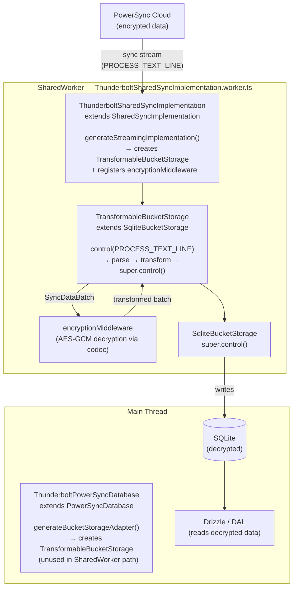
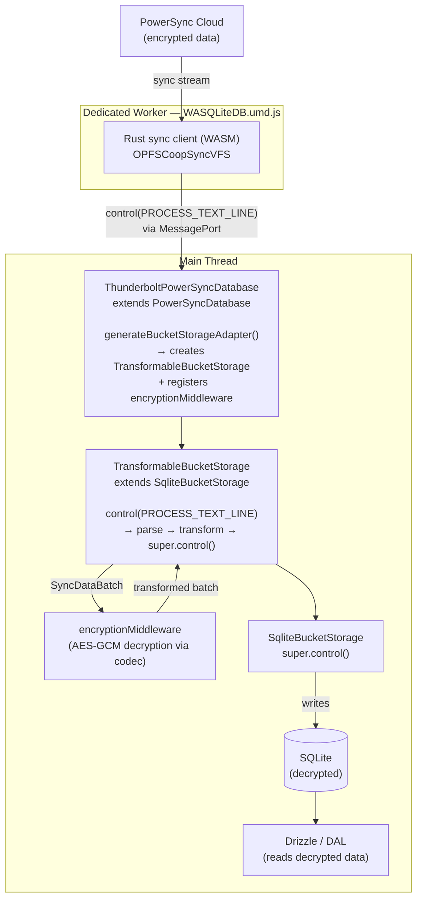

# PowerSync Sync Middleware & Custom SharedWorker

This document explains the data transformation middleware built on top of PowerSync and the custom SharedWorker required to make it work with multi-tab support.

---

## Overview

PowerSync syncs data from the server (PostgreSQL) to the local SQLite database. By default, sync data arrives from the server and is written to SQLite as-is. The middleware layer intercepts sync data **before it is written**, allowing transformations such as decoding, normalization, or decryption.

The implementation uses AES-256-GCM decryption to decrypt all encrypted columns before local storage. See [e2e-encryption.md](e2e-encryption.md) for the full encryption architecture.

---

## Architecture

### Key files

| File | Role |
|------|------|
| [src/db/powersync/TransformableBucketStorage.ts](../src/db/powersync/TransformableBucketStorage.ts) | Extends `SqliteBucketStorage` to intercept sync data and run the transformer pipeline |
| [src/db/powersync/ThunderboltPowerSyncDatabase.ts](../src/db/powersync/ThunderboltPowerSyncDatabase.ts) | Extends `PowerSyncDatabase` to inject `TransformableBucketStorage` as the storage adapter |
| [src/db/powersync/middleware/EncryptionMiddleware.ts](../src/db/powersync/middleware/EncryptionMiddleware.ts) | Decrypts all encrypted columns (defined in [`encryptedColumnsMap`](../src/db/encryption/config.ts)) using AES-256-GCM via the codec |
| [src/db/powersync/worker/ThunderboltSharedSyncImplementation.ts](../src/db/powersync/worker/ThunderboltSharedSyncImplementation.ts) | Extends `SharedSyncImplementation` to inject `TransformableBucketStorage` inside the SharedWorker |
| [src/db/powersync/worker/ThunderboltSharedSyncImplementation.worker.ts](../src/db/powersync/worker/ThunderboltSharedSyncImplementation.worker.ts) | SharedWorker entry point — mirrors PowerSync's original but uses the custom implementation |
| [src/db/powersync/database.ts](../src/db/powersync/database.ts) | Database config — wires up the custom SharedWorker for Chrome/Edge/Firefox |

---

## Data flow

Two distinct paths exist depending on the platform. Both end at the same point — decrypted data in SQLite — but the interception happens in different execution contexts.

### Chrome / Edge / Firefox (SharedWorker path)



### Safari / Tauri (dedicated worker path)



---

## How `TransformableBucketStorage` works

PowerSync's Rust sync client sends incoming data to the storage adapter via:

```
adapter.control(PROCESS_TEXT_LINE, jsonPayload)
```

`TransformableBucketStorage` overrides `control()` to intercept this call. When a `PROCESS_TEXT_LINE` command arrives with sync data, it:

1. Parses the JSON payload into a `SyncDataBatch`
2. Runs it through the registered transformer pipeline (each transformer receives the output of the previous)
3. Serializes the transformed batch back to JSON
4. Passes the result to `super.control()` → `SqliteBucketStorage` → SQLite

All other control commands (START, STOP, PROCESS_BSON_LINE, etc.) pass through unchanged.

### Middleware interface

```typescript
type DataTransformMiddleware = {
  transform(batch: SyncDataBatch): Promise<SyncDataBatch> | SyncDataBatch
}
```

Transformers operate on `SyncDataBatch` → `SyncDataBucket[]` → `OplogEntry[]`. Each entry has:
- `object_type` — table name (e.g. `"tasks"`)
- `object_id` — row ID
- `data` — JSON string of the row (modify this to transform field values)
- `op` — `INSERT` / `UPDATE` / `DELETE`

### Registering transformers

Pass them via `ThunderboltPowerSyncDatabaseOptions.transformers` in `getPowerSyncOptions()`:

```typescript
transformers: [encryptionMiddleware]
```

`ThunderboltPowerSyncDatabase.generateBucketStorageAdapter()` picks these up and registers them on `TransformableBucketStorage`.

---

## The multi-tab problem

PowerSync defaults to `enableMultiTabs: true` on Chrome/Edge/Firefox. This launches a **SharedWorker** that:

- Manages a single sync connection shared across all browser tabs
- Deduplicates CRUD uploads (only one tab uploads at a time)

**The problem**: the SharedWorker creates its own `SqliteBucketStorage` instance internally (in `SharedSyncImplementation.generateStreamingImplementation()`). It completely ignores any custom `BucketStorageAdapter` configured on the main thread. Setting `enableMultiTabs: false` was the original workaround — but this sacrifices cross-tab sync efficiency.

The root cause is architectural:
- `SharedSyncImplementation` hardcodes `new SqliteBucketStorage(...)` with no injection hook
- Transformer functions cannot be serialized across the worker boundary (Comlink limitation)
- The `adapter` field is explicitly omitted from the `SharedSyncInitOptions` type passed to the worker

---

## Solution: custom SharedWorker

Instead of disabling multi-tab, we provide a custom SharedWorker that **embeds** the transformer logic at bundle time.

### How it works

`ThunderboltSharedSyncImplementation` extends `SharedSyncImplementation` and overrides `generateStreamingImplementation()` — the one `protected` method that controls which storage adapter is used. The override is a direct copy of the parent method with `SqliteBucketStorage` replaced by `TransformableBucketStorage + encryptionMiddleware`.

`ThunderboltSharedSyncImplementation.worker.ts` is the SharedWorker entry point, mirroring PowerSync's original `SharedSyncImplementation.worker.ts` but instantiating the custom class.

In `database.ts`, the default config (Chrome/Edge/Firefox) points PowerSync to this custom worker via:

```typescript
sync: {
  worker: () =>
    new SharedWorker(
      new URL('./worker/ThunderboltSharedSyncImplementation.worker.ts', import.meta.url),
      { type: 'module', name: `shared-sync-${dbFilename}` },
    ),
}
```

Vite detects the `new SharedWorker(new URL(...))` pattern and bundles the worker file as a separate ES module chunk.

### Why this works

- Transformer **logic** lives in the worker bundle (compiled at build time) — no serialization needed
- The content key (CK) is accessed directly via IndexedDB inside the SharedWorker — no `postMessage` needed
- Multi-tab sync efficiency is preserved: SharedWorker still manages a single connection

### Accessing `SharedSyncImplementation` internals

`SharedSyncImplementation` is marked `@internal` and not in `@powersync/web`'s public exports map. We access it via a Vite alias and a matching TypeScript `paths` entry that both point to the compiled lib output:

**`vite.config.ts`:**
```typescript
resolve: {
  alias: {
    'powersync-web-internal': path.resolve(__dirname, 'node_modules/@powersync/web/lib/src'),
  }
}
```

**`tsconfig.json`:**
```json
"paths": {
  "powersync-web-internal/*": ["./node_modules/@powersync/web/lib/src/*"]
}
```

Imports then look like:
```typescript
import { SharedSyncImplementation } from 'powersync-web-internal/worker/sync/SharedSyncImplementation.js'
```

> **Upgrade note**: When upgrading `@powersync/web`, verify that `generateStreamingImplementation()` in `node_modules/@powersync/web/src/worker/sync/SharedSyncImplementation.ts` hasn't changed. If it has, update the override in `ThunderboltSharedSyncImplementation.ts` to match.

---

## Safari / Tauri: why it stays different

The Safari and Tauri config keeps `enableMultiTabs: false` and the main-thread transformer path. This is not a limitation of our middleware — it's an inherent constraint of the environment:

- **OPFSCoopSyncVFS** (required on Safari/iOS for stack size reasons) does not support SharedWorker
- **Tauri** (`tauri://` protocol) blocks SharedWorker and `import.meta.url`-based worker loading
- SharedWorker itself exceeds iOS WKWebView memory limits and causes black-screen crashes

For Safari/Tauri, `ThunderboltPowerSyncDatabase.generateBucketStorageAdapter()` is called on the main thread and the transformer runs there via the dedicated worker path.

---

## Adding encrypted columns

To encrypt a new column, add the table and column name to `encryptedColumnsMap` in [src/db/encryption/config.ts](../src/db/encryption/config.ts). The existing `encryptionMiddleware` handles all columns in the map automatically — both download decryption and upload encryption.

See [e2e-encryption.md](e2e-encryption.md#adding-a-new-encrypted-column) for details.

## Adding a non-encryption transformer

If you need a non-encryption transformation (e.g. data normalization, decompression):

1. Create a file in `src/db/powersync/middleware/` implementing `DataTransformMiddleware`.
2. Register it in **two places** (both paths must be kept in sync):
   - `getPowerSyncOptions()` in [src/db/powersync/database.ts](../src/db/powersync/database.ts) — `transformers: [encryptionMiddleware, myMiddleware]` (used by the Safari/Tauri main-thread path)
   - `ThunderboltSharedSyncImplementation.generateStreamingImplementation()` in [src/db/powersync/worker/ThunderboltSharedSyncImplementation.ts](../src/db/powersync/worker/ThunderboltSharedSyncImplementation.ts) — `storage.addTransformer(myMiddleware)` (used by the Chrome/Edge/Firefox SharedWorker path)

---

## CK access in the SharedWorker

The SharedWorker has direct `indexedDB` access, so the codec loads the content key (CK) lazily from IndexedDB without needing `postMessage`. The CK is cached in a module-scoped variable inside the worker for the process lifetime.

`invalidateCKCache()` uses a `BroadcastChannel` to propagate cache invalidation across all contexts (main thread, SharedWorker, other tabs), so the worker clears its stale CK immediately on sign-out.

See [e2e-encryption.md](e2e-encryption.md) for the full encryption architecture.
