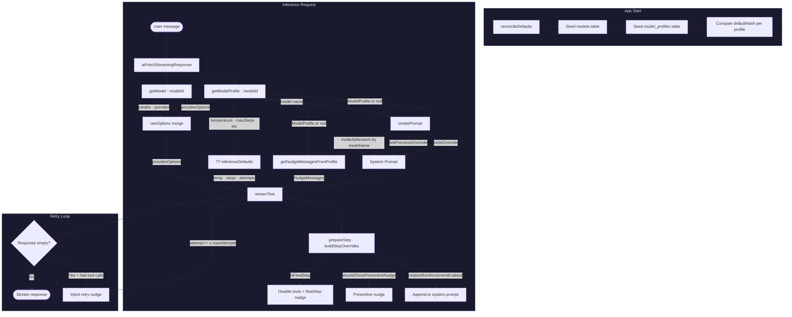

# Model Profiles & Prompt Separation — PRD

## TL;DR

Model-specific behavioral tuning (temperature, prompt overrides, nudge messages, citation reinforcement) moved from 14+ hardcoded TypeScript files to a single `model_profiles` database table. Each model gets one row with nullable override columns — `null` means "use the code default." This enables custom models to receive the same tuning as built-in models, makes profiles shippable as data (for the extension marketplace), and eliminates all `vendor === 'openai'` conditionals from the inference pipeline. A companion evaluation framework validates that profile changes don't regress citation quality across 3 models × 3 modes × 45 scenarios.

---

## Problem

### Before this change

Model-specific behavior was scattered across a `src/ai/prompts/vendors/` folder tree:

```
vendors/
  defaults.ts
  openai/
    config.ts               → { systemMessageMode: 'developer' }
    global.ts               → "After calling tools, you MUST write..."
    chat.ts / search.ts / research.ts
    nudges.ts               → GPT-OSS-specific nudge wording
    models/gpt-oss-120b/
      config.ts             → temp: 0.3, maxSteps: 8, maxAttempts: 4
  mistral/
    global.ts               → citation rule + link preview workflow
    chat.ts / search.ts / research.ts
    nudges.ts               → Mistral-specific nudge wording
    citation-reinforcement.ts
```

This caused three problems:

1. **Custom models got zero tuning.** A user adding a model via OpenRouter or local Ollama had no way to configure temperature, nudges, or prompt overrides — those only existed for hardcoded vendor/model combinations.

2. **Code conditionals everywhere.** `fetch.ts` was littered with `if (model.vendor === 'openai')` and `if (model.vendor === 'mistral')` checks. Adding a new model required touching multiple code files across the vendor tree.

3. **No data-driven distribution.** The extension marketplace couldn't ship model profiles because tuning was compiled into the application bundle.

### Why it mattered

Thunderbolt supports 3 built-in models (GPT-OSS, Mistral Medium 3.1, Sonnet 4.5) and an arbitrary number of user-added custom models. Without per-model tuning in the database, every custom model used the same generic defaults — producing worse citation compliance, more empty responses, and no link-preview optimization.

---

## Solution Overview

One database table (`model_profiles`) with one row per model. Every behavioral override is a nullable column. The inference pipeline (`fetch.ts`) loads the profile at request time and uses `??` (nullish coalescing) to fall back to code defaults for any field the profile doesn't override.

The base system prompt stays in code (`prompt.ts`) — it's universal and tightly coupled to the codebase. Only the per-model *differences* live in the database.

---

## Architecture

### New modules and what they do

| File | Purpose |
|------|---------|
| `src/db/tables.ts` | `modelProfilesTable` — 22-column schema definition |
| `src/db/relations.ts` | Bidirectional model ↔ profile relation |
| `src/types.ts` | `ModelProfileRow`, `ModelProfile` types |
| `src/dal/model-profiles.ts` | CRUD: get, upsert, createDefault, delete, reset |
| `src/defaults/model-profiles/` | Seed data — one file per model + index with hash function |
| `src/defaults/model-profiles.ts` | Barrel re-export (keeps existing import paths working) |
| `src/drizzle/0018_lucky_surge.sql` | Migration SQL |
| `src/ai/eval/` | 9-file evaluation framework (types, scenarios, runner, scoring, parser, UI, report) |

### Data model

```
model_profiles
├── model_id              TEXT PK  → FK to models.id (CASCADE)
│
├── temperature            REAL     (null = 0.2)
├── max_steps              INTEGER  (null = 20)
├── max_attempts           INTEGER  (null = 2)
├── nudge_threshold        INTEGER  (null = 6)
│
├── use_system_message_mode_developer  INTEGER DEFAULT 0
├── provider_options       TEXT/JSON (e.g. {"systemMessageMode":"developer"})
│
├── tools_override         TEXT     (appended to "# Tools" section)
├── link_previews_override TEXT     (appended to "## Link Previews")
├── chat_mode_addendum     TEXT     (appended when mode = chat)
├── search_mode_addendum   TEXT     (appended when mode = search)
├── research_mode_addendum TEXT     (appended when mode = research)
│
├── citation_reinforcement_enabled  INTEGER DEFAULT 0
├── citation_reinforcement_prompt   TEXT
│
├── nudge_final_step       TEXT     (6 nudge fields: 3 general + 3 search)
├── nudge_preventive       TEXT
├── nudge_retry            TEXT
├── nudge_search_final_step TEXT
├── nudge_search_preventive TEXT
├── nudge_search_retry     TEXT
│
├── default_hash           TEXT     (reconciliation tracking)
└── deleted_at             INTEGER  (soft delete)
```

### Data flow



**Text version** (for environments that don't render Mermaid):

```
App start
  └─ reconcileDefaults()
       ├─ models table (seed 3 default models)
       └─ model_profiles table (seed 3 default profiles, keyed by modelId)
            └─ defaultHash computed from hashModelProfile()

Inference request
  └─ aiFetchStreamingResponse()
       ├─ getModel(modelId)              → Model row
       ├─ getModelProfile(modelId)       → ModelProfile | null
       │
       ├─ createPrompt({ profile, ... }) → System prompt with injected overrides
       │    ├─ toolsOverride       → appended to "# Tools"
       │    ├─ linkPreviewsOverride → appended to "## Link Previews"
       │    └─ modeAddendum        → appended to "# Active Mode" (by modeName)
       │
       ├─ getNudgeMessagesFromProfile(profile, modeName) → NudgeMessages
       │    └─ Falls back to code defaults if profile is null or fields are null
       │
       ├─ profile?.temperature ?? inferenceDefaults.temperature → modelTemperature
       ├─ profile?.maxSteps ?? inferenceDefaults.maxSteps       → maxSteps
       │
       ├─ rawOptions = { ...openaiBaseline, ...profile.providerOptions }
       │
       └─ streamText({ prepareStep: buildStepOverrides({ profile, ... }) })
            ├─ Final step: disable tools + finalStep nudge
            ├─ Preventive: nudge after threshold tool calls
            └─ Citation reinforcement: append to system prompt after tool calls
```

### Integration points

- **`reconcile-defaults.ts`** — seeds profiles on app start, respects user modifications via `defaultHash`
- **`dal/models.ts`** — `createModel()` auto-creates a default profile; `deleteModel()` cascades soft-delete to the profile
- **`prompt.ts`** — reads `toolsOverride`, `linkPreviewsOverride`, mode addenda from profile
- **`step-logic.ts`** — `buildStepOverrides()` reads citation reinforcement config; `getNudgeMessagesFromProfile()` resolves nudge messages; `inferenceDefaults` provides fallback values
- **`fetch.ts`** — orchestrates the entire profile-driven inference pipeline

---

## Key Design Decisions

### 1. Null-means-default pattern

**Decision:** All profile columns are nullable. `null` = use the code-level default.

**Why:** Sonnet 4.5 works well with generic defaults — its profile is entirely `null`. When we improve a default (e.g. better nudge wording), all null-profile models pick it up automatically. Only GPT-OSS and Mistral carry explicit overrides where their behavior differs from baseline.

**Trade-off:** The type system doesn't enforce which fields are "really" required at runtime. Consumers must always use `??` fallback. Accepted because the alternative (storing redundant copies of every default) would make upgrades brittle.

### 2. Base prompt stays in code, overrides go to DB

**Decision:** The universal system prompt template lives in `prompt.ts`. Only per-model *differences* (tools override, link previews override, mode addenda) are stored in the database.

**Why:** The base prompt references widget formats, tool behaviors, and output patterns that are tightly coupled to the codebase version. It changes with code, not with configuration. A DB row would drift out of sync.

**Alternative considered:** Putting the entire system prompt in the DB. Rejected because `git blame` and PR diffs are essential for prompt engineering iteration.

### 3. One table instead of vendor → model hierarchy

**Decision:** Flat `model_profiles` table with one row per model. No vendor-level grouping.

**Why:** The previous vendor-level system assumed all models from a vendor share tuning. This was wrong — GPT-OSS needed different maxSteps (8) and maxAttempts (4) than a hypothetical future OpenAI model. One row per model is the simplest correct abstraction.

**Alternative considered:** Keeping vendor overrides as a fallback layer. Rejected after CR feedback from @cjroth: "do all models from the same vendor really need the same tuning?"

### 4. Citation reinforcement as a profile flag

**Decision:** `citationReinforcementEnabled` (0/1) + `citationReinforcementPrompt` (text appended to system prompt after tool calls). Only Mistral uses it.

**Why:** Mistral's native citation system (`ReferenceChunk` objects) is unavailable through the vLLM OpenAI-compatible API. The model sometimes falls back to training behavior (no text-based citations). Appending to the system prompt via `prepareStep({ system })` is the highest-authority channel for instruction-tuned models.

**Trade-off:** This is a workaround for a vLLM/Mistral-specific limitation, not a general feature. Accepted because it's profile-driven — disabling it is a single DB field change.

### 5. Reconciliation with defaultHash

**Decision:** On every app start, `reconcileDefaultsForTable()` compares `defaultHash` to detect user modifications. Unmodified profiles are safe to update; modified profiles are left alone.

**Why:** Enables shipping improved defaults in app updates without overwriting user customizations. Same pattern used for models, modes, settings, and tasks.

### 6. `buildStepOverrides` extracted from fetch.ts

**Decision:** The `prepareStep` callback logic (citation reinforcement × final step × preventive nudge) was extracted to a pure function `buildStepOverrides` in `step-logic.ts`.

**Why:** The 3 interacting branches were untestable inside `streamText`'s closure. Extraction enabled 9 unit tests covering every combination. The function lives in `step-logic.ts` alongside its dependencies (`isFinalStep`, `shouldShowPreventiveNudge`, `inferenceDefaults`).

### 7. OpenAI systemMessageMode hardcoded as baseline

**Decision:** `model.vendor === 'openai'` always injects `systemMessageMode: 'developer'` in `rawOptions`, with profile `providerOptions` spreading on top.

**Why:** This is a transport-level requirement for the Chat Completions API (our backend doesn't support the Responses API). Custom OpenAI-vendor models without a profile would silently break without this baseline. The profile can still override it if needed.

---

## Implementation Details

### How model profiles work end-to-end

1. **Seed data** (`src/defaults/model-profiles/gpt-oss.ts`, `mistral.ts`, `sonnet.ts`) defines the default profiles with exact prompt text migrated from the deleted vendor files.

2. **On app start**, `reconcileDefaults()` inserts or updates profiles in the `model_profiles` table, using `defaultHash` to detect user modifications. Profiles are reconciled *after* models (FK dependency).

3. **On model creation** (`dal/models.ts → createModel`), `createDefaultModelProfile(data.id)` is called. If the model ID matches a seed profile, it's auto-created. Custom models with unknown IDs get no profile (null).

4. **On inference** (`fetch.ts`), `getModelProfile(modelId)` fetches the active profile. Every downstream consumer handles `null` gracefully via `??` fallback to `inferenceDefaults` or code-level nudge messages.

5. **On model deletion** (`dal/models.ts → deleteModel`), the profile is soft-deleted *before* the model, using `clearNullableColumns` to scrub data for privacy.

### How the prompt system was changed

**Before:** `createPrompt()` accepted `vendor: string | null` and `model: string | null`, called `getPromptOverrides(vendor, model, modeName)` which did a 4-layer merge (vendor global → vendor mode → model global → model mode).

**After:** `createPrompt()` accepts `profile: ModelProfile | null`. Override text is read directly from profile fields by mode name:
- `profile.toolsOverride` → injected after "# Tools"
- `profile.linkPreviewsOverride` → injected after "## Link Previews"
- `profile.chatModeAddendum` / `searchModeAddendum` / `researchModeAddendum` → injected after "# Active Mode"

The `getPromptOverrides` function, `VendorConfig`/`VendorOverrides`/`PromptOverride` types, and the entire `src/ai/prompts/vendors/` folder were deleted.

### Eval system

The eval framework validates profile changes don't regress model behavior:

- **255 scenarios**: 3 models × 3 modes × (15 train + 10 validation + additional prompts)
- **Criteria per mode**: Chat requires citations; Search requires `<widget:link-preview>` tags and no homepage links; Research requires 3+ citations
- **Scoring**: `extractCitations()` (regex for `[N]` and fullwidth `【N】`), `isHomepage()` (URL path analysis), `isReviewSite()` (domain allowlist)
- **Execution**: Worker pool with configurable concurrency, timeout per scenario, SSE stream parsing
- **Reporting**: Console summary + timestamped Markdown file in `evals/`
- **Run**: `EVAL_MODELS=gpt-oss bun run eval` or `bun run eval` for all models

---

## Testing

### What is covered

| Area | File | Tests |
|------|------|-------|
| Model profiles DAL | `src/dal/model-profiles.test.ts` | 12 tests — CRUD, soft-delete, onConflictDoNothing |
| Model cascade | `src/dal/models.test.ts` | 2 new tests — auto-profile on create, cascade on delete |
| Hash function | `src/defaults/model-profiles.test.ts` | 9 tests — determinism, field sensitivity, exclusion of modelId/defaultHash |
| Step logic | `src/ai/step-logic.test.ts` | 9 new tests for `buildStepOverrides` (citation × final × preventive × priority) + 6 for `getNudgeMessagesFromProfile` with non-null profiles |
| Prompt building | `src/ai/prompt.test.ts` | 14 tests — null profile, each mode addendum, toolsOverride, linkPreviewsOverride, Active Mode section |

### How to run

```bash
# All affected tests
bun test src/ai/step-logic.test.ts src/ai/prompt.test.ts src/dal/model-profiles.test.ts src/dal/models.test.ts src/defaults/model-profiles.test.ts

# Full project
bun test

# Eval (live inference against models)
EVAL_MODELS=gpt-oss bun run eval
```

### Known gaps

- `src/ai/eval/scoring.ts` — pure functions (`isHomepage`, `extractCitations`, etc.) have no unit tests. Currently validated only through eval runs.
- `src/ai/eval/stream-parser.ts` — SSE parser has no unit tests. Buffer splitting and error recovery untested.
- `src/ai/eval/report.ts` — `summarize()` aggregation logic untested.
- `prepareStep` composition in `fetch.ts` — the `buildStepOverrides` function is tested, but its integration with `streamText` (e.g., how the AI SDK uses the returned `system`/`activeTools`/`messages` fields) is only covered by eval runs.

---

## Rollout / Migration Notes

- **Database migration** `0018_lucky_surge.sql` creates the `model_profiles` table. Runs automatically on app start via the migration system.
- **Seed data** is reconciled on every app start. First run after upgrade: 3 profile rows are inserted for the built-in models.
- **No breaking changes** to the user-facing UI. The profile system is entirely backend — the user doesn't interact with it directly (yet).
- **Existing user data is unaffected.** Models table is unchanged. The new table has a FK to models with CASCADE, so deleted models auto-clean their profiles.
- **Rollback**: If the migration needs to be reverted, drop the `model_profiles` table. The application falls back to `inferenceDefaults` in code (temperature 0.2, maxSteps 20, etc.) — functional but without per-model tuning.

---

## Open Questions / Future Work

1. **Settings UI for profiles.** The `model_profiles` table is ready for a settings screen where users can tweak temperature, nudge messages, and prompt overrides per model. No UI exists yet.

2. **Extension marketplace integration.** Profiles can be shipped as JSON data alongside model definitions. The reconciliation system supports this — a marketplace extension would insert profile rows on install.

3. **`upsertModelProfile` INSERT failure on soft-deleted rows.** When a profile was soft-deleted and a new INSERT is attempted, the PK conflict causes a failure. Needs `onConflictDoUpdate` or pre-delete of the soft-deleted row.

4. **Eval framework bugs.** `EVAL_timeout` typo (lowercase `t`) in `runner.ts` makes the env var non-functional. No `AbortController` on timeout means timed-out requests keep running. `JSON.parse` in `stream-parser.ts` is unguarded — one malformed SSE chunk aborts the entire parse.

5. **Retry escalation for maxAttempts=2.** The condition `attemptNumber >= maxAttempts - 1` is always true when maxAttempts=2, so the "final retry" escalation fires on every retry for Mistral/Sonnet. Only GPT-OSS (maxAttempts=4) gets the intended graduated urgency.

6. **Mode name typing.** `modeName` is a free-form `string | null` in both `prompt.ts` and `step-logic.ts`, but only `'chat'`, `'search'`, and `'research'` are recognized. A shared union type would catch typos at compile time.
